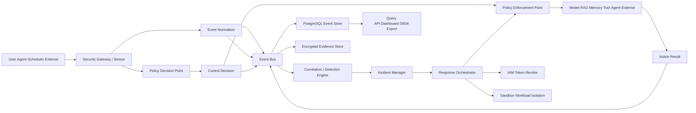
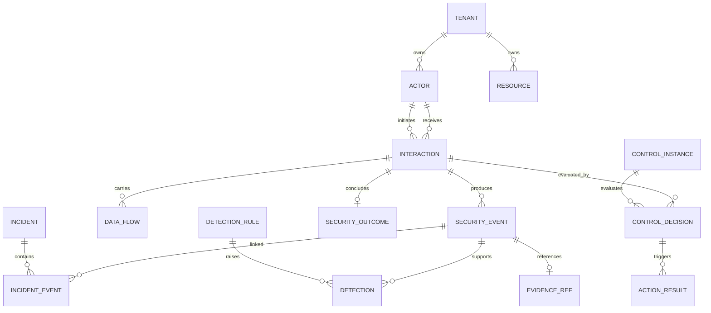
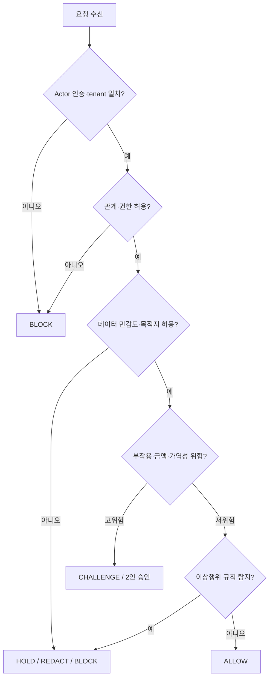
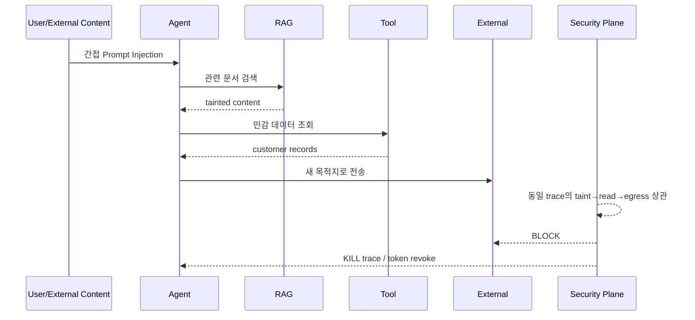

# Agentic AI 보안 이벤트 DB 및 탐지·방지 플랫폼 기획 v1

> English version: [01-project-plan.md](01-project-plan.md)

> 기준 문서: `agentic-위협매트릭스-통합-최종-v3-2026-07.md` v3.3  
> 기본 가정: **단일 AI Agent 서비스 MVP → 다중 Agent 서비스 확장**, **PostgreSQL 우선**, **OBSERVE → SHADOW → ENFORCE** 단계 전환  
> 핵심 목표: 사용자·Agent·Sub-agent·MCP/Tool·RAG·Memory·외부 시스템 사이의 통신과 데이터 이동을 관측하고, 정책을 판정하며, 필요한 경우 실행 전에 차단·격리·회수할 수 있는 보안 통제 계층을 만든다.

---

## 1. 결론 요약

이 플랫폼은 단순 로그 저장소가 아니다. 다음 네 기능을 하나의 추적 가능한 흐름으로 결합한다.

1. **관측:** Actor 간 요청, 데이터 흐름, 도구 호출, 위임, 외부 행동을 공통 이벤트로 수집한다.
2. **판정:** 요청의 신원·권한·데이터 민감도·목적지·예상 부작용을 정책과 탐지 규칙으로 평가한다.
3. **집행:** `ALLOW`, `BLOCK`, `HOLD`, `SANITIZE`, `QUARANTINE`, `REVOKE`, `KILL`을 실제 Gateway에서 실행한다.
4. **검증:** 통제 판정, 조치 실행 결과, 공격의 최종 결과를 분리해 “탐지는 했지만 막지 못한 사건”을 식별한다.

최소 구현 단위는 다음과 같다.

> **SECURITY_STEP = Source Actor × Relationship × Target Actor/Resource × Interaction × Data Flow × Control Decision × Action Result × Security Outcome**

한 번의 사용자 요청은 여러 `SECURITY_STEP`을 만들 수 있지만, `trace_id`와 `incident_id`로 하나의 호출체인과 보안사건으로 묶는다.

---

## 2. 목표와 비목표

### 2.1 목표

- Actor 간 통신과 데이터 송수신을 동일한 보안 이벤트 규격으로 정규화한다.
- User → Agent → Model/RAG/Memory/Tool/Agent/External의 전체 호출체인을 추적한다.
- 정책 판정과 실제 조치 결과를 감사 가능한 형태로 보존한다.
- Prompt Injection, Tool Poisoning, 자격증명 오용, A2A 위조, 데이터 유출, 비용 폭주 등 연쇄 공격을 상관분석한다.
- 고위험 행동은 실행 전 차단하고, 이미 시작된 작업은 trace 단위로 중지·격리한다.
- 운영 데이터와 모의공격 데이터를 분리해 탐지율·오탐률을 올바르게 측정한다.

### 2.2 비목표

- 모든 원문 Prompt와 응답을 평문으로 영구 저장하지 않는다.
- LLM 판정 하나만으로 권한·송금·삭제·외부 반출을 허용하지 않는다.
- 초기 MVP에서 모든 TG01–TG22와 모든 표준 ID를 한 번에 구현하지 않는다.
- 운영 로그만으로 “전체 실제 공격 대비 탐지율”을 계산하지 않는다.
- 본 플랫폼이 기존 IAM, SIEM, DLP, EDR, API Gateway를 전부 대체하지 않는다. 이들을 Agent 호출체인에 연결하는 보안 통제면을 제공한다.

---

## 3. 설계 원칙

1. **관계 중심:** 방어는 Actor나 자산의 속성이 아니라 Actor 간 관계를 통과하는 집행점에 둔다.
2. **판정과 결과 분리:** `BLOCK` 판정과 실제 차단 성공은 다른 사실이다.
3. **원문 최소화:** 기본 DB에는 메타데이터·해시·분류 결과만 저장하고 원문은 마스킹하거나 별도 암호화 증거 저장소에 둔다.
4. **결정론 우선:** 신원, 권한, tenant, 목적지, 금액, 부작용은 코드·정책으로 강제한다. LLM 기반 분류기는 보조 신호로 사용한다.
5. **전체 호출체인 추적:** 단일 요청이 아니라 `trace_id`, `agent_tree_id`, `delegation_id` 단위로 분석한다.
6. **Fail 정책 명시:** 통제 장애 시 관계별 `FAIL_OPEN`, `FAIL_CLOSED`, `DEGRADE_READ_ONLY`를 사전에 정한다.
7. **증거 무결성:** Agent가 자신의 보안 로그를 수정하거나 누락시킬 수 없도록 별도 Audit Sink로 전송한다.
8. **점진적 집행:** 동일 규칙을 OBSERVE, SHADOW, ENFORCE 모드로 승격한다.

---

## 4. 전체 시스템 구조



### 4.1 논리 컴포넌트

| 컴포넌트 | 책임 | MVP 구현 |
|---|---|---|
| Sensor/SDK | Agent 프레임워크 내부 단계 관측 **및 집행**: `wrap()`이 `SDK_PROFILE`의 check 16개를 실행하고(`sdk.py:152`), `ENFORCE`에서는 `GatewayError`를 raise한다(`sdk.py:199`) | Python/TypeScript SDK, OpenTelemetry hook |
| Security Gateway | 관계별 요청 중계·차단 | HTTP/gRPC middleware, Tool/RAG adapter |
| Event Normalizer | 공급자별 로그를 공통 스키마로 변환 | Stateless service |
| Policy Decision Point | 정책·권한·위험 점수 판정 | 정책 엔진 + 결정론적 규칙 |
| Policy Enforcement Point | 차단·보류·정제·회수 실행 | 각 Gateway **및 SDK**에 내장 — 현재 공유 check 표를 실행하는 집행점은 셋이다: MCP gateway(check 18개), SDK(16개), A2A broker(16개). 셋은 동등하지 않다. §4.2 참고 |
| Event Bus | 비동기 전송·재처리 | MVP는 DB 직접 기록 또는 경량 queue, 확장 시 Kafka 호환 |
| Event Store | 검색·통계·상관분석 데이터 | PostgreSQL 파티셔닝 |
| Evidence Store | 암호화 원문·파일·대용량 payload | S3 호환 Object Storage |
| Detection Engine | 단건·시계열·그래프 규칙 | SQL/stream rule + 선택적 ML |
| Incident Manager | 이벤트를 사건으로 병합 | trace·actor·resource 기반 correlation |
| Response Orchestrator | 토큰 회수·trace kill·격리 | 승인 가능한 runbook executor |
| Dashboard/API | 검색·통계·정책 운영 | REST API + 운영 UI |

### 4.2 세 집행점은 메커니즘을 공유할 뿐, 범위를 공유하지 않는다

정책 판정은 `policy.py`의 `CHECKS` 표(check 26개)에 한 번만 선언된다. 집행점은 `Profile`이다. 즉 어떤 check id를 실행하고 각각에 대해 어떤 reason code를 방출하는지의 조합이다. 통합된 것은 이게 전부다 — **커버리지가 아니라 메커니즘이다.**

| 집행점 | Profile | check 수 | 방출 namespace |
|---|---|---|---|
| MCP gateway | `GATEWAY_PROFILE` | 18 | `INTERLOCK-*`, `L1-*` |
| SDK (`wrap()`) | `SDK_PROFILE` | 16 | `INTERLOCK-*`, `L1-*` |
| A2A broker | `A2A_PROFILE`(`A2A_LINK_PROFILE` 11개 + `A2A_BOUNDARY_PROFILE` 5개로 분리) | 16 | `A2A-*` |

셋은 같은 것을 검사하지 **않으며**, 어떤 통계도 셋이 같다는 전제로 읽어서는 안 된다.

- SDK는 M2 definition check 2개를 실행하지 않는다. SDK는 `ToolRevision`을 보유하지 않기 때문이다. 이 둘은 SDK에서 "통과"가 아니라 ABSENT다.
- broker는 check 16개 중 gateway와 공유하는 것이 **8개**뿐이고, 나머지 8개는 자체 통제다(identity binding, message-part schema, payload 존재, boundary check 5개). gateway 통제 10개는 broker에 대응물이 아예 없다 — egress 목적지·export 용량·side effect·taint·approval·schema 통제가 **하나도** 없다.
- 각 집행점은 방출하는 이름을 각자 바꾼다. 같은 통제가 gateway에서는 `L1-M5-TOKEN-AUDIENCE-MISMATCH`, broker에서는 `A2A-AUDIENCE-MISMATCH`로 나타난다. 따라서 reason code를 키로 한 집계는 집행점 간에 비교 **불가**하고, canonical check id를 키로 한 집계는 비교 가능하다. 둘 사이의 join은 반드시 `Profile.reason_codes`를 거쳐야 하며 문자열 매칭으로 해서는 안 된다.

이름만 바뀐 게 아니라 실제로 다른 비교가 둘 있는데, 그 차이는 별도의 check가 아니라 매개변수다. 두 집행점 모두 `intent.expected_audience`·`intent.expected_resource`를 상대로 같은 술어를 실행한다. 다만 broker는 그 필드를 각각 `target.identity`와 `a2a://{target.id}`로 *채우는* 쪽이고(`a2a.py:650-651`), MCP gateway는 호출자가 선언한 intent에서 그대로 가져온다.

설계와 그 명시적 한계 — 특히 커버리지는 안전이 아니라는 점 — 은 [Control Coverage Statistics](specs/2026-07-27-control-coverage-statistics.md)를 참고한다.

---

## 5. 우선 적용할 Actor 관계

### 5.1 MVP 범위

| 관계 ID | 흐름 | 집행점 | 우선 탐지 |
|---|---|---|---|
| REL-01 | User → Agent | INPUT_GATEWAY | Prompt Injection, 세션 혼선, 사용자 사칭 |
| REL-03 | Agent → RAG | RAG_GATEWAY | cross-tenant 조회, RAG 오염, 대량 검색 |
| REL-05 | Agent → Tool/MCP | MCP_GATEWAY | 비신뢰 입력 기반 호출, 권한 초과, Tool drift |
| REL-07 | Agent → External | EGRESS_GATEWAY | 비밀 유출, 새 목적지, 송금·삭제·메일 발송 |
| REL-12 | All → Observability | AUDIT_SINK | 로그 누락, Gateway 우회, trace 단절 |

### 5.2 확장 범위

| 관계 ID | 흐름 | 집행점 |
|---|---|---|
| REL-02 | Agent → Model | MODEL_ROUTER |
| REL-04 | Agent → Memory | MEMORY_STORE |
| REL-06 | Agent → Agent | A2A_BROKER |
| REL-08 | Operator → Agent | APPROVAL_GATE |
| REL-09 | Scheduler → Agent | TRIGGER_VALIDATOR |
| REL-10 | Agent → Orchestrator | STATE_MACHINE |
| REL-11 | Tool → Runtime/Host | SANDBOX |
| REL-13 | Supply Chain → Runtime | DEPLOY_GATE |

`EnforcementPoint` enum(`architecture.py:31-47`)에는 단일 관계에 묶이지 않는 `DESIGN_LINTER`, `SDK`, `RESPONSE_ORCHESTRATOR`도 있다. linter는 컴파일 시점에 그래프 전체를 대상으로 돌고, SDK는 자신의 `wrap()`이 감싼 link가 무엇이든 in-process로 집행하며, response orchestrator는 판정 이후에 동작한다. `RETRIEVAL_GATEWAY`나 `TOOL_GATEWAY`는 존재하지 않는다. 각각 `RAG_GATEWAY`와 `MCP_GATEWAY`다.

---

## 6. 이벤트 분류 체계

하나의 범용 로그 테이블에 모든 의미를 넣지 않는다. 공통 Envelope와 이벤트별 Payload를 조합한다.

| Event Type | 발생 시점 | 핵심 질문 |
|---|---|---|
| `INTERACTION_REQUESTED` | Actor가 다른 Actor/Resource에 요청 | 누가 누구에게 무엇을 요청했는가 |
| `DATA_FLOW_OBSERVED` | 데이터가 신뢰경계를 통과 | 어떤 민감 데이터가 어디로 이동했는가 |
| `CONTROL_EVALUATED` | 통제가 요청을 평가 | 어떤 정책이 어떤 근거로 무엇을 판정했는가 |
| `ACTION_EXECUTED` | 차단·보류·격리·회수 실행 | 판정이 실제로 집행됐는가 |
| `INTERACTION_COMPLETED` | 대상 호출 종료 | 요청이 성공·실패·부분 실행됐는가 |
| `SECURITY_OUTCOME_SET` | 보안 결과 확정 | 공격이 차단·부분 실행·성공했는가 |
| `DETECTION_RAISED` | 규칙·모델이 이상 징후 탐지 | 어떤 증거로 어떤 시나리오가 탐지됐는가 |
| `INCIDENT_UPDATED` | 사건 생성·병합·상태 변경 | 어떤 이벤트들이 하나의 사건인가 |
| `CONTROL_HEALTH_CHANGED` | 통제 상태 변경 | 통제가 정상 동작하고 있는가 |
| `POLICY_CHANGED` | 정책 배포·승격·롤백 | 어떤 정책이 언제 누구에 의해 바뀌었는가 |
| `TEST_EXECUTED` | 시뮬레이션·레드팀·장애훈련 | 통제가 실제로 공격과 장애를 막았는가 |

### 6.1 공통 Event Envelope

| 필드 | 형식 | 필수 | 설명 |
|---|---|---:|---|
| `event_id` | UUIDv7 | Y | 전역 고유 이벤트 ID |
| `event_type` | enum | Y | 위 이벤트 유형 |
| `schema_version` | string | Y | 예: `1.0` |
| `occurred_at` | timestamptz | Y | 원 시스템 발생 시각 |
| `ingested_at` | timestamptz | Y | 수집 계층 도착 시각 |
| `tenant_id` | UUID/string | Y | tenant 격리 키 |
| `environment` | enum | Y | `DEV`, `STAGE`, `PROD` |
| `data_source` | enum | Y | `PRODUCTION`, `SIMULATION`, `RED_TEAM`, `TEST` |
| `trace_id` | string | Y | 전체 호출체인 |
| `span_id` | string | Y | 단일 단계 |
| `parent_span_id` | string | N | 부모 단계 |
| `agent_tree_id` | string | N | 상·하위 Agent 트리 |
| `interaction_id` | UUID | N | 요청–완료 묶음 |
| `incident_id` | UUID | N | 보안사건 묶음 |
| `source_actor_id` | UUID | Y | 요청 주체 |
| `target_actor_id` | UUID | N | 대상 Actor |
| `target_resource_id` | UUID | N | 대상 Resource |
| `relationship_type` | enum | Y | `REQUESTS`, `INVOKES`, `READS` 등 |
| `relationship_id` | string | Y | REL-01–REL-13 |
| `tg_ids` | string[] | N | TG01–TG22 |
| `scenario_ids` | string[] | N | 탐지·시험 시나리오 |
| `severity` | enum | Y | `INFO`, `LOW`, `MEDIUM`, `HIGH`, `CRITICAL` |
| `payload` | JSON object | Y | 이벤트 유형별 데이터 |
| `integrity_hash` | string | Y | 정규화된 이벤트의 무결성 해시 |

### 6.2 관계 enum

```text
REQUESTS
DELEGATES
INVOKES
READS
WRITES
SENDS
APPROVES
AUTHENTICATES_AS
ROUTES
EXECUTES_ON
DEPLOYS_TO
LOGS_TO
RETURNS_TO
```

### 6.3 통제 판정과 결과 enum

```text
CONTROL_DECISION
  ALLOW BLOCK CHALLENGE HOLD SANITIZE QUARANTINE REVOKE DEGRADE KILL ERROR BYPASSED

ACTION_RESULT
  COMPLETED FAILED TIMED_OUT PARTIAL NOT_APPLICABLE

SECURITY_OUTCOME
  ATTEMPTED BLOCKED PARTIALLY_EXECUTED SUCCEEDED UNKNOWN FALSE_POSITIVE SIMULATED
```

---

## 7. 표준 JSON 이벤트 예시

### 7.1 Agent → Tool 요청

```json
{
  "event_id": "019ba1d0-09af-7f90-9da1-5d57916dce11",
  "event_type": "INTERACTION_REQUESTED",
  "schema_version": "1.0",
  "occurred_at": "2026-07-15T10:21:31.123Z",
  "ingested_at": "2026-07-15T10:21:31.129Z",
  "tenant_id": "tenant-a",
  "environment": "PROD",
  "data_source": "PRODUCTION",
  "trace_id": "trace-4cf8",
  "span_id": "span-tool-17",
  "parent_span_id": "span-agent-03",
  "agent_tree_id": "tree-91",
  "interaction_id": "019ba1d0-08cd-7a04-b918-840b8e52cc02",
  "source_actor_id": "agent-customer-support",
  "target_actor_id": "tool-send-email",
  "relationship_type": "INVOKES",
  "relationship_id": "REL-05",
  "tg_ids": ["TG07", "TG08", "TG20", "TG22"],
  "severity": "INFO",
  "payload": {
    "mcp": {
      "method": "tools/call",
      "serverId": "tenant-a/prod/trusted-mail"
    },
    "toolDefinition": {
      "toolId": "tenant-a/prod/trusted-mail:send_email",
      "revisionId": "tenant-a/prod/trusted-mail:send_email@sha256:db69ee4e..."
    },
    "invocation": {
      "purpose": "reply",
      "argumentsHash": "sha256:d65a89b1083ffc3eab7484b78bb20db3d40b0fb42b39d4ae66dd561394b8e892"
    }
  },
  "integrity_hash": "sha256:..."
}
```

payload 키는 **lowerCamelCase**이며, intent의 data class·목적지·taint label·content hash는 이 이벤트에 없다. 같은 `interaction_id` 아래 바로 뒤따르는 별도의 `DATA_FLOW_OBSERVED`에 있다.

```json
{
  "event_type": "DATA_FLOW_OBSERVED",
  "payload": {
    "dataClasses": ["D7"],
    "destinations": ["user@attacker.example"],
    "taintLabels": ["UNTRUSTED_RAG_CONTENT"],
    "contentHash": "sha256:d65a89b1..."
  }
}
```

SDK는 같은 이벤트 타입 둘을 방출하지만 `INTERACTION_REQUESTED` payload가 더 **좁다**. `{"argumentsHash": …, "purpose": …}`뿐이며(`sdk.py:139`), `mcp`나 `toolDefinition` 블록이 없다. SDK가 `ToolRevision`을 보유하지 않기 때문이다. `DATA_FLOW_OBSERVED`의 형태는 gateway와 동일하다.

### 7.2 통제 판정

실제 실행에서 캡처한 것이다. `mode: ENFORCE`에서 미등록 목적지로 향하는 오염된 `EXTERNAL_WRITE`.

```json
{
  "event_type": "CONTROL_EVALUATED",
  "trace_id": "trace-4cf8",
  "interaction_id": "019ba1d0-08cd-7a04-b918-840b8e52cc02",
  "relationship_id": "REL-05",
  "severity": "HIGH",
  "payload": {
    "toolDefinition": {
      "toolId": "tenant-a/prod/trusted-mail:send_email",
      "revisionId": "tenant-a/prod/trusted-mail:send_email@sha256:db69ee4e...",
      "observedDigest": "sha256:db69ee4e...",
      "approvedDigest": "sha256:db69ee4e...",
      "state": "ACTIVE"
    },
    "authorization": {
      "credentialFingerprint": "[REDACTED]",
      "issuer": null,
      "audience": null,
      "resource": null
    },
    "control": {
      "policyId": "mcp-tool-invoke-default",
      "policyVersion": "1.0.0",
      "mode": "ENFORCE",
      "decision": "BLOCK",
      "reasonCodes": [
        "L1-M9-NEW-DESTINATION",
        "INTERLOCK-TAINTED-EXTERNAL-WRITE"
      ],
      "actualEnforced": true
    }
  }
}
```

기억이 아니라 이 이벤트에서 읽어내야 할 것이 넷이다.

- **판정은 payload 최상위가 아니라 `payload.control` 아래에 중첩된다.** `mode`(정책이 무엇을 하도록 설정됐는가)와 `actualEnforced`(실제로 무엇이 집행됐는가)는 별개 필드라서, SHADOW 평가와 실제 집행된 평가를 다른 무엇을 조합하지 않고도 구분할 수 있다.
- **`reasonCodes`는 실제로 방출되는 문자열이다.** `risk_score`, `evaluation_ms`, `control_instance_id`, `required_action` 필드는 없다. 이 문서의 이전 판본은 `UNTRUSTED_DATA_TO_EXTERNAL_WRITE`, `NEW_DESTINATION`, `PII_PRESENT`를 보여줬는데, 이 문자열들은 `src/` 어디에도 존재하지 않는다.
- **`INTERLOCK-TAINTED-EXTERNAL-WRITE`는 이 브랜치에서 gateway에 새로 도달 가능해졌다.** 이전에는 SDK에만 존재했다.
- **SDK도 같은 중첩 `payload.control` 블록을 방출**해서 reducer 하나가 둘 다 처리하지만, `toolDefinition`이나 `authorization` 형제 블록은 **없다**. 같은 호출을 `wrap()`으로 통과시키면 `reasonCodes: ["L1-M9-NEW-DESTINATION", "INTERLOCK-TAINTED-EXTERNAL-WRITE", "INTERLOCK-APPROVAL-REQUIRED"]`가 나온다. 세 번째 코드가 붙는 이유는 SDK가 승인을 충족시킬 수 없기 때문이다. [02 개발자 프레임워크 설계](02-developer-framework-design.ko.md) §3.4 참고.

### 7.3 조치 실패와 공격 성공

```json
{
  "event_type": "ACTION_EXECUTED",
  "trace_id": "trace-4cf8",
  "interaction_id": "019ba1d0-08cd-7a04-b918-840b8e52cc02",
  "payload": {
    "result": "FAILED",
    "connectorExecutionId": "8f2c1e40-...",
    "failure": "connector timed out after 30s"
  }
}
```

```json
{
  "event_type": "SECURITY_OUTCOME_SET",
  "trace_id": "trace-4cf8",
  "payload": {
    "securityOutcome": "PARTIALLY_EXECUTED",
    "connectorExecutionId": "8f2c1e40-..."
  }
}
```

`result`는 `ActionResult`(`COMPLETED`, `FAILED`, `TIMED_OUT`, `PARTIAL`, `NOT_APPLICABLE`), `securityOutcome`은 `SecurityOutcome`(`ATTEMPTED`, `BLOCKED`, `PARTIALLY_EXECUTED`, `SUCCEEDED`, `UNKNOWN`, `FALSE_POSITIVE`, `SIMULATED`)이며 둘 다 `models.py`에 있다. `_append_outcome`은 임의의 `**extra` 키를 받으므로 effect 목록이나 보상 필요 플래그를 실어 보낼 수는 있지만, 어느 쪽도 고정 필드가 아니며 현재 `src/`가 채우지도 않는다.

> **알려진 보고 결함, SDK 경로 한정.** `wrap()`이 호출을 거부할 때, `SECURITY_OUTCOME_SET: BLOCKED`를 남기고 raise하기 전에 `{"result": "COMPLETED", "connectorExecutionId": null}`인 `ACTION_EXECUTED`를 먼저 append한다(`sdk.py:193-199`). 그 조치는 실행된 적이 없다. 이는 통합 판정 엔진 작업보다 앞선 문제이며(`8ef67b0`에서 들어왔다), 여기서 짚는 이유는 DET-012 — "BLOCK 판정 뒤 downstream 성공 이벤트" — 가 바로 이 형태에 걸리는 규칙이기 때문이다. 둘은 `connectorExecutionId`로 구분한다. 이 값이 `null`인 것은 거부 경로뿐이다. SDK의 `result: COMPLETED`만으로 실행됐다고 판단해서는 안 된다.

---

## 8. 데이터베이스 논리 모델



### 8.1 테이블 역할

| 테이블 | 역할 |
|---|---|
| `tenants` | tenant와 보존·암호화 정책 |
| `actors` | User, Agent, Tool, IdP 등 실행 주체 catalog |
| `resources` | Prompt, Memory, RAG, Credential, Data 등 자산 catalog |
| `interactions` | 요청부터 완료까지의 관계 단위 |
| `security_events` | 공통 append-only 이벤트 원장 |
| `data_flows` | 데이터 이동의 출처·목적지·민감도·크기 |
| `control_instances` | 실제 배포된 통제 인스턴스와 상태 |
| `control_policies` | 정책 버전과 배포 상태 |
| `control_decisions` | 요청별 판정·근거·위험 점수 |
| `action_results` | 차단·회수·격리의 실제 실행 결과 |
| `security_outcomes` | 공격의 최종 결과와 부작용 |
| `detection_rules` | 버전 관리되는 탐지 규칙 |
| `detections` | 규칙이 발생시킨 탐지와 증거 |
| `incidents` | 여러 이벤트를 묶는 사건 |
| `incident_events` | 사건–이벤트 N:M 연결 |
| `evidence_refs` | 암호화 원문 증거의 위치·해시·보존기간 |
| `ingest_errors` | 정규화 실패·스키마 위반·유실 후보 |

---

## 9. PostgreSQL MVP DDL

> 아래는 구현 출발점이다. 운영 전에는 조직의 PostgreSQL 버전, tenant 키 형식, 개인정보 정책에 맞게 migration으로 관리한다.

```sql
CREATE EXTENSION IF NOT EXISTS pgcrypto;

CREATE TABLE tenants (
    tenant_id          text PRIMARY KEY,
    name               text NOT NULL,
    retention_days     integer NOT NULL DEFAULT 90,
    evidence_enabled   boolean NOT NULL DEFAULT false,
    created_at         timestamptz NOT NULL DEFAULT now()
);

CREATE TABLE actors (
    actor_id            text PRIMARY KEY,
    tenant_id           text NOT NULL REFERENCES tenants(tenant_id),
    actor_type          text NOT NULL CHECK (actor_type IN (
        'USER','ATTACKER','INSIDER','OPERATOR','AGENT','SUBAGENT',
        'EXTERNAL_AGENT','TOOL','ORCHESTRATOR','SCHEDULER','IDP',
        'PIPELINE','CONTROL_PLANE'
    )),
    display_name        text,
    owner_team          text,
    trust_level         text NOT NULL DEFAULT 'UNVERIFIED',
    identity_subject    text,
    attributes          jsonb NOT NULL DEFAULT '{}',
    active              boolean NOT NULL DEFAULT true,
    created_at          timestamptz NOT NULL DEFAULT now(),
    UNIQUE (tenant_id, identity_subject)
);

CREATE TABLE resources (
    resource_id         text PRIMARY KEY,
    tenant_id           text NOT NULL REFERENCES tenants(tenant_id),
    resource_type       text NOT NULL CHECK (resource_type IN (
        'PROMPT','SESSION','MEMORY','RAG','TOOL_DEFINITION','CREDENTIAL',
        'RUNTIME','LOG','SUPPLY_CHAIN','DATA','BUDGET','OTHER'
    )),
    owner_actor_id      text REFERENCES actors(actor_id),
    sensitivity         text NOT NULL DEFAULT 'INTERNAL',
    tg_ids              text[] NOT NULL DEFAULT '{}',
    attributes          jsonb NOT NULL DEFAULT '{}',
    created_at          timestamptz NOT NULL DEFAULT now()
);

CREATE TABLE interactions (
    interaction_id      uuid PRIMARY KEY DEFAULT gen_random_uuid(),
    tenant_id           text NOT NULL REFERENCES tenants(tenant_id),
    trace_id            text NOT NULL,
    span_id             text NOT NULL,
    parent_span_id      text,
    agent_tree_id       text,
    delegation_id       text,
    source_actor_id     text NOT NULL REFERENCES actors(actor_id),
    target_actor_id     text REFERENCES actors(actor_id),
    target_resource_id  text REFERENCES resources(resource_id),
    relationship_id     text NOT NULL,
    relationship_type   text NOT NULL,
    operation           text NOT NULL,
    purpose             text,
    state               text NOT NULL DEFAULT 'REQUESTED',
    requested_at        timestamptz NOT NULL,
    completed_at        timestamptz,
    attributes          jsonb NOT NULL DEFAULT '{}',
    UNIQUE (tenant_id, trace_id, span_id)
);

CREATE TABLE security_events (
    event_id            uuid NOT NULL DEFAULT gen_random_uuid(),
    occurred_at         timestamptz NOT NULL,
    ingested_at         timestamptz NOT NULL DEFAULT now(),
    event_type          text NOT NULL,
    schema_version      text NOT NULL,
    tenant_id           text NOT NULL,
    environment         text NOT NULL,
    data_source         text NOT NULL,
    trace_id            text NOT NULL,
    span_id             text,
    parent_span_id      text,
    agent_tree_id       text,
    interaction_id      uuid,
    incident_id         uuid,
    source_actor_id     text,
    target_actor_id     text,
    target_resource_id  text,
    relationship_id     text,
    relationship_type   text,
    tg_ids              text[] NOT NULL DEFAULT '{}',
    scenario_ids        text[] NOT NULL DEFAULT '{}',
    severity            text NOT NULL,
    payload             jsonb NOT NULL,
    integrity_hash      text NOT NULL,
    PRIMARY KEY (occurred_at, event_id)
) PARTITION BY RANGE (occurred_at);

CREATE TABLE security_events_2026_07
    PARTITION OF security_events
    FOR VALUES FROM ('2026-07-01') TO ('2026-08-01');

CREATE INDEX security_events_trace_idx
    ON security_events (tenant_id, trace_id, occurred_at);
CREATE INDEX security_events_actor_idx
    ON security_events (tenant_id, source_actor_id, occurred_at DESC);
CREATE INDEX security_events_type_idx
    ON security_events (tenant_id, event_type, occurred_at DESC);
CREATE INDEX security_events_payload_gin_idx
    ON security_events USING gin (payload jsonb_path_ops);

CREATE TABLE data_flows (
    data_flow_id        uuid PRIMARY KEY DEFAULT gen_random_uuid(),
    tenant_id           text NOT NULL REFERENCES tenants(tenant_id),
    interaction_id      uuid NOT NULL REFERENCES interactions(interaction_id),
    occurred_at         timestamptz NOT NULL,
    source_resource_id  text REFERENCES resources(resource_id),
    destination_type    text NOT NULL,
    destination_id      text,
    direction           text NOT NULL CHECK (direction IN ('INBOUND','OUTBOUND','INTERNAL')),
    content_type        text,
    data_classes        text[] NOT NULL DEFAULT '{}',
    sensitivity         text NOT NULL,
    byte_size           bigint,
    record_count        bigint,
    content_hash        text,
    taint_labels        text[] NOT NULL DEFAULT '{}',
    raw_stored          boolean NOT NULL DEFAULT false,
    evidence_ref_id     uuid,
    attributes          jsonb NOT NULL DEFAULT '{}'
);

CREATE TABLE control_instances (
    control_instance_id text PRIMARY KEY,
    tenant_id           text NOT NULL REFERENCES tenants(tenant_id),
    control_catalog_id  text NOT NULL,
    enforcement_point   text NOT NULL,
    mode                text NOT NULL CHECK (mode IN ('OBSERVE','SHADOW','ENFORCE')),
    status              text NOT NULL CHECK (status IN ('HEALTHY','DEGRADED','FAILED','DISABLED')),
    policy_version      text,
    last_heartbeat_at   timestamptz,
    attributes          jsonb NOT NULL DEFAULT '{}'
);

CREATE TABLE control_policies (
    policy_id           text NOT NULL,
    version             text NOT NULL,
    tenant_id           text NOT NULL REFERENCES tenants(tenant_id),
    status              text NOT NULL CHECK (status IN ('DRAFT','TESTING','ACTIVE','RETIRED')),
    definition          jsonb NOT NULL,
    definition_hash     text NOT NULL,
    approved_by         text,
    activated_at        timestamptz,
    created_at          timestamptz NOT NULL DEFAULT now(),
    PRIMARY KEY (policy_id, version, tenant_id)
);

CREATE TABLE control_decisions (
    decision_id         uuid PRIMARY KEY DEFAULT gen_random_uuid(),
    tenant_id           text NOT NULL REFERENCES tenants(tenant_id),
    interaction_id      uuid NOT NULL REFERENCES interactions(interaction_id),
    control_instance_id text NOT NULL REFERENCES control_instances(control_instance_id),
    policy_id           text NOT NULL,
    policy_version      text NOT NULL,
    decided_at          timestamptz NOT NULL,
    decision            text NOT NULL,
    reason_codes        text[] NOT NULL DEFAULT '{}',
    risk_score          numeric(5,2),
    confidence          numeric(5,4),
    evaluation_ms       integer,
    input_fingerprint   text,
    details             jsonb NOT NULL DEFAULT '{}'
);

CREATE TABLE action_results (
    action_result_id    uuid PRIMARY KEY DEFAULT gen_random_uuid(),
    tenant_id           text NOT NULL REFERENCES tenants(tenant_id),
    decision_id         uuid NOT NULL REFERENCES control_decisions(decision_id),
    interaction_id      uuid NOT NULL REFERENCES interactions(interaction_id),
    action_type         text NOT NULL,
    action_result       text NOT NULL,
    started_at          timestamptz NOT NULL,
    completed_at        timestamptz,
    failure_reason      text,
    external_reference  text,
    details             jsonb NOT NULL DEFAULT '{}'
);

CREATE TABLE security_outcomes (
    outcome_id          uuid PRIMARY KEY DEFAULT gen_random_uuid(),
    tenant_id           text NOT NULL REFERENCES tenants(tenant_id),
    interaction_id      uuid REFERENCES interactions(interaction_id),
    trace_id            text NOT NULL,
    determined_at       timestamptz NOT NULL,
    outcome             text NOT NULL,
    effects             text[] NOT NULL DEFAULT '{}',
    confidentiality     boolean NOT NULL DEFAULT false,
    integrity           boolean NOT NULL DEFAULT false,
    availability        boolean NOT NULL DEFAULT false,
    financial_impact    numeric(18,2),
    compensation_needed boolean NOT NULL DEFAULT false,
    determination       text NOT NULL DEFAULT 'AUTOMATED',
    details             jsonb NOT NULL DEFAULT '{}'
);

CREATE TABLE incidents (
    incident_id         uuid PRIMARY KEY DEFAULT gen_random_uuid(),
    tenant_id           text NOT NULL REFERENCES tenants(tenant_id),
    title               text NOT NULL,
    status              text NOT NULL CHECK (status IN (
        'OPEN','TRIAGED','CONTAINING','RECOVERING','CLOSED','FALSE_POSITIVE'
    )),
    severity            text NOT NULL,
    primary_scenario_id text,
    first_seen_at       timestamptz NOT NULL,
    last_seen_at        timestamptz NOT NULL,
    owner               text,
    summary             text,
    attributes          jsonb NOT NULL DEFAULT '{}'
);

CREATE TABLE incident_events (
    incident_id         uuid NOT NULL REFERENCES incidents(incident_id),
    event_id            uuid NOT NULL,
    event_occurred_at   timestamptz NOT NULL,
    role                text NOT NULL DEFAULT 'EVIDENCE',
    PRIMARY KEY (incident_id, event_id, event_occurred_at),
    FOREIGN KEY (event_occurred_at, event_id)
        REFERENCES security_events(occurred_at, event_id)
);

CREATE TABLE evidence_refs (
    evidence_ref_id     uuid PRIMARY KEY DEFAULT gen_random_uuid(),
    tenant_id           text NOT NULL REFERENCES tenants(tenant_id),
    event_id            uuid NOT NULL,
    event_occurred_at   timestamptz NOT NULL,
    storage_uri         text NOT NULL,
    content_hash        text NOT NULL,
    encryption_key_ref  text NOT NULL,
    redaction_status    text NOT NULL,
    expires_at          timestamptz NOT NULL,
    legal_hold          boolean NOT NULL DEFAULT false,
    access_policy       jsonb NOT NULL,
    FOREIGN KEY (event_occurred_at, event_id)
        REFERENCES security_events(occurred_at, event_id)
);
```

### 9.1 DDL 운영 주의

- 월별 partition을 자동 생성하고 보존기간 종료 시 partition 단위로 폐기한다.
- `tenant_id`가 없는 이벤트는 ingest 단계에서 거부한다.
- `security_events`는 UPDATE/DELETE를 애플리케이션 계정에 허용하지 않는다.
- JSONB는 확장 필드에만 사용하고 통계 분모가 되는 필드는 정규 컬럼으로 둔다.
- DB 장애 시 원본 이벤트는 로컬 bounded spool 또는 Event Bus에 보존하고 재전송한다.
- 이벤트 중복은 `event_id`와 producer sequence로 제거한다.
- 장기적으로 분석량이 커지면 PostgreSQL은 catalog·policy·incident를 유지하고 event fact는 ClickHouse로 복제한다.

### 9.2 테넌트 격리와 불변성 (RLS·append-only)

tenant 격리는 애플리케이션 필터가 아니라 DB 정책으로 이중 강제한다. 아래 패턴을 `tenant_id`가 있는 모든 fact·catalog 테이블에 적용한다. `security_events`를 예로 든다.

```sql
-- 신뢰된 tenant는 세션에서 자유롭게 바꿀 수 있는 GUC가 아니라
-- 인증 연결의 session_user에서 파생한다. SET/SET ROLE로는 바꿀 수 없다.
CREATE TABLE role_tenant (        -- 애플리케이션 역할 → tenant 결합(연결=인증 경계)
    role_name text PRIMARY KEY,
    tenant_id text NOT NULL REFERENCES tenants(tenant_id)
);

CREATE FUNCTION current_tenant() RETURNS text LANGUAGE sql STABLE
SECURITY DEFINER SET search_path = pg_catalog, public AS
$$ SELECT tenant_id FROM role_tenant WHERE role_name = session_user $$;
REVOKE ALL ON FUNCTION current_tenant() FROM PUBLIC;

-- 테넌트 격리. FORCE는 '테이블 소유자'에게도 RLS를 적용한다.
--   단 superuser와 BYPASSRLS 속성 역할은 여전히 우회하므로,
--   애플리케이션·마이그레이션 역할에 그 속성을 부여하지 않는다(CORE-SIM-TENANT-004).
ALTER TABLE security_events ENABLE ROW LEVEL SECURITY;
ALTER TABLE security_events FORCE  ROW LEVEL SECURITY;
CREATE POLICY tenant_isolation ON security_events
    USING (tenant_id = current_tenant())
    WITH CHECK (tenant_id = current_tenant());
-- session_user는 인증 연결에 고정되므로 custom GUC나 SET ROLE로 tenant를 바꿀 수 없다.

-- 불변성(append-only). 두 계층으로 방어한다.
--   (1) RBAC: 쓰기 역할에서 UPDATE/DELETE 권한 회수 → permission denied (트리거 도달 전)
--   (2) trigger: UPDATE 권한이 있는 역할이라도 append-only 위반 예외
-- app_writer와 시험용 역할은 배포 시 사전 생성된다(이 블록의 전제 조건).
REVOKE UPDATE, DELETE ON security_events FROM app_writer;
GRANT  INSERT, SELECT ON security_events TO app_writer;
CREATE FUNCTION deny_event_mutation() RETURNS trigger LANGUAGE plpgsql AS
$$ BEGIN RAISE EXCEPTION 'security_events is append-only'; END $$;
CREATE TRIGGER security_events_no_mutation
    BEFORE UPDATE OR DELETE ON security_events
    FOR EACH ROW EXECUTE FUNCTION deny_event_mutation();
```

> **왜 세션 GUC를 신뢰하지 않는가.** PostgreSQL은 임의의 2단계 custom parameter를 받아들이므로, `current_setting('app.tenant_id')`에 의존하면 애플리케이션 역할이 `SET app.tenant_id='다른-tenant'`로 경계를 넘을 수 있다(`SECURITY DEFINER`로 값을 넣어도 이후 직접 `SET`을 막지 못한다). 그래서 실행 migration은 **인증 연결에 고정되는 `session_user`**에서 tenant를 파생한다. `current_user`는 `SET ROLE`로 바뀔 수 있어 인증 주체의 고정 식별자로 사용하지 않는다. 대규모 멀티테넌시로 역할 수가 부담되면, 애플리케이션이 위조·재설정할 수 없는 신뢰 연결 계층 컨텍스트(전용 프록시·확장)로 대체하되 "앱이 값을 못 바꾼다"를 시험으로 증명해야 한다. 실행 가능한 축소 migration과 API 계약은 [12 PostgreSQL Ledger API](12-postgresql-ledger-api.ko.md)를 따른다.

- `tenant_id`가 없는 이벤트는 ingest에서 거부하고 `ingest_errors`에 남긴다.
- evidence 조회도 tenant 경계를 넘지 못하며(§15.2), 조회 자체가 별도 보안 이벤트로 기록된다.
- 이 격리의 커버리지는 **부분적**이며, 그 공백은 [05 L1 검증 계획](05-l1-security-validation-plan.ko.md) §10에 정확히 적혀 있다. 요약하면 `CORE-SIM-TENANT-001`과 `002`는 `tests/test_postgres_ledger.py`가 실제 PostgreSQL을 대상으로 실행하지만, `003`(append-only trigger)과 `004`(RLS 우회 속성)은 **전혀 시험되지 않는다**. 이 둘의 유일한 증거는 migration 파일 텍스트에 대한 부분 문자열 일치다. append-only trigger를 검증된 것으로 읽어서는 안 된다.

---

## 10. 수집과 정규화

### 10.1 수집 지점

| 위치 | 반드시 수집할 값 |
|---|---|
| Agent SDK | task, plan step, model/tool 선택, sub-agent 생성, trace |
| Input Gateway | 사용자 신원, session, 입력 provenance, taint |
| Model Router | model ID/version, prompt template version, token 사용량 |
| RAG Gateway | subject/tenant, query, 필터, 반환 문서 ID·ACL |
| Memory Gateway | writer, source, TTL, memory version, read/write |
| Tool Gateway | manifest digest, tool args hash, 권한, 목적지, 부작용 |
| A2A Broker | card digest, sender/receiver, delegation, nonce, hop |
| Egress Gateway | destination, data class, byte size, transaction effect |
| Identity Provider | actor, audience, scope, issue/revoke, token lineage |
| Sandbox/Runtime | process, filesystem, network, child process, exit |
| Audit Sink | expected producer, sequence gap, heartbeat, ingest lag |

### 10.2 데이터 정규화 순서

```text
수신 → producer 인증 → schema 검증 → tenant 강제 → 시간 보정
→ Actor/Resource resolve → 민감정보 탐지·마스킹 → hash 생성
→ TG/관계 태깅 → 저장·정책 평가 → correlation
```

스키마 위반 이벤트를 조용히 버리지 않는다. `ingest_errors`에 producer, 오류, 원본 해시를 남기고, 고위험 관계에서 반복되면 `CONTROL_HEALTH_CHANGED`와 우회 탐지를 발생시킨다.

### 10.3 OpenTelemetry 연계

- W3C `traceparent`를 Agent·Gateway·Tool 호출에 전달한다.
- 외부 도구가 trace를 지원하지 않으면 Gateway가 span을 생성한다.
- `trace_id`는 보안 상관키이고 인증 수단이 아니다.
- 외부에서 받은 trace ID를 그대로 신뢰하지 않고 tenant 경계에서 재바인딩한다.

---

## 11. 정책 판정과 집행

### 11.1 판정 순서



### 11.2 관계별 장애 정책

| 관계 | 기본 장애 정책 | 이유 |
|---|---|---|
| User → Agent 읽기 | 제한적 `FAIL_OPEN` 또는 `DEGRADE` | 낮은 부작용 |
| Agent → RAG | `FAIL_CLOSED` | tenant/ACL 판정 없이는 유출 위험 |
| Agent → Memory 쓰기 | `FAIL_CLOSED` | 지속 오염 위험 |
| Agent → Tool 읽기 | 도구 등급별 | 민감정보 접근 여부 |
| Agent → Tool 쓰기 | `FAIL_CLOSED` | 외부 부작용 |
| Agent → External | `FAIL_CLOSED` | 유출·송금·발송 위험 |
| Scheduler → Agent | `FAIL_CLOSED` | 무감시 반복 실행 |
| All → Audit | 고위험 행동 `DEGRADE_READ_ONLY` | 관측 불가 상태에서 쓰기 금지 |

### 11.3 정책 모드

| 모드 | 판정 | 실제 집행 | 용도 |
|---|---|---|---|
| OBSERVE | 기록만 | 없음 | 기준선 수집 |
| SHADOW | 차단 가상 판정 | 허용 | 영향·오탐 측정 |
| ENFORCE | 실제 판정 | 차단·보류·정제 | 운영 방어 |

승격 조건은 단순 기간이 아니라 시뮬레이션 재현율, 정상 트래픽 오탐, p95 판정 지연, 우회율, rollback 준비 상태로 정한다.

---

## 12. MVP 탐지 규칙

| Rule ID | 관계 | 탐지 조건 | 기본 조치 | 대상 |
|---|---|---|---|---|
| DET-001 | REL-01 | 비신뢰 콘텐츠의 명령 패턴 + 고위험 의도 | taint, HOLD | TG01 |
| DET-002 | REL-03 | subject tenant와 검색 tenant 불일치 | BLOCK | TG06·TG18 |
| DET-003 | REL-03 | 짧은 시간에 광범위 문서/벡터 열거 | rate limit, HOLD | TG06·TG22 |
| DET-004 | REL-05 | 비신뢰 taint가 `EXTERNAL_WRITE` Tool 인수로 전달 | BLOCK(§12.1 참고) | TG09·TG20 |
| DET-005 | REL-05 | 승인 manifest digest와 실행 digest 불일치 | QUARANTINE | TG07·TG08 |
| DET-006 | REL-05 | Agent 권한보다 넓은 Tool scope 요청 | BLOCK | TG13 |
| DET-007 | REL-07 | 새로운 외부 목적지 + PII/SECRET | BLOCK/승인 | TG20·TG22 |
| DET-008 | REL-07 | 요청 목적과 무관한 대량 outbound | KILL trace | TG20·TG22 |
| DET-009 | REL-12 | Agent 로그는 있으나 Gateway 로그 없음 | BYPASS incident | TG17 |
| DET-010 | REL-12 | producer sequence gap 또는 heartbeat 상실 | 고위험 쓰기 중지 | TG17 |
| DET-011 | Trace | sub-agent fan-out·재시도·비용 급증 | circuit break | TG10·TG21 |
| DET-012 | Trace | BLOCK 판정 뒤 downstream 성공 이벤트 | CRITICAL incident | TG17·TG20 |

### 12.1 규칙 정의 예시

아래는 선언적 규칙 정의의 **목표** 형태다. 규칙 언어는 아직 존재하지 않고, DET-004는 현재 하드코딩된 check로 구현돼 있으며 둘은 서로 다르다. 구현된 동작을 먼저 읽어야 한다.

**구현된 형태** — `_tainted_external_write`(`policy.py:238-243`), check id `INTERLOCK-TAINTED-EXTERNAL-WRITE`:

```python
if context.intent.estimated_side_effect != SideEffect.EXTERNAL_WRITE:
    return None                     # DESTRUCTIVE_WRITE는 이 통제의 대상이 아니다
if not context.intent.taint_labels:
    return ()
return (("INTERLOCK-TAINTED-EXTERNAL-WRITE", ControlDecision.BLOCK),)
```

아래 목표 형태와 다른 점이 셋이고, 각각 운영상 의미가 있다.

1. **판정은 `HOLD`가 아니라 `BLOCK`이다.** 무조건적이며 `LinkPolicy`의 action 필드로 설정할 수 없다. 가역적 대기도, 승인할 대상도 없다.
2. **`approval_valid`를 전혀 읽지 않는다.** `unless: valid_operator_approval` 절은 이 통제가 구현하지 않는다. 보류 후 승인 흐름은 *다른* check인 `INTERLOCK-APPROVAL-REQUIRED`(`_approval`, `policy.py:246-249`)가 담당하며, 이쪽은 `approval_valid`를 읽고 `HOLD`를 방출한다.
3. **`DESTRUCTIVE_WRITE`는 다루지 않는다.** 이 check는 `EXTERNAL_WRITE` 이외의 모든 side effect에 대해 `None`을 반환하므로, 오염된 destructive write는 여기서 차단이 아니라 INAPPLICABLE이다.

이 통제는 MCP gateway에서 **새로 활성화됐다**. 이전에는 `sdk.py`에만 있었으나, 공유 표로 승격되면서 `GATEWAY_PROFILE`에 들어갔고, `mcp_transport.py:148`이 호출자가 준 `taint_labels`를 intent로 전달하기 때문에 운영에서 도달 가능하다. 이전에는 gateway를 통과하던 오염된 외부 쓰기가 이제 차단된다.

**목표 형태**(미구현 — 이 파일을 소비하는 규칙 엔진은 없다):

```yaml
rule_id: DET-004
version: 1.0.0
status: PROPOSED          # 이 파일을 읽는 규칙 엔진은 없다
relationship_ids: [REL-05]
when:
  all:
    - payload.taint_labels contains UNTRUSTED_INPUT
    - payload.estimated_side_effect in [EXTERNAL_WRITE, DESTRUCTIVE_WRITE]
unless:
  - valid_operator_approval == true
decision: HOLD
reason_code: UNTRUSTED_DATA_TO_HIGH_IMPACT_TOOL   # src/ 어디에서도 방출되지 않는다
tg_ids: [TG09, TG20]
test_cases:
  - SIM-DET-004-ALLOW-001
  - SIM-DET-004-BLOCK-001
```

---

## 13. 연쇄공격 상관분석

단건 탐지만으로 Agent 공격을 판단하지 않는다. 다음 키를 사용해 그래프를 구성한다.

- `trace_id`: 한 요청의 end-to-end 경로
- `agent_tree_id`: 주 Agent와 Sub-agent 계보
- `delegation_id`: 위임 자격과 hop
- `interaction_id`: 요청–판정–완료
- `resource_id`: 동일 Memory/RAG/Credential 접근
- `destination_id`: 동일 외부 목적지

### 13.1 대표 상관 시나리오



### 13.2 Incident 병합 규칙

- 동일 trace에서 5분 내 발생한 관련 탐지는 기본적으로 하나의 Incident로 묶는다.
- trace가 달라도 동일 compromised actor, credential, memory, destination이면 병합 후보로 둔다.
- 자동 병합에는 근거 코드를 남기고 운영자가 분리할 수 있어야 한다.
- 동일 이벤트를 여러 Incident에 연결할 수 있지만 대표 Incident를 지정한다.

---

## 14. 자동 대응 Runbook

| Response ID | 동작 | 사전조건 | 검증 |
|---|---|---|---|
| RESP-01 | `BLOCK_INTERACTION` | Gateway가 아직 dispatch 전 | downstream 완료 이벤트 부재 |
| RESP-02 | `HOLD_FOR_APPROVAL` | 가역적 대기 가능 | 승인 만료·서명 검증 |
| RESP-03 | `REVOKE_CREDENTIAL_LINEAGE` | delegation/token lineage 존재 | 모든 audience에서 회수 확인 |
| RESP-04 | `KILL_TRACE` | agent_tree/queue 작업 식별 가능 | 하위 작업 종료 확인 |
| RESP-05 | `QUARANTINE_TOOL` | Tool digest/instance 식별 | 신규 호출 0, 캐시 제거 |
| RESP-06 | `ISOLATE_WORKLOAD` | sandbox/runtime 제어 가능 | network·process 차단 확인 |
| RESP-07 | `ROLLBACK_MEMORY` | 안전 snapshot 존재 | 오염 파생 데이터 제거 |
| RESP-08 | `BLOCK_DESTINATION` | egress gateway 제어 가능 | DNS/IP/URL 우회 시험 |
| RESP-09 | `DEGRADE_READ_ONLY` | 관측·정책 장애 | 쓰기·외부 송신 0 |

현재 RESP-02를 실제로 뒷받침하는 것에 대해 두 가지. 승인 상태를 근거로 `HOLD`를 방출하는 통제는 `INTERLOCK-APPROVAL-REQUIRED`(`_approval`, `policy.py:246-249`) 하나뿐이고, 승인을 부여하는 API는 `MCPToolGateway.grant_approval`(`gateway.py:140`) 하나뿐이다. `INTERLOCK-TAINTED-EXTERNAL-WRITE`는 DET-004의 서술과 달리 이 runbook에 **속하지 않는다**. 무조건 `BLOCK`을 반환하며 `approval_valid`를 읽지 않는다(§12.1 참고).

RESP-09의 `DEGRADE_READ_ONLY`는 선언 가능한 `FailureMode` 값이지만 **`src/`에 소비자가 없다**. `LinkPolicy.failure_mode`를 실행 시점에 읽는 곳은 정확히 한 군데, `egress.py:145`이며 여기서는 `FAIL_CLOSED`인지만 검사한다. 나머지 참조는 전부 설계 시점 lint이거나 직렬화다. link에 `DEGRADE_READ_ONLY`를 선언해도 현재 실행 시점 동작은 전혀 바뀌지 않는다.

자동 대응은 `decision`을 기록하는 것에서 끝나지 않는다. 각 Runbook은 `action_result`와 독립 검증 이벤트를 생성해야 한다.

---

## 15. 개인정보·증거·로그 무결성

### 15.1 저장 기본값

| 데이터 | 기본 저장 |
|---|---|
| Prompt/응답 원문 | 저장하지 않음 또는 즉시 마스킹 |
| Tool arguments | 정형 필드·해시·민감도, 필요 필드만 |
| RAG 문서 | 문서 ID·버전·ACL·hash, 본문 제외 |
| Credential | 절대 원문 저장 금지, token ID·scope·audience만 |
| 파일 | hash·MIME·크기·검사 결과, 원문은 격리 저장소 |
| 외부 목적지 | 정규화된 domain/service/account |
| 승인 | 승인자·대상·diff hash·만료·서명 |

### 15.2 증거 저장 원칙

- 원문 증거는 tenant별 키로 암호화한다.
- DB에는 URI, hash, key reference, 보존기간만 저장한다.
- 증거 조회 자체도 별도 보안 이벤트로 기록한다.
- 법적 보존과 일반 보존을 분리한다.
- 관리자도 tenant를 건너 검색할 수 없게 RLS 또는 별도 DB 경계를 적용한다.

### 15.3 무결성

- producer 인증과 event signing 또는 mTLS를 적용한다.
- 이벤트의 canonical JSON hash를 저장한다.
- producer별 monotonic sequence로 누락을 탐지한다.
- 선택적으로 일정 구간의 hash chain 또는 외부 WORM 보관을 사용한다.

---

## 16. API 초안

| Method | Path | 목적 |
|---|---|---|
| POST | `/v1/events` | 정규화 이벤트 수집 |
| POST | `/v1/interactions/evaluate` | 동기 정책 판정 |
| POST | `/v1/actions/{decision_id}/result` | 집행 결과 보고 |
| POST | `/v1/outcomes` | 보안 결과 확정 |
| GET | `/v1/traces/{trace_id}` | 호출체인 조회 |
| GET | `/v1/incidents` | 사건 검색 |
| POST | `/v1/incidents/{id}/responses` | 대응 Runbook 실행 |
| GET | `/v1/controls/health` | 통제 상태 조회 |
| POST | `/v1/rules/{id}/simulate` | 과거 이벤트에 규칙 시험 |

`POST /v1/events`와 `GET /v1/traces/{trace_id}`의 현재 실행 계약은 [12 PostgreSQL Ledger API](12-postgresql-ledger-api.ko.md)와 [`ledger-api.openapi.yaml`](../schemas/ledger-api.openapi.yaml)에 있다. mutation은 인증 principal·tenant·idempotency key를 결합한다. 동기 판정 API는 짧은 timeout과 idempotency key를 가져야 한다. timeout 시 행동은 요청에 맡기지 않고 관계별 장애 정책에서 결정한다.

---

## 17. 통계와 대시보드

### 17.1 운영 지표

| 지표 | 정의 |
|---|---|
| 통제 적용률 | 통제를 거친 요청 ÷ 통과했어야 할 요청 |
| Gateway 우회율 | 대상 시스템 직접 호출 ÷ 전체 호출 |
| 차단 집행 성공률 | `ACTION_RESULT=COMPLETED` ÷ 차단 계열 판정 |
| 부분 실행률 | `PARTIALLY_EXECUTED` ÷ 공격 시도 |
| 판정 지연 | 관계·통제별 p50/p95/p99 |
| Trace 완전성 | 필수 span을 모두 가진 trace 비율 |
| Token 회수 전파시간 | revoke 요청부터 최종 audience 무효화까지 |
| Incident MTTD | 최초 악성 단계부터 최초 탐지까지 |
| Incident MTTC | 최초 탐지부터 봉쇄 완료까지 |
| 정책 오탐률 | 라벨된 정상 요청 중 차단·보류 비율 |
| 비용 방어 효과 | 차단된 예상 비용·실제 절감 비용 |

### 17.2 분석 SQL 예시

```sql
-- 탐지는 했지만 실제 차단에 실패한 요청
SELECT
    d.interaction_id,
    d.decision,
    a.action_result,
    o.outcome,
    i.trace_id
FROM control_decisions d
JOIN interactions i USING (interaction_id)
LEFT JOIN action_results a USING (interaction_id)
LEFT JOIN security_outcomes o USING (interaction_id)
WHERE d.decision <> 'ALLOW'
  AND (a.action_result IS DISTINCT FROM 'COMPLETED'
       OR o.outcome IN ('PARTIALLY_EXECUTED', 'SUCCEEDED'));
```

> **왜 decision allowlist가 아니라 `<> 'ALLOW'`인가.** 코드에서 차단 계열은 부정으로 정의된다. `analytics.py`의 `block_decision`과 `src/`에 남은 유사 술어 네 개가 `!= ALLOW`를 검사한다. 열거 목록은 판정을 소리 없이 누락시킨다. (`block_decision`은 실행 허가 거부도 OR로 함께 본다. 이 질의는 그것을 볼 수 없다. `security_events`가 담는 것은 decision이지 `control.executionPermitted`가 아니므로, decision이 ALLOW로 축약된 거부는 이 패널에서 누락된다.) 이 질의의 이전 판본은 `('BLOCK','QUARANTINE','KILL')`을 나열했는데, 여기에는 **`HOLD`** — `new_destination_action`의 기본값(`models.py:179`)이자 `INTERLOCK-APPROVAL-REQUIRED`의 하드코딩된 판정 — 이 빠져 있었고, `REVOKE`·`CHALLENGE`·`SANITIZE`·`DEGRADE`·`ERROR`도 빠져 있었으며, 반대로 `src/`의 어떤 코드도 생성하지 않는 `KILL`을 포함하고 있었다. `HOLD`는 이 플랫폼이 방출하는 non-ALLOW 판정 중 단연 가장 흔하므로, 이 누락은 패널이 다루려던 대상의 대부분을 가리고 있었다.
>
> 이 질의가 표현할 수 없는 단서가 하나 있다. `PolicyDecisionRecord.would_block`은 `!= ALLOW`가 아니라 rank map을 읽으므로, 이것과 나머지 `!= ALLOW` 술어 다섯 개는 **`BYPASSED`에서 서로 어긋난다**. `BYPASSED`는 `ALLOW`보다 낮은 rank이기 때문이다. `BYPASSED`는 현재 `src/`에 생성자가 없고 `LinkPolicy`의 action 필드 다섯 개를 운영자가 설정해야만 도달 가능하다. 두 해석을 어떻게 일치시킬지는 Plan 2의 미결 과제다.

```sql
-- Actor 관계별 위험 이벤트와 차단률
SELECT
    i.relationship_id,
    count(*) FILTER (WHERE d.risk_score >= 80) AS high_risk,
    count(*) FILTER (WHERE d.decision = 'BLOCK') AS blocked,
    round(
      count(*) FILTER (WHERE d.decision = 'BLOCK')::numeric
      / NULLIF(count(*) FILTER (WHERE d.risk_score >= 80), 0), 4
    ) AS high_risk_block_ratio
FROM control_decisions d
JOIN interactions i USING (interaction_id)
GROUP BY i.relationship_id;
```

### 17.3 데이터 출처 분리

```text
PRODUCTION  실제 빈도·운영 영향·대응시간
SIMULATION  알려진 공격에 대한 탐지·차단율
RED_TEAM    예상하지 못한 우회와 미탐
TEST        통제 장애·회수·복구 실효성
```

운영 데이터만으로 탐지율을 계산하지 않는다. 미탐 공격은 운영 로그에 존재하지 않기 때문이다.

---

## 18. 배포 구조와 확장 전략

### 18.1 MVP

```text
Agent Service
 ├─ Security SDK
 ├─ Input Middleware
 ├─ RAG Adapter
 ├─ Tool Gateway
 └─ Egress Gateway
          │
          ├─ Policy/Detection Service
          └─ PostgreSQL
               ├─ Catalog/Policy
               ├─ Event Partitions
               └─ Incident/Outcome
```

### 18.2 확장

```text
Multiple Agent Services
        │
Regional Gateways
        │
Kafka-compatible Event Bus
        ├─ Realtime Detection
        ├─ PostgreSQL: policy/catalog/incident
        ├─ ClickHouse: high-volume event analytics
        ├─ Object Storage: encrypted evidence
        └─ SIEM/SOAR export
```

이벤트량이 커져도 동기 판정 경로가 분석 DB에 의존하면 안 된다. Policy cache와 핵심 allow/deny 규칙은 Gateway 가까이에 두고, 비동기 분석 장애가 정상 요청 처리 전체를 멈추지 않게 한다. 단, 고위험 쓰기는 Audit/Policy 상태가 불명확할 때 fail-closed한다.

---

## 19. 단계별 구현 계획

### Phase 0 — 기준선과 위협모델 (1주)

- 서비스의 Actor·Resource·REL·TG 목록 확정
- 고위험 Tool·외부 행동 목록 작성
- 데이터 분류와 보존정책 합의
- 관계별 fail 정책 결정
- 정상 호출 trace 기준선 정의

**완료 기준:** 모든 고위험 행동이 어떤 Gateway를 통과해야 하는지 소유자가 정해져 있다.

### Phase 1 — Observe MVP (2–3주)

- 공통 Event Envelope와 SDK 구현
- REL-01·03·05·07·12 수집
- PostgreSQL schema와 partition 운영
- trace 조회 API와 기본 대시보드
- 원문 마스킹·evidence reference

**완료 기준:** 사용자 요청에서 외부 행동까지 trace가 연결되고 필수 이벤트 누락률을 측정할 수 있다.

### Phase 2 — Shadow Detection (2–3주)

- DET-001–012 구현
- 과거 이벤트 replay와 rule versioning
- SIMULATION/RED_TEAM dataset 구축
- 가상 차단 영향과 오탐 측정

**완료 기준:** 각 규칙에 정상·공격 test case가 있고, 정책 승격 판단 자료가 생성된다.

### Phase 3 — Selective Enforcement (2–4주)

- cross-tenant RAG, 비신뢰→고위험 Tool, PII→새 목적지 우선 차단
- HOLD/승인 흐름 구현
- action result와 outcome 검증
- RESP-01·02·03·04·08·09 구현

**완료 기준:** 차단 판정뿐 아니라 실제 downstream 부작용 부재가 자동 확인된다.

### Phase 4 — Multi-Agent·Runtime 확장

- A2A Broker와 delegation lineage
- Memory rollback과 provenance
- Scheduler·Webhook 서명 검증
- Sandbox/EDR·SIEM·SOAR 연계
- ClickHouse·Event Bus 확장

**완료 기준:** agent tree 전체를 kill하고 토큰 회수가 모든 downstream에 전파됐는지 검증할 수 있다.

---

## 20. 시험 시나리오와 승인 기준

| Test ID | 시나리오 | 기대 결과 |
|---|---|---|
| SIM-001 | 외부 문서의 Prompt Injection이 이메일 Tool 호출 유도 | taint 유지, HOLD/BLOCK |
| SIM-002 | 다른 tenant의 RAG 문서 검색 | RAG_GATEWAY 차단 |
| SIM-003 | 승인 후 Tool manifest 변경 | Tool quarantine |
| SIM-004 | 악성 MCP endpoint가 connector에서 shell 실행 유도 | endpoint 차단, workload 격리 |
| SIM-005 | 위임 토큰을 다른 audience에서 재사용 | 인증 거부, lineage 회수 |
| SIM-006 | Agent가 새 도메인으로 PII 전송 | egress 차단·Incident 생성 |
| SIM-007 | Agent 로그만 보내고 Gateway 우회 | BYPASSED 탐지 |
| SIM-008 | 차단 API 실패 후 Tool 호출 성공 | `BLOCK/FAILED/SUCCEEDED` 조합 탐지 |
| SIM-009 | Sub-agent 무한 fan-out | budget/circuit breaker 작동 |
| SIM-010 | Audit Sink 장애 | 고위험 행동 read-only degrade |

### 20.1 운영 승격 기준 예시

- 필수 관계의 통제 적용률 ≥ 99.9%
- 고위험 trace 완전성 ≥ 99.9%
- 차단 조치 실행 성공률 ≥ 99.5%
- 정책 판정 p95가 서비스 SLO 예산 이내
- 시뮬레이션 공격 차단율 목표 충족
- 정상 라벨 traffic 오탐률 목표 충족
- rollback과 정책 비활성화가 정기 훈련에서 성공

수치는 조직의 위험 허용도와 트래픽 기준선으로 최종 조정한다.

---

## 21. 권장 프로젝트 구조

```text
agent-security-plane/
├── schemas/
│   ├── event-envelope.schema.json
│   ├── interaction.schema.json
│   ├── control-decision.schema.json
│   └── security-outcome.schema.json
├── migrations/
│   └── postgresql/
├── sdk/
│   ├── python/
│   └── typescript/
├── gateways/
│   ├── input/
│   ├── retrieval/
│   ├── tool/
│   └── egress/
├── policy/
│   ├── rules/
│   └── tests/
├── detection/
│   ├── correlation/
│   └── replay/
├── response/
│   └── runbooks/
├── api/
├── dashboard/
└── docs/
```

---

## 22. 다음 설계 단계에서 확정할 사항

1. 첫 적용 대상 Agent 서비스와 프레임워크
2. Python·TypeScript 중 우선 SDK
3. PostgreSQL 버전과 운영 환경
4. 기존 API Gateway·IAM·SIEM·Object Storage
5. Tool/MCP 호출 방식과 interception 가능 지점
6. RAG·Memory 저장소와 tenant 강제 방식
7. 개인정보·비밀정보 분류 체계
8. 원문 증거 저장 허용 범위와 보존기간
9. 자동 차단이 허용되는 행동과 사람 승인이 필요한 행동
10. 서비스별 latency·availability SLO

이 항목들이 정해지면 다음 산출물로 분리한다.

- `event-envelope.schema.json`과 이벤트별 JSON Schema
- 실행 가능한 PostgreSQL migration
- OpenAPI 명세
- DET-001–012 규칙 파일과 테스트 fixture
- Gateway/SDK PoC
- 운영 대시보드 요구사항

---

## 23. 최종 판단

이 보안 해자의 핵심은 이벤트를 많이 모으는 것이 아니라 다음 세 질문에 항상 답할 수 있게 만드는 것이다.

1. **누가 어떤 관계를 통해 무엇에 접근했는가?**
2. **어떤 통제가 왜 허용·차단했고 그 조치가 실제 실행됐는가?**
3. **호출체인 전체에서 공격이 최종적으로 차단됐는가, 일부라도 실행됐는가?**

따라서 구현 우선순위는 대시보드보다 **관계별 Gateway, 공통 Event Envelope, trace 상관키, 판정–조치–결과 분리**에 둔다. 이 네 요소가 먼저 성립해야 이후 통계·탐지·자동대응이 신뢰할 수 있는 데이터 위에서 동작한다.
