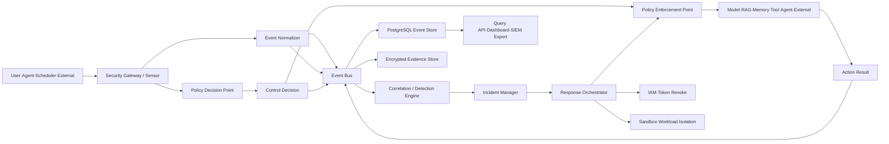
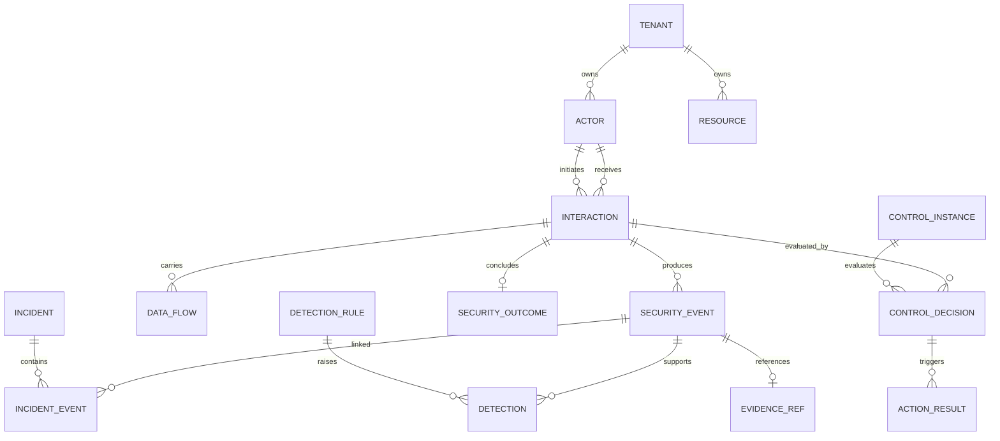
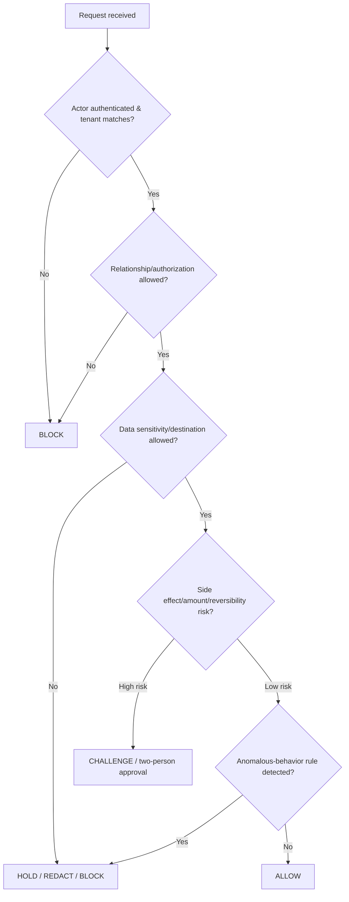
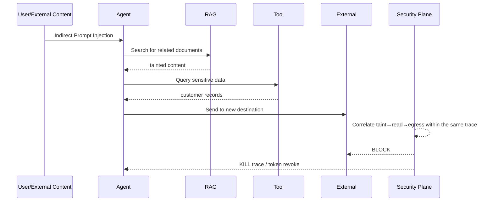

# Agentic AI Security Event DB and Detection/Prevention Platform Plan v1

> 한국어 원문: [01-project-plan.ko.md](01-project-plan.ko.md)

> Reference document: `agentic-위협매트릭스-통합-최종-v3-2026-07.md` v3.3  
> Baseline assumptions: **single AI Agent service MVP → expansion to multi-Agent services**, **PostgreSQL-first**, **staged transition through OBSERVE → SHADOW → ENFORCE**  
> Core objective: build a security control layer that observes communication and data movement among Users, Agents, Sub-agents, MCP/Tools, RAG, Memory, and external systems, evaluates policy against that activity, and — when necessary — blocks, quarantines, or revokes it before execution.

---

## 1. Executive Summary

This platform is not a simple log store. It combines the following four functions into a single traceable flow.

1. **Observation:** Collects requests between Actors, data flows, tool calls, delegations, and external actions as common events.
2. **Decision:** Evaluates a request's identity, authorization, data sensitivity, destination, and expected side effects against policy and detection rules.
3. **Enforcement:** Executes `ALLOW`, `BLOCK`, `HOLD`, `SANITIZE`, `QUARANTINE`, `REVOKE`, and `KILL` on the actual Gateway.
4. **Verification:** Separates the control decision, the result of executing that action, and the attack's final outcome, so that "detected but not blocked" incidents can be identified.

The minimal unit of implementation is:

> **SECURITY_STEP = Source Actor × Relationship × Target Actor/Resource × Interaction × Data Flow × Control Decision × Action Result × Security Outcome**

A single user request can produce multiple `SECURITY_STEP`s, but a `trace_id` and an `incident_id` tie them together into one call chain and one security incident.

---

## 2. Goals and Non-Goals

### 2.1 Goals

- Normalize communication and data exchange between Actors into a single common security event schema.
- Trace the entire call chain: User → Agent → Model/RAG/Memory/Tool/Agent/External.
- Preserve policy decisions and actual action results in an auditable form.
- Correlate chained attacks such as Prompt Injection, Tool Poisoning, credential misuse, A2A spoofing, data exfiltration, and cost blowouts.
- Block high-risk actions before execution, and stop/quarantine already-started work at the trace level.
- Separate production data from simulated-attack data so that detection rate and false-positive rate can be measured correctly.

### 2.2 Non-Goals

- Do not permanently store all raw prompts and responses in plaintext.
- Do not allow authorization, money transfer, deletion, or external exfiltration based on a single LLM verdict alone.
- Do not implement every TG01–TG22 and every standard ID at once in the initial MVP.
- Do not compute an "overall detection rate against all real attacks" from production logs alone.
- This platform does not replace existing IAM, SIEM, DLP, EDR, or API Gateway systems entirely. It provides a security control plane that connects them to the Agent call chain.

---

## 3. Design Principles

1. **Relationship-centric:** Defense is placed at the enforcement point that a relationship between Actors passes through, not on properties of an Actor or asset.
2. **Separate decision from outcome:** A `BLOCK` decision and an actual, successful block are different facts.
3. **Minimize raw content:** The primary DB stores only metadata, hashes, and classification results; raw content is masked or kept in a separate encrypted evidence store.
4. **Determinism first:** Identity, authorization, tenant, destination, amount, and side effects are enforced by code and policy. LLM-based classifiers are used only as supplementary signals.
5. **Trace the full call chain:** Analyze at the level of `trace_id`, `agent_tree_id`, and `delegation_id`, not a single request.
6. **Explicit fail policy:** Define `FAIL_OPEN`, `FAIL_CLOSED`, and `DEGRADE_READ_ONLY` per relationship in advance, for use when a control fails.
7. **Evidence integrity:** Send events to a separate Audit Sink so an Agent cannot modify or drop its own security logs.
8. **Progressive enforcement:** Promote the same rule through OBSERVE, SHADOW, and ENFORCE modes.

---

## 4. Overall System Architecture



### 4.1 Logical Components

| Component | Responsibility | MVP Implementation |
|---|---|---|
| Sensor/SDK | Observes internal steps within the Agent framework **and enforces**: `wrap()` runs `SDK_PROFILE`'s 19 checks (`sdk.py:152`) and raises `GatewayError` under `ENFORCE` (`sdk.py:199`) | Python/TypeScript SDK, OpenTelemetry hook |
| Security Gateway | Relays/blocks requests per relationship | HTTP/gRPC middleware, Tool/RAG adapter |
| Event Normalizer | Converts provider-specific logs into the common schema | Stateless service |
| Policy Decision Point | Evaluates policy, authorization, and risk score | Policy engine + deterministic rules |
| Policy Enforcement Point | Executes block/hold/sanitize/revoke | Embedded in each Gateway **and in the SDK** — three points run the shared check table today: MCP gateway (21 checks), SDK (19), A2A broker (17). They are not equivalent; see §4.2 |
| Event Bus | Asynchronous delivery and reprocessing | MVP writes directly to the DB or uses a lightweight queue; Kafka-compatible at scale |
| Event Store | Data for search, statistics, and correlation | PostgreSQL partitioning |
| Evidence Store | Encrypted raw content, files, and large payloads | S3-compatible Object Storage |
| Detection Engine | Single-event, time-series, and graph rules | SQL/stream rules + optional ML |
| Incident Manager | Merges events into incidents | trace/actor/resource-based correlation |
| Response Orchestrator | Token revocation, trace kill, quarantine | Approvable runbook executor |
| Dashboard/API | Search, statistics, policy operations | REST API + operations UI |

### 4.2 The Three Enforcement Points Share a Mechanism, Not a Scope

Policy judgment is declared once, in `policy.py`'s `CHECKS` table (29 checks). An enforcement point is a `Profile`: which check ids it runs, and what reason code it emits for each. That is the whole of what was unified — **the mechanism, not the coverage.**

| Point | Profile | Checks | Emitted namespace |
|---|---|---|---|
| MCP gateway | `GATEWAY_PROFILE` | 21 | `INTERLOCK-*`, `L1-*` |
| SDK (`wrap()`) | `SDK_PROFILE` | 19 | `INTERLOCK-*`, `L1-*` |
| A2A broker | `A2A_PROFILE` (split into `A2A_LINK_PROFILE` 12 + `A2A_BOUNDARY_PROFILE` 5) | 17 | `A2A-*` |

The three do **not** check the same things, and no statistic should be read as if they did:

- The SDK omits the two M2 definition checks — it never holds a `ToolRevision`. Those are ABSENT at the SDK, not "passed".
- The broker shares only **9** of its 17 checks with the gateway; the other 8 are its own (identity binding, message-part schema, payload presence, and the five boundary checks). Twelve gateway controls have no counterpart on the broker at all — it has **no** egress-destination, export-volume, side-effect, taint, approval or schema control.
- Each point renames what it emits. The same control appears as `L1-M5-TOKEN-AUDIENCE-MISMATCH` at the gateway and `A2A-AUDIENCE-MISMATCH` at the broker. Aggregates keyed on reason code are therefore **not** comparable across points; aggregates keyed on the canonical check id are. Any join between the two must go through `Profile.reason_codes`, never a string match.

Two comparisons genuinely differ rather than merely being renamed, and the difference is a parameter rather than a second check. Both points run the same predicate against `intent.expected_audience` and `intent.expected_resource`; the broker is what *fills those fields*, from `target.identity` and `a2a://{target.id}` respectively (`a2a.py:650-651`), where the MCP gateway takes them from the caller's declared intent.

See [Control Coverage Statistics](specs/2026-07-27-control-coverage-statistics.md) for the design and its explicit limits — in particular that coverage is not safety.

---

## 5. Actor Relationships to Prioritize

### 5.1 MVP Scope

| Relationship ID | Flow | Enforcement Point | Priority Detections |
|---|---|---|---|
| REL-01 | User → Agent | INPUT_GATEWAY | Prompt Injection, session confusion, user impersonation |
| REL-03 | Agent → RAG | RAG_GATEWAY | cross-tenant lookups, RAG poisoning, bulk search |
| REL-05 | Agent → Tool/MCP | MCP_GATEWAY | calls driven by untrusted input, authorization overreach, Tool drift |
| REL-07 | Agent → External | EGRESS_GATEWAY | secret exfiltration, new destinations, money transfer/deletion/email sending |
| REL-12 | All → Observability | AUDIT_SINK | missing logs, Gateway bypass, broken trace |

### 5.2 Extended Scope

| Relationship ID | Flow | Enforcement Point |
|---|---|---|
| REL-02 | Agent → Model | MODEL_ROUTER |
| REL-04 | Agent → Memory | MEMORY_STORE |
| REL-06 | Agent → Agent | A2A_BROKER |
| REL-08 | Operator → Agent | APPROVAL_GATE |
| REL-09 | Scheduler → Agent | TRIGGER_VALIDATOR |
| REL-10 | Agent → Orchestrator | STATE_MACHINE |
| REL-11 | Tool → Runtime/Host | SANDBOX |
| REL-13 | Supply Chain → Runtime | DEPLOY_GATE |

The `EnforcementPoint` enum (`architecture.py:31-47`) additionally carries `DESIGN_LINTER`, `SDK`, and `RESPONSE_ORCHESTRATOR`, which are not tied to a single relationship: the linter runs at compile time over the whole graph, the SDK enforces in-process on whatever link its `wrap()` guards, and the response orchestrator acts after a verdict. There is no `RETRIEVAL_GATEWAY` or `TOOL_GATEWAY` — those are `RAG_GATEWAY` and `MCP_GATEWAY`.

---

## 6. Event Classification System

We do not put all meaning into a single general-purpose log table. We combine a common Envelope with an event-specific Payload.

| Event Type | When It Occurs | Key Question |
|---|---|---|
| `INTERACTION_REQUESTED` | An Actor requests another Actor/Resource | Who requested what from whom |
| `DATA_FLOW_OBSERVED` | Data crosses a Trust Boundary | What sensitive data moved where |
| `CONTROL_EVALUATED` | A control evaluates the request | Which policy decided what, on what basis |
| `CONTROL_COVERAGE_DECLARED` | Declared once per coverage digest (carries no `interaction_id`) | Which checks were armed and which were evaluated for a link |
| `ACTION_EXECUTED` | Block/hold/quarantine/revoke executes | Was the decision actually enforced |
| `INTERACTION_COMPLETED` | The target call ends | Did the request succeed, fail, or partially execute |
| `SECURITY_OUTCOME_SET` | The security outcome is finalized | Was the attack blocked, partially executed, or successful |
| `DETECTION_RAISED` | A rule or model detects an anomaly | Which scenario was detected, on what evidence |
| `INCIDENT_UPDATED` | An incident is created, merged, or its status changes | Which events belong to a single incident |
| `CONTROL_HEALTH_CHANGED` | A control's status changes | Is the control operating normally |
| `POLICY_CHANGED` | Policy is deployed, promoted, or rolled back | Which policy changed, when, and by whom |
| `TEST_EXECUTED` | Simulation, red team, or failure drill | Did the control actually stop the attack or failure |

### 6.1 Common Event Envelope

| Field | Format | Required | Description |
|---|---|---:|---|
| `event_id` | UUIDv7 | Y | Globally unique event ID |
| `event_type` | enum | Y | One of the event types above |
| `schema_version` | string | Y | e.g., `1.0` |
| `occurred_at` | timestamptz | Y | Time the event occurred in the originating system |
| `ingested_at` | timestamptz | Y | Time the event arrived at the ingestion layer |
| `tenant_id` | UUID/string | Y | Tenant isolation key |
| `environment` | enum | Y | `DEV`, `STAGE`, `PROD` |
| `data_source` | enum | Y | `PRODUCTION`, `SIMULATION`, `RED_TEAM`, `TEST` |
| `trace_id` | string | Y | Full call chain |
| `span_id` | string | Y | A single step |
| `parent_span_id` | string | N | Parent step |
| `agent_tree_id` | string | N | Parent/child Agent tree |
| `interaction_id` | UUID | N | Groups request through completion |
| `incident_id` | UUID | N | Groups a security incident |
| `source_actor_id` | UUID | Y | Requesting subject |
| `target_actor_id` | UUID | N | Target Actor |
| `target_resource_id` | UUID | N | Target Resource |
| `relationship_type` | enum | Y | `REQUESTS`, `INVOKES`, `READS`, etc. |
| `relationship_id` | string | Y | REL-01–REL-13 |
| `tg_ids` | string[] | N | TG01–TG22 |
| `scenario_ids` | string[] | N | Detection/test scenarios |
| `severity` | enum | Y | `INFO`, `LOW`, `MEDIUM`, `HIGH`, `CRITICAL` |
| `payload` | JSON object | Y | Event-type-specific data |
| `integrity_hash` | string | Y | Integrity hash of the normalized event |

### 6.2 Relationship Enum

```text
REQUESTS
DELEGATES
INVOKES
READS
WRITES
SENDS
APPROVES
AUTHENTICATES_AS
ROUTES
EXECUTES_ON
DEPLOYS_TO
LOGS_TO
RETURNS_TO
```

### 6.3 Control Decision and Result Enums

```text
CONTROL_DECISION
  ALLOW BLOCK CHALLENGE HOLD SANITIZE QUARANTINE REVOKE DEGRADE KILL ERROR BYPASSED

ACTION_RESULT
  COMPLETED FAILED TIMED_OUT PARTIAL NOT_APPLICABLE

SECURITY_OUTCOME
  ATTEMPTED BLOCKED PARTIALLY_EXECUTED SUCCEEDED UNKNOWN FALSE_POSITIVE SIMULATED
```

---

## 7. Standard JSON Event Examples

### 7.1 Agent → Tool Request

```json
{
  "event_id": "019ba1d0-09af-7f90-9da1-5d57916dce11",
  "event_type": "INTERACTION_REQUESTED",
  "schema_version": "1.0",
  "occurred_at": "2026-07-15T10:21:31.123Z",
  "ingested_at": "2026-07-15T10:21:31.129Z",
  "tenant_id": "tenant-a",
  "environment": "PROD",
  "data_source": "PRODUCTION",
  "trace_id": "trace-4cf8",
  "span_id": "span-tool-17",
  "parent_span_id": "span-agent-03",
  "agent_tree_id": "tree-91",
  "interaction_id": "019ba1d0-08cd-7a04-b918-840b8e52cc02",
  "source_actor_id": "agent-customer-support",
  "target_actor_id": "tool-send-email",
  "relationship_type": "INVOKES",
  "relationship_id": "REL-05",
  "tg_ids": ["TG07", "TG08", "TG20", "TG22"],
  "severity": "INFO",
  "payload": {
    "mcp": {
      "method": "tools/call",
      "serverId": "tenant-a/prod/trusted-mail"
    },
    "toolDefinition": {
      "toolId": "tenant-a/prod/trusted-mail:send_email",
      "revisionId": "tenant-a/prod/trusted-mail:send_email@sha256:db69ee4e..."
    },
    "invocation": {
      "purpose": "reply",
      "argumentsHash": "sha256:d65a89b1083ffc3eab7484b78bb20db3d40b0fb42b39d4ae66dd561394b8e892"
    }
  },
  "integrity_hash": "sha256:..."
}
```

Payload keys are **lowerCamelCase**, and the intent's data classes, destinations, taint labels and content hash are not in this event — they are in the separate `DATA_FLOW_OBSERVED` that immediately follows, under the same `interaction_id`:

```json
{
  "event_type": "DATA_FLOW_OBSERVED",
  "payload": {
    "dataClasses": ["D7"],
    "destinations": ["user@attacker.example"],
    "taintLabels": ["UNTRUSTED_RAG_CONTENT"],
    "contentHash": "sha256:d65a89b1..."
  }
}
```

The SDK emits the same two event types with a **narrower** `INTERACTION_REQUESTED` payload — `{"argumentsHash": …, "purpose": …}` (`sdk.py:139`), with no `mcp` or `toolDefinition` block, because the SDK holds no `ToolRevision`. Its `DATA_FLOW_OBSERVED` is identical in shape to the gateway's.

### 7.2 Control Decision

Captured from a real run: a tainted `EXTERNAL_WRITE` to an unlisted destination, under `mode: ENFORCE`.

```json
{
  "event_type": "CONTROL_EVALUATED",
  "trace_id": "trace-4cf8",
  "interaction_id": "019ba1d0-08cd-7a04-b918-840b8e52cc02",
  "relationship_id": "REL-05",
  "severity": "HIGH",
  "payload": {
    "toolDefinition": {
      "toolId": "tenant-a/prod/trusted-mail:send_email",
      "revisionId": "tenant-a/prod/trusted-mail:send_email@sha256:db69ee4e...",
      "observedDigest": "sha256:db69ee4e...",
      "approvedDigest": "sha256:db69ee4e...",
      "state": "ACTIVE"
    },
    "authorization": {
      "credentialFingerprint": "[REDACTED]",
      "issuer": null,
      "audience": null,
      "resource": null
    },
    "control": {
      "policyId": "mcp-tool-invoke-default",
      "policyVersion": "1.0.0",
      "mode": "ENFORCE",
      "decision": "BLOCK",
      "reasonCodes": [
        "L1-M9-NEW-DESTINATION",
        "INTERLOCK-TAINTED-EXTERNAL-WRITE"
      ],
      "actualEnforced": true,
      "enforcementPoint": "MCP_GATEWAY",
      "evaluatedProfile": "sha256:7a1c...",
      "flaggedChecks": ["L1-M9-NEW-DESTINATION", "INTERLOCK-TAINTED-EXTERNAL-WRITE"]
    }
  }
}
```

Five things to read off this event rather than from memory:

- **The verdict nests under `payload.control`**, not at the payload root. `mode` (what the policy was configured to do) and `actualEnforced` (what was actually enforced) are separate fields, so a SHADOW evaluation is distinguishable from an enforced one without composing it from anything else.
- **`reasonCodes` are the real emitted strings.** There is no `risk_score`, `evaluation_ms`, `control_instance_id` or `required_action` field. Earlier revisions of this document showed `UNTRUSTED_DATA_TO_EXTERNAL_WRITE`, `NEW_DESTINATION` and `PII_PRESENT`; none of those strings exists anywhere in `src/`.
- **`INTERLOCK-TAINTED-EXTERNAL-WRITE` is newly reachable at the gateway** on this branch — it previously existed only in the SDK.
- **The SDK emits the same nested `payload.control` block** so one reducer handles both, but with **no** `toolDefinition` or `authorization` sibling. The same call through `wrap()` yields `reasonCodes: ["L1-M9-NEW-DESTINATION", "INTERLOCK-TAINTED-EXTERNAL-WRITE", "INTERLOCK-APPROVAL-REQUIRED"]` — the third code appears because the SDK cannot satisfy an approval; see [02 Developer Framework Design](02-developer-framework-design.md) §4.2.
- **A matching `CONTROL_COVERAGE_DECLARED` event carries what `evaluatedProfile` means** — the checks armed and evaluated for this link, keyed by the same digest.

### 7.3 Action Failure and Attack Success

```json
{
  "event_type": "ACTION_EXECUTED",
  "trace_id": "trace-4cf8",
  "interaction_id": "019ba1d0-08cd-7a04-b918-840b8e52cc02",
  "payload": {
    "result": "FAILED",
    "connectorExecutionId": "8f2c1e40-...",
    "failure": "connector timed out after 30s"
  }
}
```

```json
{
  "event_type": "SECURITY_OUTCOME_SET",
  "trace_id": "trace-4cf8",
  "payload": {
    "securityOutcome": "PARTIALLY_EXECUTED",
    "connectorExecutionId": "8f2c1e40-..."
  }
}
```

`result` is an `ActionResult` (`COMPLETED`, `FAILED`, `TIMED_OUT`, `PARTIAL`, `NOT_APPLICABLE`) and `securityOutcome` a `SecurityOutcome` (`ATTEMPTED`, `BLOCKED`, `PARTIALLY_EXECUTED`, `SUCCEEDED`, `UNKNOWN`, `FALSE_POSITIVE`, `SIMULATED`), both in `models.py`. `_append_outcome` accepts arbitrary `**extra` keys, so an effect list or compensation flag can be carried, but neither is a fixed field and neither is populated by `src/` today.

> **Known reporting defect, SDK path only.** When `wrap()` refuses an invocation it appends `ACTION_EXECUTED` with `{"result": "COMPLETED", "connectorExecutionId": null}` before `SECURITY_OUTCOME_SET: BLOCKED` and raising (`sdk.py:193-199`). The action never ran. This predates the unified-engine work (it arrived with `8ef67b0`) and is called out here because DET-012 — "downstream success event after a BLOCK decision" — is exactly the rule this shape trips. Distinguish the two with `connectorExecutionId`, which is `null` only on the refused path; do not treat SDK `result: COMPLETED` alone as evidence of execution.

---

## 8. Database Logical Model



### 8.1 Table Roles

| Table | Role |
|---|---|
| `tenants` | Tenant and retention/encryption policy |
| `actors` | Catalog of execution subjects: User, Agent, Tool, IdP, etc. |
| `resources` | Catalog of assets: Prompt, Memory, RAG, Credential, Data, etc. |
| `interactions` | Relationship unit from request through completion |
| `security_events` | Common append-only event ledger |
| `data_flows` | Source, destination, sensitivity, and size of data movement |
| `control_instances` | Actually deployed control instances and their status |
| `control_policies` | Policy versions and deployment status |
| `control_decisions` | Per-request decision, reasoning, and risk score |
| `action_results` | Actual execution results of block/revoke/quarantine |
| `security_outcomes` | Final result of the attack and its side effects |
| `detection_rules` | Version-controlled detection rules |
| `detections` | Detections raised by rules, with evidence |
| `incidents` | Incidents that group multiple events |
| `incident_events` | N:M linkage between incidents and events |
| `evidence_refs` | Location, hash, and retention period of encrypted raw evidence |
| `ingest_errors` | Normalization failures, schema violations, candidate data loss |

---

## 9. PostgreSQL MVP DDL

> The following is an implementation starting point. Before going to production, manage it as migrations tailored to your organization's PostgreSQL version, tenant key format, and personal data policy.

```sql
CREATE EXTENSION IF NOT EXISTS pgcrypto;

CREATE TABLE tenants (
    tenant_id          text PRIMARY KEY,
    name               text NOT NULL,
    retention_days     integer NOT NULL DEFAULT 90,
    evidence_enabled   boolean NOT NULL DEFAULT false,
    created_at         timestamptz NOT NULL DEFAULT now()
);

CREATE TABLE actors (
    actor_id            text PRIMARY KEY,
    tenant_id           text NOT NULL REFERENCES tenants(tenant_id),
    actor_type          text NOT NULL CHECK (actor_type IN (
        'USER','ATTACKER','INSIDER','OPERATOR','AGENT','SUBAGENT',
        'EXTERNAL_AGENT','TOOL','ORCHESTRATOR','SCHEDULER','IDP',
        'PIPELINE','CONTROL_PLANE'
    )),
    display_name        text,
    owner_team          text,
    trust_level         text NOT NULL DEFAULT 'UNVERIFIED',
    identity_subject    text,
    attributes          jsonb NOT NULL DEFAULT '{}',
    active              boolean NOT NULL DEFAULT true,
    created_at          timestamptz NOT NULL DEFAULT now(),
    UNIQUE (tenant_id, identity_subject)
);

CREATE TABLE resources (
    resource_id         text PRIMARY KEY,
    tenant_id           text NOT NULL REFERENCES tenants(tenant_id),
    resource_type       text NOT NULL CHECK (resource_type IN (
        'PROMPT','SESSION','MEMORY','RAG','TOOL_DEFINITION','CREDENTIAL',
        'RUNTIME','LOG','SUPPLY_CHAIN','DATA','BUDGET','OTHER'
    )),
    owner_actor_id      text REFERENCES actors(actor_id),
    sensitivity         text NOT NULL DEFAULT 'INTERNAL',
    tg_ids              text[] NOT NULL DEFAULT '{}',
    attributes          jsonb NOT NULL DEFAULT '{}',
    created_at          timestamptz NOT NULL DEFAULT now()
);

CREATE TABLE interactions (
    interaction_id      uuid PRIMARY KEY DEFAULT gen_random_uuid(),
    tenant_id           text NOT NULL REFERENCES tenants(tenant_id),
    trace_id            text NOT NULL,
    span_id             text NOT NULL,
    parent_span_id      text,
    agent_tree_id       text,
    delegation_id       text,
    source_actor_id     text NOT NULL REFERENCES actors(actor_id),
    target_actor_id     text REFERENCES actors(actor_id),
    target_resource_id  text REFERENCES resources(resource_id),
    relationship_id     text NOT NULL,
    relationship_type   text NOT NULL,
    operation           text NOT NULL,
    purpose             text,
    state               text NOT NULL DEFAULT 'REQUESTED',
    requested_at        timestamptz NOT NULL,
    completed_at        timestamptz,
    attributes          jsonb NOT NULL DEFAULT '{}',
    UNIQUE (tenant_id, trace_id, span_id)
);

CREATE TABLE security_events (
    event_id            uuid NOT NULL DEFAULT gen_random_uuid(),
    occurred_at         timestamptz NOT NULL,
    ingested_at         timestamptz NOT NULL DEFAULT now(),
    event_type          text NOT NULL,
    schema_version      text NOT NULL,
    tenant_id           text NOT NULL,
    environment         text NOT NULL,
    data_source         text NOT NULL,
    trace_id            text NOT NULL,
    span_id             text,
    parent_span_id      text,
    agent_tree_id       text,
    interaction_id      uuid,
    incident_id         uuid,
    source_actor_id     text,
    target_actor_id     text,
    target_resource_id  text,
    relationship_id     text,
    relationship_type   text,
    tg_ids              text[] NOT NULL DEFAULT '{}',
    scenario_ids        text[] NOT NULL DEFAULT '{}',
    severity            text NOT NULL,
    payload             jsonb NOT NULL,
    integrity_hash      text NOT NULL,
    PRIMARY KEY (occurred_at, event_id)
) PARTITION BY RANGE (occurred_at);

CREATE TABLE security_events_2026_07
    PARTITION OF security_events
    FOR VALUES FROM ('2026-07-01') TO ('2026-08-01');

CREATE INDEX security_events_trace_idx
    ON security_events (tenant_id, trace_id, occurred_at);
CREATE INDEX security_events_actor_idx
    ON security_events (tenant_id, source_actor_id, occurred_at DESC);
CREATE INDEX security_events_type_idx
    ON security_events (tenant_id, event_type, occurred_at DESC);
CREATE INDEX security_events_payload_gin_idx
    ON security_events USING gin (payload jsonb_path_ops);

CREATE TABLE data_flows (
    data_flow_id        uuid PRIMARY KEY DEFAULT gen_random_uuid(),
    tenant_id           text NOT NULL REFERENCES tenants(tenant_id),
    interaction_id      uuid NOT NULL REFERENCES interactions(interaction_id),
    occurred_at         timestamptz NOT NULL,
    source_resource_id  text REFERENCES resources(resource_id),
    destination_type    text NOT NULL,
    destination_id      text,
    direction           text NOT NULL CHECK (direction IN ('INBOUND','OUTBOUND','INTERNAL')),
    content_type        text,
    data_classes        text[] NOT NULL DEFAULT '{}',
    sensitivity         text NOT NULL,
    byte_size           bigint,
    record_count        bigint,
    content_hash        text,
    taint_labels        text[] NOT NULL DEFAULT '{}',
    raw_stored          boolean NOT NULL DEFAULT false,
    evidence_ref_id     uuid,
    attributes          jsonb NOT NULL DEFAULT '{}'
);

CREATE TABLE control_instances (
    control_instance_id text PRIMARY KEY,
    tenant_id           text NOT NULL REFERENCES tenants(tenant_id),
    control_catalog_id  text NOT NULL,
    enforcement_point   text NOT NULL,
    mode                text NOT NULL CHECK (mode IN ('OBSERVE','SHADOW','ENFORCE')),
    status              text NOT NULL CHECK (status IN ('HEALTHY','DEGRADED','FAILED','DISABLED')),
    policy_version      text,
    last_heartbeat_at   timestamptz,
    attributes          jsonb NOT NULL DEFAULT '{}'
);

CREATE TABLE control_policies (
    policy_id           text NOT NULL,
    version             text NOT NULL,
    tenant_id           text NOT NULL REFERENCES tenants(tenant_id),
    status              text NOT NULL CHECK (status IN ('DRAFT','TESTING','ACTIVE','RETIRED')),
    definition          jsonb NOT NULL,
    definition_hash     text NOT NULL,
    approved_by         text,
    activated_at        timestamptz,
    created_at          timestamptz NOT NULL DEFAULT now(),
    PRIMARY KEY (policy_id, version, tenant_id)
);

CREATE TABLE control_decisions (
    decision_id         uuid PRIMARY KEY DEFAULT gen_random_uuid(),
    tenant_id           text NOT NULL REFERENCES tenants(tenant_id),
    interaction_id      uuid NOT NULL REFERENCES interactions(interaction_id),
    control_instance_id text NOT NULL REFERENCES control_instances(control_instance_id),
    policy_id           text NOT NULL,
    policy_version      text NOT NULL,
    decided_at          timestamptz NOT NULL,
    decision            text NOT NULL,
    reason_codes        text[] NOT NULL DEFAULT '{}',
    risk_score          numeric(5,2),
    confidence          numeric(5,4),
    evaluation_ms       integer,
    input_fingerprint   text,
    details             jsonb NOT NULL DEFAULT '{}'
);

CREATE TABLE action_results (
    action_result_id    uuid PRIMARY KEY DEFAULT gen_random_uuid(),
    tenant_id           text NOT NULL REFERENCES tenants(tenant_id),
    decision_id         uuid NOT NULL REFERENCES control_decisions(decision_id),
    interaction_id      uuid NOT NULL REFERENCES interactions(interaction_id),
    action_type         text NOT NULL,
    action_result       text NOT NULL,
    started_at          timestamptz NOT NULL,
    completed_at        timestamptz,
    failure_reason      text,
    external_reference  text,
    details             jsonb NOT NULL DEFAULT '{}'
);

CREATE TABLE security_outcomes (
    outcome_id          uuid PRIMARY KEY DEFAULT gen_random_uuid(),
    tenant_id           text NOT NULL REFERENCES tenants(tenant_id),
    interaction_id      uuid REFERENCES interactions(interaction_id),
    trace_id            text NOT NULL,
    determined_at       timestamptz NOT NULL,
    outcome             text NOT NULL,
    effects             text[] NOT NULL DEFAULT '{}',
    confidentiality     boolean NOT NULL DEFAULT false,
    integrity           boolean NOT NULL DEFAULT false,
    availability        boolean NOT NULL DEFAULT false,
    financial_impact    numeric(18,2),
    compensation_needed boolean NOT NULL DEFAULT false,
    determination       text NOT NULL DEFAULT 'AUTOMATED',
    details             jsonb NOT NULL DEFAULT '{}'
);

CREATE TABLE incidents (
    incident_id         uuid PRIMARY KEY DEFAULT gen_random_uuid(),
    tenant_id           text NOT NULL REFERENCES tenants(tenant_id),
    title               text NOT NULL,
    status              text NOT NULL CHECK (status IN (
        'OPEN','TRIAGED','CONTAINING','RECOVERING','CLOSED','FALSE_POSITIVE'
    )),
    severity            text NOT NULL,
    primary_scenario_id text,
    first_seen_at       timestamptz NOT NULL,
    last_seen_at        timestamptz NOT NULL,
    owner               text,
    summary             text,
    attributes          jsonb NOT NULL DEFAULT '{}'
);

CREATE TABLE incident_events (
    incident_id         uuid NOT NULL REFERENCES incidents(incident_id),
    event_id            uuid NOT NULL,
    event_occurred_at   timestamptz NOT NULL,
    role                text NOT NULL DEFAULT 'EVIDENCE',
    PRIMARY KEY (incident_id, event_id, event_occurred_at),
    FOREIGN KEY (event_occurred_at, event_id)
        REFERENCES security_events(occurred_at, event_id)
);

CREATE TABLE evidence_refs (
    evidence_ref_id     uuid PRIMARY KEY DEFAULT gen_random_uuid(),
    tenant_id           text NOT NULL REFERENCES tenants(tenant_id),
    event_id            uuid NOT NULL,
    event_occurred_at   timestamptz NOT NULL,
    storage_uri         text NOT NULL,
    content_hash        text NOT NULL,
    encryption_key_ref  text NOT NULL,
    redaction_status    text NOT NULL,
    expires_at          timestamptz NOT NULL,
    legal_hold          boolean NOT NULL DEFAULT false,
    access_policy       jsonb NOT NULL,
    FOREIGN KEY (event_occurred_at, event_id)
        REFERENCES security_events(occurred_at, event_id)
);
```

### 9.1 DDL Operational Notes

- Auto-generate monthly partitions, and drop them by partition when the retention period ends.
- Reject events without a `tenant_id` at the ingest stage.
- Do not allow application accounts to UPDATE/DELETE `security_events`.
- Use JSONB only for extension fields; keep fields used as statistical denominators as regular columns.
- On DB failure, retain the original events in a local bounded spool or the Event Bus and retransmit them.
- Remove event duplicates using `event_id` and the producer sequence.
- As analytical volume grows over time, keep catalog/policy/incident in PostgreSQL and replicate event facts to ClickHouse.

### 9.2 Tenant Isolation and Immutability (RLS / Append-Only)

Tenant isolation is doubly enforced by DB policy, not by an application-level filter. Apply the pattern below to every fact/catalog table that has a `tenant_id`. `security_events` is used as the example.

```sql
-- The trusted tenant is not a GUC that can be freely changed within a session;
-- it is derived from the session_user of the authenticated connection. It cannot be changed via SET/SET ROLE.
CREATE TABLE role_tenant (        -- application role → tenant binding (connection = authentication boundary)
    role_name text PRIMARY KEY,
    tenant_id text NOT NULL REFERENCES tenants(tenant_id)
);

CREATE FUNCTION current_tenant() RETURNS text LANGUAGE sql STABLE
SECURITY DEFINER SET search_path = pg_catalog, public AS
$$ SELECT tenant_id FROM role_tenant WHERE role_name = session_user $$;
REVOKE ALL ON FUNCTION current_tenant() FROM PUBLIC;

-- Tenant isolation. FORCE applies RLS even to the "table owner."
--   However, superuser and roles with the BYPASSRLS attribute can still bypass it,
--   so do not grant that attribute to application/migration roles (CORE-SIM-TENANT-004).
ALTER TABLE security_events ENABLE ROW LEVEL SECURITY;
ALTER TABLE security_events FORCE  ROW LEVEL SECURITY;
CREATE POLICY tenant_isolation ON security_events
    USING (tenant_id = current_tenant())
    WITH CHECK (tenant_id = current_tenant());
-- session_user is fixed to the authenticated connection, so the tenant cannot be changed via a custom GUC or SET ROLE.

-- Immutability (append-only). Enforced in two layers.
--   (1) RBAC: revoke UPDATE/DELETE from the writer role → permission denied (before the trigger is reached)
--   (2) trigger: raises an append-only-violation exception even for a role that has UPDATE privilege
-- app_writer and the test role are pre-created at deployment time (a precondition of this block).
REVOKE UPDATE, DELETE ON security_events FROM app_writer;
GRANT  INSERT, SELECT ON security_events TO app_writer;
CREATE FUNCTION deny_event_mutation() RETURNS trigger LANGUAGE plpgsql AS
$$ BEGIN RAISE EXCEPTION 'security_events is append-only'; END $$;
CREATE TRIGGER security_events_no_mutation
    BEFORE UPDATE OR DELETE ON security_events
    FOR EACH ROW EXECUTE FUNCTION deny_event_mutation();
```

> **Why we don't trust the session GUC.** PostgreSQL accepts arbitrary two-tier custom parameters, so relying on `current_setting('app.tenant_id')` lets an application role cross the boundary with `SET app.tenant_id='another-tenant'` (even if `SECURITY DEFINER` sets the value, it cannot subsequently prevent a direct `SET`). That's why the executable migration derives the tenant from **`session_user`, which is fixed to the authenticated connection**. `current_user` can be changed via `SET ROLE`, so it is not used as the fixed identifier of the authenticated subject. If the role count becomes burdensome at large-scale multi-tenancy, replace this with a trusted connection-layer context that the application cannot forge or reset (a dedicated proxy or extension), but you must prove with a test that "the app cannot change the value." For the executable reduced migration and API contract, see [12 PostgreSQL Ledger API](12-postgresql-ledger-api.md).

- Events without a `tenant_id` are rejected at ingest and recorded in `ingest_errors`.
- Evidence lookups also cannot cross the tenant boundary (§15.2); the lookup itself is recorded as a separate security event.
- Coverage of this isolation is **partial**, and the gap is stated precisely in [05 L1 Security Validation Plan](05-l1-security-validation-plan.md) §10. In short: `CORE-SIM-TENANT-001` and `002` are exercised against a live PostgreSQL by `tests/test_postgres_ledger.py`; `003` (append-only trigger) and `004` (RLS-bypass attribute) are **not tested at all** — their only evidence is a substring match on the text of the migration file. Do not read the append-only trigger as verified.

---

## 10. Collection and Normalization

### 10.1 Collection Points

| Location | Values That Must Be Collected |
|---|---|
| Agent SDK | task, plan step, model/tool selection, sub-agent creation, trace |
| Input Gateway | user identity, session, input provenance, taint |
| Model Router | model ID/version, prompt template version, token usage |
| RAG Gateway | subject/tenant, query, filters, returned document ID/ACL |
| Memory Gateway | writer, source, TTL, memory version, read/write |
| Tool Gateway | manifest digest, tool args hash, authorization, destination, side effects |
| A2A Broker | card digest, sender/receiver, delegation, nonce, hop |
| Egress Gateway | destination, data class, byte size, transaction effect |
| Identity Provider | actor, audience, scope, issue/revoke, token lineage |
| Sandbox/Runtime | process, filesystem, network, child process, exit |
| Audit Sink | expected producer, sequence gap, heartbeat, ingest lag |

### 10.2 Data Normalization Order

```text
receive → producer authentication → schema validation → tenant enforcement → time correction
→ Actor/Resource resolve → sensitive-data detection/masking → hash generation
→ TG/relationship tagging → storage/policy evaluation → correlation
```

Schema-violating events are not silently dropped. Record the producer, error, and original hash in `ingest_errors`, and if this repeats on a high-risk relationship, raise `CONTROL_HEALTH_CHANGED` and a bypass detection.

### 10.3 OpenTelemetry Integration

- Propagate the W3C `traceparent` across Agent, Gateway, and Tool calls.
- If an external tool doesn't support tracing, the Gateway generates the span.
- `trace_id` is a security correlation key, not an authentication mechanism.
- Do not trust a trace ID received from outside as-is; rebind it at the tenant boundary.

---

## 11. Policy Decision and Enforcement

### 11.1 Decision Sequence



### 11.2 Fail Policy by Relationship

| Relationship | Default Fail Policy | Reason |
|---|---|---|
| User → Agent read | Limited `FAIL_OPEN` or `DEGRADE` | Low side effect |
| Agent → RAG | `FAIL_CLOSED` | Leak risk without a tenant/ACL decision |
| Agent → Memory write | `FAIL_CLOSED` | Risk of persistent poisoning |
| Agent → Tool read | Per tool tier | Whether sensitive data is accessed |
| Agent → Tool write | `FAIL_CLOSED` | External side effect |
| Agent → External | `FAIL_CLOSED` | Risk of exfiltration, money transfer, or sending |
| Scheduler → Agent | `FAIL_CLOSED` | Unsupervised repeated execution |
| All → Audit | High-risk actions `DEGRADE_READ_ONLY` | Writes prohibited while observation is unavailable |

### 11.3 Policy Modes

| Mode | Decision | Actual Enforcement | Purpose |
|---|---|---|---|
| OBSERVE | Log only | None | Baseline collection |
| SHADOW | Hypothetical block decision | Allow | Measure impact/false positives |
| ENFORCE | Real decision | Block/hold/sanitize | Production defense |

Promotion criteria are not simply elapsed time but simulation recall, false positives on normal traffic, p95 decision latency, bypass rate, and rollback readiness.

---

## 12. MVP Detection Rules

| Rule ID | Relationship | Detection Condition | Default Action | Target |
|---|---|---|---|---|
| DET-001 | REL-01 | Command pattern in untrusted content + high-risk intent | taint, HOLD | TG01 |
| DET-002 | REL-03 | Subject tenant and search tenant mismatch | BLOCK | TG06/TG18 |
| DET-003 | REL-03 | Broad document/vector enumeration in a short time | rate limit, HOLD | TG06/TG22 |
| DET-004 | REL-05 | Untrusted taint passed as an `EXTERNAL_WRITE` Tool argument | BLOCK (see §12.1) | TG09/TG20 |
| DET-005 | REL-05 | Approved manifest digest and execution digest mismatch | QUARANTINE | TG07/TG08 |
| DET-006 | REL-05 | Tool scope requested wider than the Agent's authorization | BLOCK | TG13 |
| DET-007 | REL-07 | New external destination + PII/SECRET | BLOCK/approval | TG20/TG22 |
| DET-008 | REL-07 | Bulk outbound unrelated to the request's purpose | KILL trace | TG20/TG22 |
| DET-009 | REL-12 | Agent log present but no Gateway log | BYPASS incident | TG17 |
| DET-010 | REL-12 | Producer sequence gap or lost heartbeat | Halt high-risk writes | TG17 |
| DET-011 | Trace | Sub-agent fan-out, retries, cost spike | circuit break | TG10/TG21 |
| DET-012 | Trace | Downstream success event after a BLOCK decision | CRITICAL incident | TG17/TG20 |

### 12.1 Rule Definition Example

This is the **target** shape for a declarative rule definition. The rule language does not exist yet; DET-004 is implemented today as a hard-coded check, and the two differ. Read the implemented behaviour first.

**As implemented** — `_tainted_external_write` (`policy.py:238-243`), check id `INTERLOCK-TAINTED-EXTERNAL-WRITE`:

```python
if context.intent.estimated_side_effect != SideEffect.EXTERNAL_WRITE:
    return None                     # DESTRUCTIVE_WRITE is not covered by this control
if not context.intent.taint_labels:
    return ()
return (("INTERLOCK-TAINTED-EXTERNAL-WRITE", ControlDecision.BLOCK),)
```

Three differences from the aspiration below, each of which matters operationally:

1. **The verdict is `BLOCK`, not `HOLD`.** It is unconditional and not configurable through a `LinkPolicy` action field. There is no reversible wait and nothing to approve.
2. **`approval_valid` is never read.** The `unless: valid_operator_approval` arm is not implemented by this control. A held-then-approved flow is served by a *different* check, `INTERLOCK-APPROVAL-REQUIRED` (`_approval`, `policy.py:246-249`), which does read `approval_valid` and does emit `HOLD`.
3. **`DESTRUCTIVE_WRITE` is not covered.** The check returns `None` for every side effect other than `EXTERNAL_WRITE`, so a tainted destructive write is INAPPLICABLE here, not blocked.

Note this control is **newly live at the MCP gateway**. It previously existed only in `sdk.py`; promoting it to the shared table put it in `GATEWAY_PROFILE`, and it is production-reachable because `mcp_transport.py:148` forwards caller-supplied `taint_labels` into the intent. A tainted external write that passed at the gateway before now blocks.

**As aspired** (not implemented — no rule engine consumes this):

```yaml
rule_id: DET-004
version: 1.0.0
status: PROPOSED          # no rule engine reads this file
relationship_ids: [REL-05]
when:
  all:
    - payload.taint_labels contains UNTRUSTED_INPUT
    - payload.estimated_side_effect in [EXTERNAL_WRITE, DESTRUCTIVE_WRITE]
unless:
  - valid_operator_approval == true
decision: HOLD
reason_code: UNTRUSTED_DATA_TO_HIGH_IMPACT_TOOL   # not emitted anywhere in src/
tg_ids: [TG09, TG20]
test_cases:
  - SIM-DET-004-ALLOW-001
  - SIM-DET-004-BLOCK-001
```

---

## 13. Chained Attack Correlation

We do not judge an Agent attack from a single detection alone. The following keys are used to build a graph.

- `trace_id`: the end-to-end path of a single request
- `agent_tree_id`: lineage of the primary Agent and its Sub-agents
- `delegation_id`: delegation credential and hop
- `interaction_id`: request–decision–completion
- `resource_id`: access to the same Memory/RAG/Credential
- `destination_id`: the same external destination

### 13.1 Representative Correlation Scenario



### 13.2 Incident Merge Rules

- Related detections occurring within 5 minutes on the same trace are merged into a single Incident by default.
- Even across different traces, the same compromised actor, credential, memory, or destination makes detections a merge candidate.
- Automatic merges must leave a reason code, and an operator must be able to split them apart.
- The same event can be linked to multiple Incidents, but a representative Incident is designated.

---

## 14. Automated Response Runbooks

| Response ID | Action | Precondition | Verification |
|---|---|---|---|
| RESP-01 | `BLOCK_INTERACTION` | Gateway has not yet dispatched | Absence of a downstream completion event |
| RESP-02 | `HOLD_FOR_APPROVAL` | Reversible wait is possible | Approval expiry/signature verification |
| RESP-03 | `REVOKE_CREDENTIAL_LINEAGE` | Delegation/token lineage exists | Confirm revocation across all audiences |
| RESP-04 | `KILL_TRACE` | agent_tree/queue work is identifiable | Confirm termination of child work |
| RESP-05 | `QUARANTINE_TOOL` | Tool digest/instance identified | Zero new calls, cache purged |
| RESP-06 | `ISOLATE_WORKLOAD` | Sandbox/runtime control available | Confirm network/process blocked |
| RESP-07 | `ROLLBACK_MEMORY` | A safe snapshot exists | Remove data derived from the poisoning |
| RESP-08 | `BLOCK_DESTINATION` | Egress gateway control available | DNS/IP/URL bypass test |
| RESP-09 | `DEGRADE_READ_ONLY` | Observation/policy failure | Zero writes/external sends |

Two notes on what backs RESP-02 today. The only control that emits `HOLD` off an approval state is `INTERLOCK-APPROVAL-REQUIRED` (`_approval`, `policy.py:246-249`), and the only approval-granting API is `MCPToolGateway.grant_approval` (`gateway.py:140`). `INTERLOCK-TAINTED-EXTERNAL-WRITE` is **not** part of this runbook despite DET-004's wording: it returns an unconditional `BLOCK` and never reads `approval_valid` (see §12.1).

RESP-09's `DEGRADE_READ_ONLY` is a declarable `FailureMode` value with **no consumer in `src/`**. `LinkPolicy.failure_mode` is read at runtime in exactly one place, `egress.py:145`, which tests for `FAIL_CLOSED`; every other reference is design-time lint or serialisation. Declaring `DEGRADE_READ_ONLY` on a link changes no runtime behaviour today.

Automated response does not end with recording the `decision`. Each Runbook must generate an `action_result` and an independent verification event.

---

## 15. Personal Data, Evidence, and Log Integrity

### 15.1 Storage Defaults

| Data | Default Storage |
|---|---|
| Prompt/response raw content | Not stored, or masked immediately |
| Tool arguments | Structured fields, hash, sensitivity — only the fields needed |
| RAG documents | Document ID/version/ACL/hash, excluding body content |
| Credential | Never store the raw value; only token ID/scope/audience |
| File | hash/MIME/size/scan result; raw content in isolated storage |
| External destination | Normalized domain/service/account |
| Approval | Approver, target, diff hash, expiry, signature |

### 15.2 Evidence Storage Principles

- Raw evidence is encrypted with a per-tenant key.
- The DB stores only the URI, hash, key reference, and retention period.
- Evidence lookups themselves are recorded as a separate security event.
- Legal hold and general retention are kept separate.
- Apply RLS or a separate DB boundary so that even administrators cannot search across tenants.

### 15.3 Integrity

- Apply producer authentication and event signing or mTLS.
- Store the canonical JSON hash of the event.
- Detect gaps using a per-producer monotonic sequence.
- Optionally use a hash chain over a fixed interval, or external WORM storage.

---

## 16. API Draft

| Method | Path | Purpose |
|---|---|---|
| POST | `/v1/events` | Ingest normalized events |
| POST | `/v1/interactions/evaluate` | Synchronous policy decision |
| POST | `/v1/actions/{decision_id}/result` | Report enforcement result |
| POST | `/v1/outcomes` | Finalize security outcome |
| GET | `/v1/traces/{trace_id}` | Query call chain |
| GET | `/v1/incidents` | Search incidents |
| POST | `/v1/incidents/{id}/responses` | Execute response Runbook |
| GET | `/v1/controls/health` | Query control status |
| POST | `/v1/rules/{id}/simulate` | Test a rule against historical events |

The current executable contract for `POST /v1/events` and `GET /v1/traces/{trace_id}` is in [12 PostgreSQL Ledger API](12-postgresql-ledger-api.md) and [`ledger-api.openapi.yaml`](../schemas/ledger-api.openapi.yaml). Mutations combine the authenticated principal, tenant, and idempotency key. Synchronous decision APIs must have a short timeout and an idempotency key. Behavior on timeout is not left to the request; it is determined by the per-relationship fail policy.

---

## 17. Statistics and Dashboard

### 17.1 Operational Metrics

| Metric | Definition |
|---|---|
| Control coverage rate | Requests that passed through a control ÷ requests that should have |
| Gateway bypass rate | Direct calls to the target system ÷ total calls |
| Block enforcement success rate | `ACTION_RESULT=COMPLETED` ÷ block-family decisions |
| Partial execution rate | `PARTIALLY_EXECUTED` ÷ attack attempts |
| Decision latency | p50/p95/p99 per relationship/control |
| Trace completeness | Share of traces with all required spans |
| Token revocation propagation time | From revoke request to final audience invalidation |
| Incident MTTD | From the first malicious step to the first detection |
| Incident MTTC | From first detection to containment complete |
| Policy false-positive rate | Share of labeled normal requests that were blocked/held |
| Cost defense effect | Estimated blocked cost / actual cost saved |

### 17.2 Analytical SQL Examples

```sql
-- Requests that were detected but where the actual block failed
SELECT
    d.interaction_id,
    d.decision,
    a.action_result,
    o.outcome,
    i.trace_id
FROM control_decisions d
JOIN interactions i USING (interaction_id)
LEFT JOIN action_results a USING (interaction_id)
LEFT JOIN security_outcomes o USING (interaction_id)
WHERE d.decision <> 'ALLOW'
  AND (a.action_result IS DISTINCT FROM 'COMPLETED'
       OR o.outcome IN ('PARTIALLY_EXECUTED', 'SUCCEEDED'));
```

> **Why `<> 'ALLOW'` and not a decision allowlist.** The block family is defined negatively in the code — `block_decision` in `analytics.py` and the four remaining such predicates in `src/` test `!= ALLOW`. An enumerated list silently drops verdicts. (`block_decision` also ORs in a denied execution permit, which this query cannot see: `security_events` carries the decision, not `control.executionPermitted`, so the panel under-counts a refusal whose decision reduced to ALLOW.) The previous version of this query listed `('BLOCK','QUARANTINE','KILL')`, which omitted **`HOLD`** — the default `new_destination_action` (`models.py:179`) and the hard-coded verdict for `INTERLOCK-APPROVAL-REQUIRED` — as well as `REVOKE`, `CHALLENGE`, `SANITIZE`, `DEGRADE` and `ERROR`, while including `KILL`, which no code in `src/` produces. Since `HOLD` is the single most common non-ALLOW verdict this platform emits, the omission hid most of the panel's own subject.
>
> One caveat this query cannot express: `PolicyDecisionRecord.would_block` reads the rank map rather than `!= ALLOW`, so it and the five remaining `!= ALLOW` predicates **disagree on `BYPASSED`**, which ranks below `ALLOW`. `BYPASSED` has no producer in `src/` today and is reachable only by operator configuration of the five `LinkPolicy` action fields; reconciling the two readings is an open question for Plan 2.

```sql
-- High-risk events and block rate by Actor relationship
SELECT
    i.relationship_id,
    count(*) FILTER (WHERE d.risk_score >= 80) AS high_risk,
    count(*) FILTER (WHERE d.decision = 'BLOCK') AS blocked,
    round(
      count(*) FILTER (WHERE d.decision = 'BLOCK')::numeric
      / NULLIF(count(*) FILTER (WHERE d.risk_score >= 80), 0), 4
    ) AS high_risk_block_ratio
FROM control_decisions d
JOIN interactions i USING (interaction_id)
GROUP BY i.relationship_id;
```

### 17.3 Data Source Separation

```text
PRODUCTION  actual frequency, operational impact, response time
SIMULATION  detection/block rate against known attacks
RED_TEAM    unanticipated bypasses and missed detections
TEST        control failure, revocation, and recovery effectiveness
```

We do not compute the detection rate from production data alone, because undetected attacks do not appear in production logs.

---

## 18. Deployment Architecture and Scaling Strategy

### 18.1 MVP

```text
Agent Service
 ├─ Security SDK
 ├─ Input Middleware
 ├─ RAG Adapter
 ├─ Tool Gateway
 └─ Egress Gateway
          │
          ├─ Policy/Detection Service
          └─ PostgreSQL
               ├─ Catalog/Policy
               ├─ Event Partitions
               └─ Incident/Outcome
```

### 18.2 Scaling

```text
Multiple Agent Services
        │
Regional Gateways
        │
Kafka-compatible Event Bus
        ├─ Realtime Detection
        ├─ PostgreSQL: policy/catalog/incident
        ├─ ClickHouse: high-volume event analytics
        ├─ Object Storage: encrypted evidence
        └─ SIEM/SOAR export
```

Even as event volume grows, the synchronous decision path must not depend on the analytics DB. Keep the policy cache and core allow/deny rules close to the Gateway, so that an asynchronous analytics failure does not halt normal request processing entirely. However, high-risk writes fail closed whenever Audit/Policy status is unclear.

---

## 19. Phased Implementation Plan

### Phase 0 — Baseline and Threat Model (1 week)

- Finalize the service's Actor/Resource/REL/TG lists
- Compile a list of high-risk Tools and external actions
- Agree on data classification and retention policy
- Decide the fail policy per relationship
- Define a baseline for normal call traces

**Completion criteria:** An owner has determined which Gateway every high-risk action must pass through.

### Phase 1 — Observe MVP (2–3 weeks)

- Implement the common Event Envelope and SDK
- Collect REL-01/03/05/07/12
- Operate the PostgreSQL schema and partitions
- Trace query API and a basic dashboard
- Raw-content masking and evidence references

**Completion criteria:** The trace connects from the user request to the external action, and the required-event drop rate can be measured.

### Phase 2 — Shadow Detection (2–3 weeks)

- Implement DET-001–012
- Historical event replay and rule versioning
- Build SIMULATION/RED_TEAM datasets
- Measure hypothetical block impact and false positives

**Completion criteria:** Every rule has normal and attack test cases, and material for the policy promotion decision is generated.

### Phase 3 — Selective Enforcement (2–4 weeks)

- Prioritize blocking cross-tenant RAG, untrusted → high-risk Tool, and PII → new destination
- Implement the HOLD/approval flow
- Verify action result and outcome
- Implement RESP-01/02/03/04/08/09

**Completion criteria:** Not just the block decision but the actual absence of downstream side effects is automatically confirmed.

### Phase 4 — Multi-Agent / Runtime Expansion

- A2A Broker and delegation lineage
- Memory rollback and provenance
- Scheduler/Webhook signature verification
- Sandbox/EDR/SIEM/SOAR integration
- ClickHouse/Event Bus expansion

**Completion criteria:** You can kill the entire agent tree and verify that token revocation propagated to every downstream.

---

## 20. Test Scenarios and Acceptance Criteria

| Test ID | Scenario | Expected Result |
|---|---|---|
| SIM-001 | Prompt Injection in an external document induces an email Tool call | Taint is preserved, HOLD/BLOCK |
| SIM-002 | Searching RAG documents belonging to another tenant | RAG_GATEWAY blocks |
| SIM-003 | Tool manifest changes after approval | Tool quarantine |
| SIM-004 | A malicious MCP endpoint induces shell execution from a connector | Endpoint blocked, workload isolated |
| SIM-005 | A delegated token is reused with a different audience | Authentication rejected, lineage revoked |
| SIM-006 | Agent sends PII to a new domain | Egress blocked, Incident created |
| SIM-007 | Only the Agent log is sent, bypassing the Gateway | BYPASSED detection |
| SIM-008 | Block API fails, then the Tool call succeeds | `BLOCK/FAILED/SUCCEEDED` combination detected |
| SIM-009 | Sub-agent infinite fan-out | budget/circuit breaker triggers |
| SIM-010 | Audit Sink failure | High-risk actions degrade to read-only |

### 20.1 Example Production Promotion Criteria

- Control coverage for required relationships ≥ 99.9%
- High-risk trace completeness ≥ 99.9%
- Block action execution success rate ≥ 99.5%
- Policy decision p95 within the service's SLO budget
- Simulated attack block rate meets target
- False-positive rate on labeled normal traffic meets target
- Rollback and policy deactivation succeed in regular drills

Final numbers are tuned to the organization's risk tolerance and traffic baseline.

---

## 21. Recommended Project Structure

```text
agent-security-plane/
├── schemas/
│   ├── event-envelope.schema.json
│   ├── interaction.schema.json
│   ├── control-decision.schema.json
│   └── security-outcome.schema.json
├── migrations/
│   └── postgresql/
├── sdk/
│   ├── python/
│   └── typescript/
├── gateways/
│   ├── input/
│   ├── retrieval/
│   ├── tool/
│   └── egress/
├── policy/
│   ├── rules/
│   └── tests/
├── detection/
│   ├── correlation/
│   └── replay/
├── response/
│   └── runbooks/
├── api/
├── dashboard/
└── docs/
```

---

## 22. Items to Finalize in the Next Design Phase

1. The first Agent service and framework to apply this to
2. Which SDK to prioritize, Python or TypeScript
3. PostgreSQL version and operating environment
4. Existing API Gateway/IAM/SIEM/Object Storage
5. Tool/MCP call mechanism and where interception is possible
6. RAG/Memory stores and how tenant enforcement is applied
7. Personal-data/secret classification scheme
8. Scope allowed for storing raw evidence and its retention period
9. Actions where automatic blocking is allowed vs. actions requiring human approval
10. Per-service latency/availability SLOs

Once these items are decided, they are split into the following deliverables.

- `event-envelope.schema.json` and per-event JSON Schemas
- Executable PostgreSQL migrations
- OpenAPI specification
- DET-001–012 rule files and test fixtures
- Gateway/SDK PoC
- Operations dashboard requirements

---

## 23. Final Assessment

The essence of this security moat is not collecting a large number of events, but always being able to answer the following three questions.

1. **Who accessed what, through which relationship?**
2. **Which control allowed or blocked it, why, and was that action actually executed?**
3. **Across the entire call chain, was the attack ultimately blocked, or did some part of it execute?**

Implementation priority is therefore placed on **per-relationship Gateways, a common Event Envelope, trace correlation keys, and separating decision–action–outcome**, ahead of dashboards. Only once these four elements are established can subsequent statistics, detection, and automated response operate on trustworthy data.
