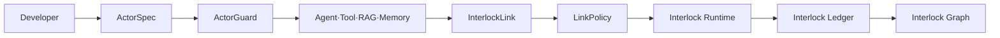
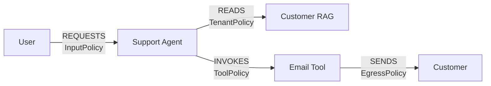
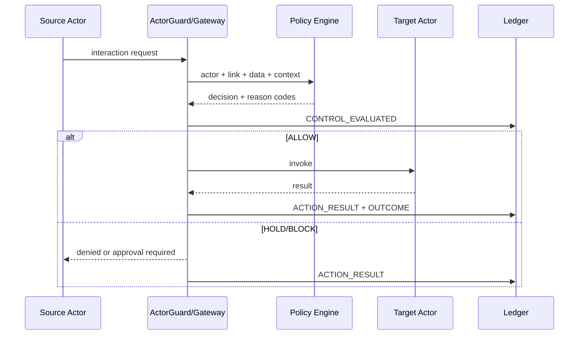
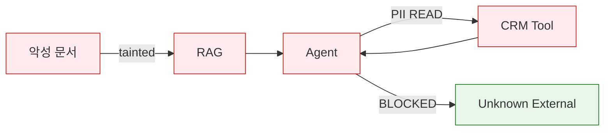

# Agent Interlock 개발자 프레임워크 및 그래프 설계 v1

> English version: [02-developer-framework-design.md](02-developer-framework-design.md)

## 1. 목적

Agent Interlock는 보안팀이 운영 로그를 사후 분석하는 제품에 머물지 않는다. 개발자가 Agent, Tool, RAG, Memory, Scheduler, External Service를 만들 때부터 다음 내용을 선언하도록 한다.

- 이 Actor는 누구인가
- 무엇을 할 수 있는가
- 어떤 데이터를 읽고 쓸 수 있는가
- 누구와 어떤 관계로 연결될 수 있는가
- 어떤 행동이 외부 부작용을 만드는가
- 어떤 조건에서 승인·차단·격리가 필요한가
- 장애 시 fail-open, fail-closed, read-only 중 무엇을 선택하는가

Runtime은 이 선언을 실제 호출에 강제하고, Ledger는 판정과 결과를 기록하며, Graph는 선언된 관계와 실제 실행의 차이를 보여준다.

**예외가 하나 있고, 이 예외는 구조적으로 중요하다.** ActorSpec의 `dataAccess`는 런타임에 집행되지 **않는다**. SDK가 마지막 런타임 소비자였는데, 판정 엔진이 통합된 뒤로 데이터 등급 check는 intent의 등급을 대상 Actor의 허용 범위가 아니라 *link policy*의 `allowedDataClasses`/`deniedDataClasses`와 비교한다. 이제 `ActorSpec.data_access`를 읽는 곳은 설계 시점 linter(`ARCH-DATA-CLASS-EXCEEDS-ACTOR`)와 `scaffold.py`의 테스트 생성기뿐이다. 그래도 선언해야 한다 — linter가 이 값을 필요로 하고, link policy가 대상 Actor의 범위를 넘어 넓어지는 것을 막는 유일한 수단이다 — 다만 여기서 런타임 차단을 기대해서는 안 된다.

## 2. 개발자 경험



배포된 경험은 `defineActor` 표면이 아니라, `interlock architecture skeleton`이 생성하고 Anthropic Tool Runner adapter가 소비하는 프로젝트 모듈 계약이다. `interlock architecture skeleton <manifest> --out-dir .`은 `MANIFEST`, `TENANT_ID`, `SOURCE_ACTOR_ID`, `APPROVER`, TOOL 노드마다 하나씩의 `ToolDefinition`/`ToolBinding` 쌍, 그리고 `(gateway, tools)`를 반환하는 `build(bindings=BINDINGS, *, ledger=None)`을 노출하는 Python 모듈을 작성한다. 손으로 쓴 모듈도 같은 계약을 따른다.

```python
import json
from pathlib import Path
from agent_interlock import (
    ArchitectureGraph, MCPToolGateway, ToolBinding, ToolDefinition, bind_architecture, guard_tools,
)

MANIFEST = Path(__file__).with_name("architecture.json")
TENANT_ID = "tenant-dev"
SOURCE_ACTOR_ID = "agent.support"

send_email_definition = ToolDefinition(
    server_id="tool.send-email", tool_name="send_email", title="Send email",
    description="Send a support reply to the customer.",
    input_schema={"type": "object", "required": ["to", "body"], "additionalProperties": False,
                  "properties": {"to": {"type": "string", "format": "email"},
                                 "body": {"type": "string", "maxLength": 2000}}},
    output_schema={"type": "object", "required": ["status"],
                   "properties": {"status": {"type": "string"}}},
)

def send_email(arguments):
    ...  # 실제 구현
    return {"status": "sent"}

BINDINGS = (ToolBinding(send_email_definition, send_email, "tool.send-email", "SUPPORT_REPLY"),)

def build(bindings=BINDINGS, *, ledger=None):
    gateway = MCPToolGateway(ledger=ledger)
    graph = ArchitectureGraph.from_dict(json.loads(MANIFEST.read_text()))
    bind_architecture(gateway, graph,
                      tool_bindings={b.definition.tool_name: b.actor_id for b in bindings},
                      approver="platform-review")
    tools = guard_tools(gateway, tenant_id=TENANT_ID, source_actor_id=SOURCE_ACTOR_ID,
                        bindings=bindings, approver="platform-review")
    return gateway, tools
```

`guard_tools`는 각 definition을 admit하고 승인·활성화한 뒤, 격리된 definition — 숨은 지시, cross-server 참조, 지원하지 않는 schema keyword — 에 대한 tool은 돌려주지 않는다. 그래서 모델은 그런 tool을 보지 못한다. 반환되는 각 `GuardedTool`/`GuardedAsyncTool`은 매 호출마다 모델이 실제로 선택한 인자에서 intent를 도출하고, gateway에 판정을 묻고, 허용된 경우에만 실제 함수를 실행하고, sanitize된 결과를 반환한다. 거부는 raise되는 예외가 아니라 reason code를 담은 `is_error` tool 결과로 모델에 도달한다. `externalWriteRequiresApproval: true`인 edge는 `guard_tools(..., approve=...)`의 콜백 — 또는 미리 만들어 둔 `gateway.grant_approval` — 이 정확히 그 인자에 바인딩된 승인을 내줄 때까지 첫 호출을 hold한다.

그런 다음 tool은 SDK 자체의 agentic loop 안에서 수정 없이 실행된다.

```python
import anthropic
gateway, tools = build()
client = anthropic.Anthropic()
runner = client.beta.messages.tool_runner(
    model="claude-opus-5", max_tokens=16000, tools=list(tools),
    messages=[{"role": "user", "content": "Where is order 1001? Email the customer."}],
)
final = runner.until_done()
```

**도입 경로**: manifest 작성 → `ToolDefinition`/`ToolBinding` 쌍 생성 또는 직접 작성 → `build()` 안에서 `bind_architecture`와 `guard_tools` 연결 → 반환된 tool을 Tool Runner loop에 전달 → CI에서 `interlock verify path/to/project.py`를 실행해 manifest의 통제가 프레임워크 자체 fixture가 아니라 실제로 자신의 tool에 armed되어 있음을 증명한다. 전체 10분 안내는 [16 기존 Agent에 Agent Interlock 추가하기](16-adding-interlock-to-an-agent.ko.md)를 참고한다.

위 예시를 읽을 때 유의할 점 하나: **데이터 등급은 `D1`–`D9` 코드**이지 상징적인 이름이 아니다. `allowedDataClasses`와 `deniedDataClasses`는 `InvocationIntent.data_classes`와 집합으로 비교되며, 이 비교는 문자 그대로의 집합 연산이다 — `CUSTOMER_PII` 같은 상징적인 값은 대상 Actor가 보유하지 않은 등급일 뿐이다. 배포된 `examples/secure_multi_agent_architecture.json`에 상징적 어휘를 대입하면 깨끗하던 lint가 **CRITICAL `ARCH-DATA-CLASS-EXCEEDS-ACTOR` 4건**으로 바뀌고, 이어서 `interlock architecture compile`이 그래프를 거부한다. 코드 정의는 [03 L1 보안 프로파일](03-l1-mcp-tool-security-profile.ko.md)을 참고한다.

## 3. ActorSpec

### 3.1 필수 필드

| 필드 | 설명 |
|---|---|
| `id` | 환경 전체에서 안정적인 Actor ID |
| `type` | USER, AGENT, SUBAGENT, TOOL, RAG, MEMORY, SCHEDULER, EXTERNAL 등 |
| `owner` | 운영·사고대응 책임 팀 |
| `identity` | workload identity 또는 인증 subject |
| `capabilities` | 수행 가능한 행동 |
| `dataAccess` | 읽기·쓰기 가능한 데이터 등급 |
| `sideEffects` | 외부 쓰기, 삭제, 송금, 권한 변경 등 |
| `inputSchema` | 허용 입력 구조 |
| `outputSchema` | 허용 출력 구조 |
| `tenantMode` | REQUIRED, OPTIONAL, GLOBAL |
| `failureMode` | FAIL_OPEN, FAIL_CLOSED, DEGRADE_READ_ONLY |

### 3.2 선택 필드

- 허용 모델과 Tool
- credential scope와 audience
- 호출·token·비용·시간 예산
- 동시 실행과 재시도 한도
- 위임 가능 여부와 최대 깊이
- 원문 증거 보관 여부
- 데이터 보존기간
- heartbeat와 health SLO
- 배포 artifact digest와 provenance

### 3.3 Manifest 표현

```yaml
apiVersion: interlock.dev/v1alpha1
kind: Actor
metadata:
  id: tool.send-email
  owner: customer-platform
spec:
  type: TOOL
  identity: spiffe://prod.example/tool/send-email
  capabilities: [EMAIL_SEND]
  dataAccess: [D2, D3]
  sideEffects: [EXTERNAL_WRITE]
  tenantMode: REQUIRED
  schemas:
    input: schemas/send-email-input.json
    output: schemas/send-email-output.json
  limits:
    callsPerTrace: 3
    timeoutMs: 5000
  failureMode: FAIL_CLOSED
```

loader가 받아들이는 버전은 `interlock.dev/v1alpha1` 하나뿐이다. `ArchitectureGraph.from_dict`(`architecture.py:333-334`)는 그 외의 값을 `ValueError`로 거부하며, [04 MCP Tool Gateway 명세](04-mcp-tool-gateway-spec.ko.md)도 전체에서 같은 문자열을 쓴다. `schemas/actor.schema.json`은 `interlock.dev/v1`도 허용하지만 `src/`에서 이 schema를 읽는 곳이 없으므로 그것으로 `v1`이 로드되지는 않는다.

## 4. ActorGuard

ActorGuard는 기존 비즈니스 로직의 앞뒤에서 다음 처리를 수행한다.

```text
입력 수신
→ 호출 Actor 인증
→ tenant·relationship 검증
→ schema·민감정보·taint 검사
→ LinkPolicy 판정
→ ALLOW/BLOCK/HOLD/SANITIZE
→ 원래 Actor 실행
→ 출력·부작용 검사
→ Action Result·Security Outcome 기록
```

### 4.1 지원 형태

| 형태 | 대상 | 특징 | 상태 |
|---|---|---|---|
| In-process SDK | 직접 개발하는 Agent·Tool | 가장 풍부한 내부 단계 관측 | 배포됨 (`sdk.py` `wrap()`) |
| Framework Adapter | LangGraph 등 Agent runtime | 낮은 도입 비용 | Anthropic Python SDK Tool Runner에 한해 배포됨(`adapters/anthropic_tools.py`); LangGraph와 Claude Agent SDK는 미구현 |
| Sidecar Proxy | 수정하기 어려운 서비스 | 네트워크 경계 관측·차단 | 미구현 |
| Gateway | MCP, A2A, RAG, Egress | 중앙 정책과 강제력 | 배포됨 (`gateway.py`, `a2a.py`) |

SDK가 없어도 Proxy로 통신은 관측할 수 있지만, plan step·memory provenance·sub-agent tree 같은 의미는 SDK가 있어야 정확히 수집할 수 있다.

### 4.2 `wrap()`은 집행하며, 이제 승인도 할 수 있다

`wrap()`은 관측 전용이 아니다. `PolicyMode.ENFORCE`에서는 `SDK_PROFILE`의 check 18개를 실행하고(`sdk.py:152`), 종합 판정이 거부면 `GatewayError`를 raise한다. 호출은 일어나지 않는다. gateway의 check 20개 중 18개가 여기서 실행되며, 빠지는 것은 M2 definition check 2개뿐이다. SDK는 `ToolRevision`을 보유하지 않기 때문이다.

**`wrap()`으로 감싼 Tool은 일치하는 승인을 보유하면 외부 쓰기를 수행할 수 있다.** `external_write_requires_approval`의 기본값이 `True`이므로 `approval_valid`가 설정되지 않는 한 모든 `EXTERNAL_WRITE` intent에서 `INTERLOCK-APPROVAL-REQUIRED`가 발생한다. 이제 gateway와 SDK는 승인 저장소 하나(`approvals.ApprovalStore`)를 공유한다. `Interlock.grant_approval(...)`은 `MCPToolGateway.grant_approval`과 같은 방식으로 승인을 발급하고, `_invoke`는 매 호출마다 이를 조회해 `CheckContext.approval_valid`로 전달한다. 승인은 발급 당시의 정확한 인자 해시, canonical 목적지 집합, tenant, 만료 시각에 바인딩되며 그 외에는 아무것도 검증하지 않는다.

```python
agent.connect(tool, LinkPolicy(id="p", version="1", mode=PolicyMode.ENFORCE))
send = tool.wrap(send_email)
arguments = {"to": "user@customer.example"}
approval = interlock.grant_approval(
    tenant_id="t",
    arguments=arguments,
    canonical_destinations=(canonical_destination("user@customer.example"),),
    approver="operator",
)
send(arguments, source=agent, tenant_id="t",
     intent=InvocationIntent(purpose="reply",
                             destinations=("user@customer.example",),
                             estimated_side_effect=SideEffect.EXTERNAL_WRITE,
                             approval_id=approval.approval_id))
# 실행된다 -- approval_id 없이 같은 호출을 하면 여전히 다음을 raise한다
# GatewayError: actor invocation blocked: INTERLOCK-APPROVAL-REQUIRED
```

`_invoke`는 gateway의 결과 처리도 공유한다. 반환되는 모든 값은 `results.inspect_tool_result`를 거치며, 이는 비밀정보를 redact하고 결과를 target의 output schema로 검증한다. `ENFORCE`에서는 schema가 유효하지 않은 결과가 gateway와 동일한 quarantine 값으로 교체되고, 인자 쪽 check가 아무것도 flag하지 않았더라도 `SECURITY_OUTCOME_SET`은 이 quarantine을 `SUCCEEDED`로 기록한다. `SHADOW`/`OBSERVE`에서는 sanitize만 되고 quarantine되지 않은 값이 반환되며 schema 오류는 결과를 바꾸지 않은 채 기록된다.

`LinkPolicy(external_write_requires_approval=False)`는 통제를 완전히 내려놓는 명시적이고 감사 가능한 결정으로 여전히 사용할 수 있다. 승인이 없다고 부작용을 `EXTERNAL_WRITE`가 아닌 다른 값으로 선언해 우회해서는 안 된다. 그렇게 하면 눈에 보이는 hold를 잘해야 조용한 `L1-UNDECLARED-SIDE-EFFECT`로, 최악의 경우 탐지되지 않은 외부 쓰기로 바꾸는 것이다.

## 5. InterlockLink와 LinkPolicy

보안 정책은 Actor 노드가 아니라 Actor 사이 Edge에 배치한다.



### 5.1 LinkPolicy 필드

| 영역 | 옵션 |
|---|---|
| 신원 | source/target type, workload ID, tenant |
| 행동 | 허용 operation·capability·purpose |
| 데이터 | 허용 등급, taint 전달, 마스킹 |
| 목적지 | domain, account, region, network zone |
| 위임 | actor/audience binding, hop, depth, TTL |
| 부작용 | read/write/delete/payment/permission |
| 승인 | 위험조건, 승인자, 만료, 2인 승인 |
| 예산 | 호출·token·비용·시간·fan-out |
| 증거 | metadata/hash/redacted/raw-encrypted |
| 장애 | fail policy, timeout, fallback |

## 6. Interlock Runtime

Runtime은 Policy Decision Point와 Policy Enforcement Point를 분리한다.



정책 엔진 장애 시의 동작은 Runtime이 임의로 선택하지 않고 LinkPolicy의 `failureMode`를 따른다.

**현재 배포된 구현에서는 이 말이 들리는 것보다 범위가 좁다.** `src/`에서 `LinkPolicy.failure_mode`를 읽는 런타임 코드는 정확히 하나, `FAIL_CLOSED` 여부를 검사하는 `egress.py:145`뿐이다. 정책 판정 경로는 어디에서도 이 값을 참조하지 않으며, `DEGRADE_READ_ONLY`는 소비자가 아예 없다. 그 밖에 이 필드가 등장하는 곳은 모두 설계 시점 lint(`ARCH-BOUNDARY-FAIL-OPEN`, `ARCH-HIGH-RISK-FAIL-OPEN`) 아니면 manifest 직렬화다. `FAIL_CLOSED`를 선언하는 것은 여전히 옳고 linter가 요구하는 바이기도 하다. 다만 아직 엔진 전체에 걸친 런타임 스위치로 읽어서는 안 된다.

## 7. Interlock Ledger

Ledger는 다음 이벤트를 분리한다.

| 이벤트 | 의미 |
|---|---|
| Interaction Requested | 무엇을 요청했는가 |
| Data Flow Observed | 어떤 데이터가 이동했는가 |
| Control Evaluated | 어떤 통제가 무엇을 판정했는가 |
| Action Executed | 차단·격리·회수가 실행됐는가 |
| Interaction Completed | 대상 호출이 완료됐는가 |
| Security Outcome Set | 공격이 최종 성공했는가 |

`decision=BLOCK`, `action_result=FAILED`, `security_outcome=SUCCEEDED`를 별개 값으로 유지해야 탐지는 했지만 막지 못한 사고를 찾을 수 있다.

## 8. Interlock Graph

### 8.1 정적 설계 그래프

ActorSpec과 LinkPolicy에서 생성한다.

- 등록된 Actor와 owner
- 선언된 연결과 금지된 연결
- capability와 데이터 접근 범위
- 승인·예산·실패 정책
- 통제가 없는 Edge
- 과도한 권한과 순환 위임
- 단일 장애점

### 8.2 런타임 실행 그래프

Ledger의 trace에서 생성한다.

- 실제 호출 순서와 latency
- Agent → Sub-agent fan-out
- Tool·RAG·Memory 접근
- 데이터 민감도와 taint 전파
- 정책 판정과 차단 지점
- 부분 실행과 외부 부작용
- token·비용·재시도

### 8.3 공격 경로 그래프



Edge를 선택하면 다음 정보를 제공한다.

- source/target Actor
- relationship과 operation
- 전달 데이터 등급과 크기
- 적용 Policy와 버전
- decision·reason code
- action result·security outcome
- 관련 trace·Incident·TG·ATLAS·ASI

### 8.4 선언과 실행의 차이

가장 중요한 탐지는 “실제 호출이 선언 그래프에 존재하는가”이다.

```text
Declared Edge 없음 + Runtime Call 있음  → UNDECLARED_RELATIONSHIP
Declared Tool digest ≠ Runtime digest    → ACTOR_DRIFT
Declared data class 초과                 → DATA_SCOPE_VIOLATION
Declared budget 초과                     → BUDGET_VIOLATION
Gateway event 없음 + Target event 있음   → CONTROL_BYPASS
```

## 9. Console 화면

1. **Inventory:** Actor, owner, identity, capability, health
2. **Design Graph:** 선언 관계와 통제 공백
3. **Live Graph:** 현재 trace와 실시간 판정
4. **Incidents:** 공격 경로, 영향 Actor, 대응 상태
5. **Policies:** LinkPolicy 작성·시뮬레이션·승격
6. **Controls:** Gateway·ActorGuard 상태와 우회율
7. **Data Flows:** 민감 데이터 이동과 목적지
8. **Tests:** red-team·simulation 결과와 회귀

## 10. 구현 우선순위

### 1단계 — SDK 최소 기능

- TypeScript 또는 Python ActorSpec
- `wrap()`과 `connect()`
- JSON Schema 입출력 검증
- OpenTelemetry trace 연동
- Event Envelope 생성

### 2단계 — Runtime과 Ledger

- Tool/RAG/Egress Gateway
- OBSERVE·SHADOW·ENFORCE
- PostgreSQL 이벤트 저장
- 판정–조치–결과 분리

### 3단계 — Graph

- ActorSpec 기반 정적 그래프
- trace 기반 런타임 그래프
- 미선언 Edge와 drift 탐지
- Incident 공격 경로 표시

### 4단계 — 다중 Agent 확장

- A2A Broker
- delegation lineage
- Memory provenance·rollback
- Scheduler·Sandbox
- 중앙 Console과 조직 단위 policy

## 11. MVP 완료 기준

- 개발자가 Actor 두 개를 선언하고 `connect()`로 관계를 만들 수 있다.
- 기존 Tool을 `wrap()`해 호출 전 정책을 집행할 수 있으며, `Interlock.grant_approval`로 승인받은 외부 쓰기도 포함한다. *(충족. §4.2 참고.)*
- 모든 호출에 trace와 Interaction Event가 생성된다.
- 선언되지 않은 Actor 관계를 탐지한다.
- 비신뢰 입력이 외부 쓰기 Tool로 전달될 때 HOLD/BLOCK한다.
- 정적 설계 그래프와 단일 trace 실행 그래프를 표시한다.
- 차단 판정과 실제 집행 결과를 별도로 조회한다.
- Runtime 장애 시 관계별 failureMode가 동작한다. *(부분 충족 — §6 참고. 현재 이 값을 읽는 곳은 `egress.py`뿐이다.)*

## 12. 제품 명명 체계

```text
제품              Agent Interlock
개발자 SDK         Interlock SDK
Actor 선언         ActorSpec
보안 Wrapper       ActorGuard
관계               InterlockLink
관계 정책          LinkPolicy
실행 계층          Interlock Runtime
이벤트 원장        Interlock Ledger
그래프              Interlock Graph
운영 UI            Interlock Console
```

공식 설명은 **“AI Agent 상호작용 보안 프레임워크”**로 사용한다.
