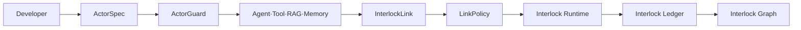
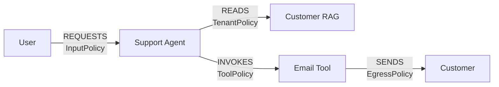
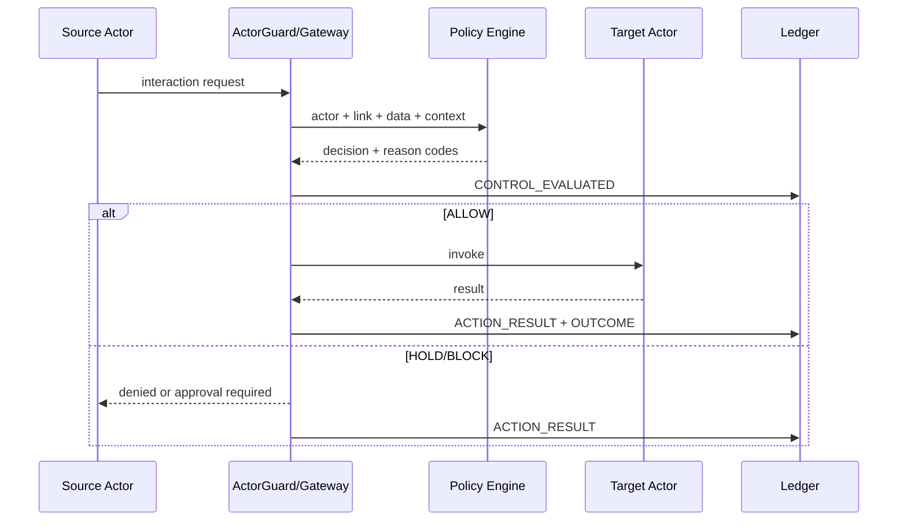
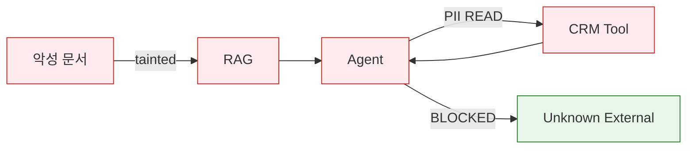

# Agent Interlock 개발자 프레임워크 및 그래프 설계 v1

## 1. 목적

Agent Interlock는 보안팀이 운영 로그를 사후 분석하는 제품에 머물지 않는다. 개발자가 Agent, Tool, RAG, Memory, Scheduler, External Service를 만들 때부터 다음 내용을 선언하도록 한다.

- 이 Actor는 누구인가
- 무엇을 할 수 있는가
- 어떤 데이터를 읽고 쓸 수 있는가
- 누구와 어떤 관계로 연결될 수 있는가
- 어떤 행동이 외부 부작용을 만드는가
- 어떤 조건에서 승인·차단·격리가 필요한가
- 장애 시 fail-open, fail-closed, read-only 중 무엇을 선택하는가

Runtime은 이 선언을 실제 호출에 강제하고, Ledger는 판정과 결과를 기록하며, Graph는 선언된 관계와 실제 실행의 차이를 보여준다.

## 2. 개발자 경험



개발자가 수행할 핵심 작업은 `define`, `wrap`, `connect` 세 가지다.

```typescript
const supportAgent = interlock.defineActor({
  id: "agent.support",
  type: "AGENT",
  owner: "customer-platform",
  tenantMode: "REQUIRED",
  capabilities: ["CUSTOMER_LOOKUP", "SUPPORT_REPLY"],
  dataAccess: ["CUSTOMER_PII"],
  maxDelegationDepth: 2,
});

const emailTool = interlock.defineActor({
  id: "tool.send-email",
  type: "TOOL",
  inputSchema: SendEmailSchema,
  outputSchema: SendEmailResultSchema,
  sideEffects: ["EXTERNAL_WRITE"],
  capabilities: ["EMAIL_SEND"],
});

export const secureSendEmail = emailTool.wrap(sendEmail);

supportAgent.connect(emailTool, {
  relationship: "INVOKES",
  allowedPurposes: ["SUPPORT_REPLY", "REFUND_NOTICE"],
  allowedData: ["CUSTOMER_NAME", "CUSTOMER_EMAIL"],
  destinationPolicy: "KNOWN_CUSTOMER_ONLY",
  approvalRequiredWhen: ["NEW_DESTINATION", "BULK_SEND"],
  maxCallsPerTrace: 3,
  failureMode: "FAIL_CLOSED"
});
```

## 3. ActorSpec

### 3.1 필수 필드

| 필드 | 설명 |
|---|---|
| `id` | 환경 전체에서 안정적인 Actor ID |
| `type` | USER, AGENT, SUBAGENT, TOOL, RAG, MEMORY, SCHEDULER, EXTERNAL 등 |
| `owner` | 운영·사고대응 책임 팀 |
| `identity` | workload identity 또는 인증 subject |
| `capabilities` | 수행 가능한 행동 |
| `dataAccess` | 읽기·쓰기 가능한 데이터 등급 |
| `sideEffects` | 외부 쓰기, 삭제, 송금, 권한 변경 등 |
| `inputSchema` | 허용 입력 구조 |
| `outputSchema` | 허용 출력 구조 |
| `tenantMode` | REQUIRED, OPTIONAL, GLOBAL |
| `failureMode` | FAIL_OPEN, FAIL_CLOSED, DEGRADE_READ_ONLY |

### 3.2 선택 필드

- 허용 모델과 Tool
- credential scope와 audience
- 호출·token·비용·시간 예산
- 동시 실행과 재시도 한도
- 위임 가능 여부와 최대 깊이
- 원문 증거 보관 여부
- 데이터 보존기간
- heartbeat와 health SLO
- 배포 artifact digest와 provenance

### 3.3 Manifest 표현

```yaml
apiVersion: interlock.dev/v1
kind: Actor
metadata:
  id: tool.send-email
  owner: customer-platform
spec:
  type: TOOL
  identity: spiffe://prod.example/tool/send-email
  capabilities: [EMAIL_SEND]
  dataAccess: [CUSTOMER_NAME, CUSTOMER_EMAIL]
  sideEffects: [EXTERNAL_WRITE]
  tenantMode: REQUIRED
  schemas:
    input: schemas/send-email-input.json
    output: schemas/send-email-output.json
  limits:
    callsPerTrace: 3
    timeoutMs: 5000
  failureMode: FAIL_CLOSED
```

## 4. ActorGuard

ActorGuard는 기존 비즈니스 로직의 앞뒤에서 다음 처리를 수행한다.

```text
입력 수신
→ 호출 Actor 인증
→ tenant·relationship 검증
→ schema·민감정보·taint 검사
→ LinkPolicy 판정
→ ALLOW/BLOCK/HOLD/SANITIZE
→ 원래 Actor 실행
→ 출력·부작용 검사
→ Action Result·Security Outcome 기록
```

### 4.1 지원 형태

| 형태 | 대상 | 특징 |
|---|---|---|
| In-process SDK | 직접 개발하는 Agent·Tool | 가장 풍부한 내부 단계 관측 |
| Framework Adapter | LangGraph 등 Agent runtime | 낮은 도입 비용 |
| Sidecar Proxy | 수정하기 어려운 서비스 | 네트워크 경계 관측·차단 |
| Gateway | MCP, A2A, RAG, Egress | 중앙 정책과 강제력 |

SDK가 없어도 Proxy로 통신은 관측할 수 있지만, plan step·memory provenance·sub-agent tree 같은 의미는 SDK가 있어야 정확히 수집할 수 있다.

## 5. InterlockLink와 LinkPolicy

보안 정책은 Actor 노드가 아니라 Actor 사이 Edge에 배치한다.



### 5.1 LinkPolicy 필드

| 영역 | 옵션 |
|---|---|
| 신원 | source/target type, workload ID, tenant |
| 행동 | 허용 operation·capability·purpose |
| 데이터 | 허용 등급, taint 전달, 마스킹 |
| 목적지 | domain, account, region, network zone |
| 위임 | actor/audience binding, hop, depth, TTL |
| 부작용 | read/write/delete/payment/permission |
| 승인 | 위험조건, 승인자, 만료, 2인 승인 |
| 예산 | 호출·token·비용·시간·fan-out |
| 증거 | metadata/hash/redacted/raw-encrypted |
| 장애 | fail policy, timeout, fallback |

## 6. Interlock Runtime

Runtime은 Policy Decision Point와 Policy Enforcement Point를 분리한다.



정책 엔진 장애 시의 동작은 Runtime이 임의로 선택하지 않고 LinkPolicy의 `failureMode`를 따른다.

## 7. Interlock Ledger

Ledger는 다음 이벤트를 분리한다.

| 이벤트 | 의미 |
|---|---|
| Interaction Requested | 무엇을 요청했는가 |
| Data Flow Observed | 어떤 데이터가 이동했는가 |
| Control Evaluated | 어떤 통제가 무엇을 판정했는가 |
| Action Executed | 차단·격리·회수가 실행됐는가 |
| Interaction Completed | 대상 호출이 완료됐는가 |
| Security Outcome Set | 공격이 최종 성공했는가 |

`decision=BLOCK`, `action_result=FAILED`, `security_outcome=SUCCEEDED`를 별개 값으로 유지해야 탐지는 했지만 막지 못한 사고를 찾을 수 있다.

## 8. Interlock Graph

### 8.1 정적 설계 그래프

ActorSpec과 LinkPolicy에서 생성한다.

- 등록된 Actor와 owner
- 선언된 연결과 금지된 연결
- capability와 데이터 접근 범위
- 승인·예산·실패 정책
- 통제가 없는 Edge
- 과도한 권한과 순환 위임
- 단일 장애점

### 8.2 런타임 실행 그래프

Ledger의 trace에서 생성한다.

- 실제 호출 순서와 latency
- Agent → Sub-agent fan-out
- Tool·RAG·Memory 접근
- 데이터 민감도와 taint 전파
- 정책 판정과 차단 지점
- 부분 실행과 외부 부작용
- token·비용·재시도

### 8.3 공격 경로 그래프



Edge를 선택하면 다음 정보를 제공한다.

- source/target Actor
- relationship과 operation
- 전달 데이터 등급과 크기
- 적용 Policy와 버전
- decision·reason code
- action result·security outcome
- 관련 trace·Incident·TG·ATLAS·ASI

### 8.4 선언과 실행의 차이

가장 중요한 탐지는 “실제 호출이 선언 그래프에 존재하는가”이다.

```text
Declared Edge 없음 + Runtime Call 있음  → UNDECLARED_RELATIONSHIP
Declared Tool digest ≠ Runtime digest    → ACTOR_DRIFT
Declared data class 초과                 → DATA_SCOPE_VIOLATION
Declared budget 초과                     → BUDGET_VIOLATION
Gateway event 없음 + Target event 있음   → CONTROL_BYPASS
```

## 9. Console 화면

1. **Inventory:** Actor, owner, identity, capability, health
2. **Design Graph:** 선언 관계와 통제 공백
3. **Live Graph:** 현재 trace와 실시간 판정
4. **Incidents:** 공격 경로, 영향 Actor, 대응 상태
5. **Policies:** LinkPolicy 작성·시뮬레이션·승격
6. **Controls:** Gateway·ActorGuard 상태와 우회율
7. **Data Flows:** 민감 데이터 이동과 목적지
8. **Tests:** red-team·simulation 결과와 회귀

## 10. 구현 우선순위

### 1단계 — SDK 최소 기능

- TypeScript 또는 Python ActorSpec
- `wrap()`과 `connect()`
- JSON Schema 입출력 검증
- OpenTelemetry trace 연동
- Event Envelope 생성

### 2단계 — Runtime과 Ledger

- Tool/RAG/Egress Gateway
- OBSERVE·SHADOW·ENFORCE
- PostgreSQL 이벤트 저장
- 판정–조치–결과 분리

### 3단계 — Graph

- ActorSpec 기반 정적 그래프
- trace 기반 런타임 그래프
- 미선언 Edge와 drift 탐지
- Incident 공격 경로 표시

### 4단계 — 다중 Agent 확장

- A2A Broker
- delegation lineage
- Memory provenance·rollback
- Scheduler·Sandbox
- 중앙 Console과 조직 단위 policy

## 11. MVP 완료 기준

- 개발자가 Actor 두 개를 선언하고 `connect()`로 관계를 만들 수 있다.
- 기존 Tool을 `wrap()`해 호출 전 정책을 집행할 수 있다.
- 모든 호출에 trace와 Interaction Event가 생성된다.
- 선언되지 않은 Actor 관계를 탐지한다.
- 비신뢰 입력이 외부 쓰기 Tool로 전달될 때 HOLD/BLOCK한다.
- 정적 설계 그래프와 단일 trace 실행 그래프를 표시한다.
- 차단 판정과 실제 집행 결과를 별도로 조회한다.
- Runtime 장애 시 관계별 failureMode가 동작한다.

## 12. 제품 명명 체계

```text
제품              Agent Interlock
개발자 SDK         Interlock SDK
Actor 선언         ActorSpec
보안 Wrapper       ActorGuard
관계               InterlockLink
관계 정책          LinkPolicy
실행 계층          Interlock Runtime
이벤트 원장        Interlock Ledger
그래프              Interlock Graph
운영 UI            Interlock Console
```

공식 설명은 **“AI Agent 상호작용 보안 프레임워크”**로 사용한다.

