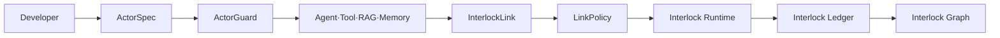
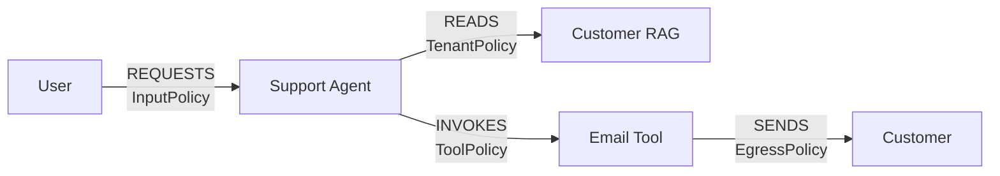
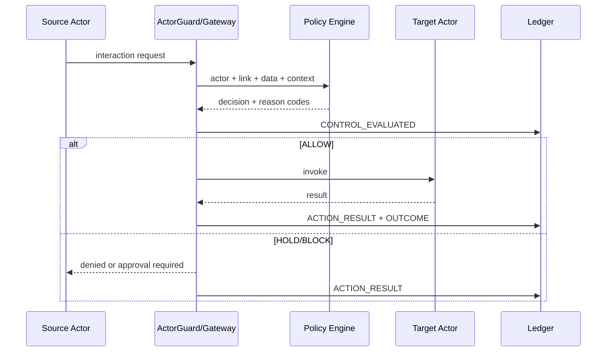
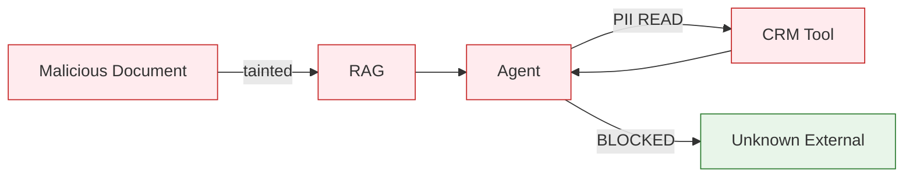

# Agent Interlock Developer Framework and Graph Design v1

> 한국어 원문: [02-developer-framework-design.ko.md](02-developer-framework-design.ko.md)

## 1. Purpose

Agent Interlock is not just a product for security teams to analyze operational logs after the fact. It requires developers to declare the following from the moment they build an Agent, Tool, RAG, Memory, Scheduler, or External Service:

- Who is this Actor?
- What can it do?
- What data can it read and write?
- Who can it connect to, and in what relationship?
- Which actions produce external side effects?
- Under what conditions is approval, blocking, or quarantine required?
- On failure, which of fail-open, fail-closed, or read-only should be chosen?

The Runtime enforces this declaration against actual calls, the Ledger records the verdict and outcome, and the Graph shows the gap between the declared relationships and actual execution.

**One exception, and it is load-bearing.** `dataAccess` on an ActorSpec is **not** enforced at runtime. The SDK was its last runtime consumer; since the judgment engines merged, the data-class check compares the intent's classes against the *link policy's* `allowedDataClasses`/`deniedDataClasses`, not against the target Actor's grant. `ActorSpec.data_access` is now read only by the design-time linter (`ARCH-DATA-CLASS-EXCEEDS-ACTOR`) and by `scaffold.py`'s test generator. Declare it — the linter needs it, and it is the only thing that keeps a link policy from being widened past its target — but do not expect a runtime block from it.

## 2. Developer Experience



The shipped path to this experience is not a `defineActor` surface — it is the project-module contract that `interlock architecture skeleton` generates and the Anthropic Tool Runner adapter consumes. `interlock architecture skeleton <manifest> --out-dir .` writes a Python module exposing `MANIFEST`, `TENANT_ID`, `SOURCE_ACTOR_ID`, `APPROVER`, one `ToolDefinition`/`ToolBinding` pair per TOOL node, and a `build(bindings=BINDINGS, *, ledger=None)` that returns `(gateway, tools)`; a hand-written module follows the same contract:

```python
import json
from pathlib import Path
from agent_interlock import (
    ArchitectureGraph, MCPToolGateway, ToolBinding, ToolDefinition, bind_architecture, guard_tools,
)

MANIFEST = Path(__file__).with_name("architecture.json")
TENANT_ID = "tenant-dev"
SOURCE_ACTOR_ID = "agent.support"

send_email_definition = ToolDefinition(
    server_id="tool.send-email", tool_name="send_email", title="Send email",
    description="Send a support reply to the customer.",
    input_schema={"type": "object", "required": ["to", "body"], "additionalProperties": False,
                  "properties": {"to": {"type": "string", "format": "email"},
                                 "body": {"type": "string", "maxLength": 2000}}},
    output_schema={"type": "object", "required": ["status"],
                   "properties": {"status": {"type": "string"}}},
)

def send_email(arguments):
    ...  # your implementation
    return {"status": "sent"}

BINDINGS = (ToolBinding(send_email_definition, send_email, "tool.send-email", "SUPPORT_REPLY"),)

def build(bindings=BINDINGS, *, ledger=None):
    gateway = MCPToolGateway(ledger=ledger)
    graph = ArchitectureGraph.from_dict(json.loads(MANIFEST.read_text()))
    bind_architecture(gateway, graph,
                      tool_bindings={b.definition.tool_name: b.actor_id for b in bindings},
                      approver="platform-review")
    tools = guard_tools(gateway, tenant_id=TENANT_ID, source_actor_id=SOURCE_ACTOR_ID,
                        bindings=bindings, approver="platform-review")
    return gateway, tools
```

`guard_tools` admits each definition, approves and activates it, and refuses to hand back a tool whose definition was quarantined — a poisoned description, a cross-server reference, an unsupported schema keyword — so the model never sees it. Each returned `GuardedTool`/`GuardedAsyncTool` derives intent from the arguments the model actually chose on every call, asks the gateway for a verdict, runs the real function only when permitted, and returns the sanitized result; a refusal reaches the model as an `is_error` tool result carrying the reason codes, never a raised exception. An edge with `externalWriteRequiresApproval: true` holds the first call until `guard_tools(..., approve=...)`'s callback — or a `gateway.grant_approval` made ahead of time — grants a one-use approval bound to the complete invocation identity and installed policy.

The tools then run inside the SDK's own agentic loop, unmodified:

```python
import anthropic
gateway, tools = build()
client = anthropic.Anthropic()
runner = client.beta.messages.tool_runner(
    model="claude-opus-5", max_tokens=16000, tools=list(tools),
    messages=[{"role": "user", "content": "Where is order 1001? Email the customer."}],
)
final = runner.until_done()
```

**Adoption path**: write a manifest → generate or hand-write the `ToolDefinition`/`ToolBinding` pairs → wire `bind_architecture` and `guard_tools` inside `build()` → hand the returned tools to the Tool Runner loop → run `interlock verify path/to/project.py` in CI to prove the manifest's controls are actually armed on your tools, not just on the framework's own fixtures. See [16 Adding Agent Interlock to an Agent](16-adding-interlock-to-an-agent.md) for the full ten-minute walkthrough.

One note on reading the example above: **data classes are the `D1`–`D9` codes**, not symbolic names. `allowedDataClasses` and `deniedDataClasses` are compared as sets against `InvocationIntent.data_classes`, and the comparison is a literal set operation — a symbolic value such as `CUSTOMER_PII` is simply a class the target Actor does not hold. Substituting the symbolic vocabulary into the shipped `examples/secure_multi_agent_architecture.json` turns a clean lint into **four CRITICAL `ARCH-DATA-CLASS-EXCEEDS-ACTOR` findings**, and `interlock architecture compile` then refuses the graph. See [03 L1 MCP Tool Security Profile](03-l1-mcp-tool-security-profile.md) for the code definitions.

## 3. ActorSpec

### 3.1 Required Fields

| Field | Description |
|---|---|
| `id` | Actor ID stable across the entire environment |
| `type` | USER, AGENT, SUBAGENT, TOOL, RAG, MEMORY, SCHEDULER, EXTERNAL, etc. |
| `owner` | Team responsible for operations and incident response |
| `identity` | Workload identity or authentication subject |
| `capabilities` | Actions it can perform |
| `dataAccess` | Data classes it can read and write |
| `sideEffects` | External writes, deletions, payments, permission changes, etc. |
| `inputSchema` | Allowed input structure |
| `outputSchema` | Allowed output structure |
| `tenantMode` | REQUIRED, OPTIONAL, GLOBAL |
| `failureMode` | FAIL_OPEN, FAIL_CLOSED, DEGRADE_READ_ONLY |

### 3.2 Optional Fields

- Allowed models and Tools
- credential scope and audience
- Call, token, cost, and time budgets
- Concurrency and retry limits
- Whether delegation is allowed and the maximum depth
- Whether to retain raw evidence
- Data retention period
- heartbeat and health SLO
- Deployment artifact digest and provenance

### 3.3 Manifest Representation

```yaml
apiVersion: interlock.dev/v1alpha1
kind: Actor
metadata:
  id: tool.send-email
  owner: customer-platform
spec:
  type: TOOL
  identity: spiffe://prod.example/tool/send-email
  capabilities: [EMAIL_SEND]
  dataAccess: [D2, D3]
  sideEffects: [EXTERNAL_WRITE]
  tenantMode: REQUIRED
  schemas:
    input: schemas/send-email-input.json
    output: schemas/send-email-output.json
  limits:
    callsPerTrace: 3
    timeoutMs: 5000
  failureMode: FAIL_CLOSED
```

`interlock.dev/v1alpha1` is the only version the loader accepts: `ArchitectureGraph.from_dict` (`architecture.py:333-334`) rejects anything else with a `ValueError`, and [04 MCP Tool Gateway Spec](04-mcp-tool-gateway-spec.md) uses the same string throughout. `schemas/actor.schema.json` also permits `interlock.dev/v1`, but nothing in `src/` reads that schema, so it does not make `v1` loadable.

## 4. ActorGuard

ActorGuard performs the following processing before and after the existing business logic:

```text
Receive input
→ Authenticate calling Actor
→ Validate tenant/relationship
→ Check schema, sensitive data, taint
→ LinkPolicy verdict
→ ALLOW/BLOCK/HOLD/SANITIZE
→ Execute the original Actor
→ Check output and side effects
→ Record Action Result and Security Outcome
```

### 4.1 Supported Forms

| Form | Target | Characteristics | Status |
|---|---|---|---|
| In-process SDK | Directly developed Agents/Tools | Richest observation of internal steps | Shipped (`sdk.py` `wrap()`) |
| Framework Adapter | Agent runtimes such as LangGraph | Low adoption cost | Shipped for the Anthropic Python SDK Tool Runner only (`adapters/anthropic_tools.py`); LangGraph and the Claude Agent SDK are not built |
| Sidecar Proxy | Services that are hard to modify | Observation and blocking at the network boundary | Not built |
| Gateway | MCP, A2A, RAG, Egress | Centralized policy and enforcement | Shipped (`gateway.py`, `a2a.py`) |

Even without an SDK, a Proxy can observe communication, but semantics such as plan steps, memory provenance, and sub-agent trees can only be captured accurately with an SDK.

### 4.2 `wrap()` Enforces, and Can Now Approve

`wrap()` is not observation-only. Under `PolicyMode.ENFORCE` it runs `SDK_PROFILE`'s 19 checks (`sdk.py:152`) and raises `GatewayError` when the aggregate refuses. The call does not happen. Nineteen of the gateway's twenty-one checks run here; only the two M2 definition checks are absent, because the SDK never holds a `ToolRevision`.

The gateway and SDK use the same approval implementation, with separate process-local stores per instance. `grant_approval` binds tenant, source and target Actors, definition revision/digest, installed policy content, the complete intent (including canonical destinations, data classes and side effect), exact arguments and expiry. A grant is consumed atomically immediately before an enforced external write, including a failed execution. It cannot approve another tool, purpose, policy or second operation. Gateway idempotent retries reuse the original result; this is not a durable cross-process invocation cache.

```python
from dataclasses import replace

agent.connect(tool, LinkPolicy(id="p", version="1", mode=PolicyMode.ENFORCE))
send = tool.wrap(send_email)
arguments = {"to": "user@customer.example"}
intent = InvocationIntent(
    purpose="reply", destinations=("user@customer.example",),
    estimated_side_effect=SideEffect.EXTERNAL_WRITE,
)
approval = interlock.grant_approval(
    tenant_id="t", source_actor_id=agent.spec.id, target_actor_id=tool.spec.id,
    intent=intent, arguments=arguments, approver="operator",
)
send(arguments, source=agent, tenant_id="t",
     intent=replace(intent, approval_id=approval.approval_id))
```

`_invoke` also shares the gateway's result handling: every returned value passes through `results.inspect_tool_result`, which redacts secrets and validates the result against the target's output schema. Under `ENFORCE` a schema-invalid result is replaced by the same quarantine value the gateway emits, and `SECURITY_OUTCOME_SET` records `SUCCEEDED` for that quarantine even when no argument-side check flagged the call. The SDK returns its sanitized, non-quarantined value under `SHADOW`/`OBSERVE`; schema errors remain recorded. ENFORCE additionally quarantines invalid output.

`LinkPolicy(external_write_requires_approval=False)` remains available as an explicit, auditable decision to drop the control entirely. Do not work around a missing approval by declaring the side effect as something other than `EXTERNAL_WRITE`; that trades a visible hold for a silent `L1-UNDECLARED-SIDE-EFFECT` at best and an undetected write at worst.

## 5. InterlockLink and LinkPolicy

Security policy is placed on the Edges between Actors, not on the Actor nodes.



### 5.1 LinkPolicy Fields

| Area | Options |
|---|---|
| Identity | source/target type, workload ID, tenant |
| Action | Allowed operation, capability, purpose |
| Data | Allowed class, taint propagation, masking |
| Destination | domain, account, region, network zone |
| Delegation | actor/audience binding, hop, depth, TTL |
| Side effect | read/write/delete/payment/permission |
| Approval | Risk condition, approver, expiration, two-person approval |
| Budget | Calls, tokens, cost, time, fan-out |
| Evidence | metadata/hash/redacted/raw-encrypted |
| Failure | fail policy, timeout, fallback |

## 6. Interlock Runtime

The Runtime separates the Policy Decision Point from the Policy Enforcement Point.



The behavior when the policy engine fails is not chosen arbitrarily by the Runtime; it follows the `failureMode` in the LinkPolicy.

**As shipped, that is narrower than it sounds.** `LinkPolicy.failure_mode` has exactly one runtime reader in `src/`: `egress.py:145`, which tests for `FAIL_CLOSED`. No policy-decision path consults it, and `DEGRADE_READ_ONLY` has no consumer at all. Everywhere else the field appears it is design-time lint (`ARCH-BOUNDARY-FAIL-OPEN`, `ARCH-HIGH-RISK-FAIL-OPEN`) or manifest serialisation. Declaring `FAIL_CLOSED` is still correct and is what the linter requires; just do not read it as a runtime switch across the whole engine yet.

## 7. Interlock Ledger

The Ledger separates the following events:

| Event | Meaning |
|---|---|
| Interaction Requested | What was requested |
| Data Flow Observed | What data moved |
| Control Evaluated | Which control rendered what verdict |
| Action Executed | Whether blocking, quarantine, or revocation was executed |
| Interaction Completed | Whether the target call completed |
| Security Outcome Set | Whether the attack ultimately succeeded |

Keeping `decision=BLOCK`, `action_result=FAILED`, and `security_outcome=SUCCEEDED` as separate values makes it possible to find incidents that were detected but not actually stopped.

## 8. Interlock Graph

### 8.1 Static Design Graph

Generated from ActorSpec and LinkPolicy.

- Registered Actors and owners
- Declared connections and forbidden connections
- capability and data access scope
- Approval, budget, and failure policy
- Edges without controls
- Excessive privilege and circular delegation
- Single points of failure

### 8.2 Runtime Execution Graph

Generated from the Ledger's trace.

- Actual call order and latency
- Agent → Sub-agent fan-out
- Tool, RAG, Memory access
- Data sensitivity and taint propagation
- Policy verdicts and blocking points
- Partial execution and external side effects
- token, cost, retries

### 8.3 Attack Path Graph



Selecting an Edge provides the following information:

- source/target Actor
- relationship and operation
- Transferred data class and size
- Applied Policy and version
- decision, reason code
- action result, security outcome
- Related trace, Incident, TG, ATLAS, ASI

### 8.4 Gap Between Declaration and Execution

The most important detection is whether the actual call exists in the declared graph.

```text
No Declared Edge + Runtime Call exists   → UNDECLARED_RELATIONSHIP
Declared Tool digest ≠ Runtime digest    → ACTOR_DRIFT
Declared data class exceeded             → DATA_SCOPE_VIOLATION
Declared budget exceeded                 → BUDGET_VIOLATION
No Gateway event + Target event exists   → CONTROL_BYPASS
```

## 9. Console Screens

1. **Inventory:** Actor, owner, identity, capability, health
2. **Design Graph:** Declared relationships and control gaps
3. **Live Graph:** Current trace and real-time verdicts
4. **Incidents:** Attack path, affected Actors, response status
5. **Policies:** LinkPolicy authoring, simulation, promotion
6. **Controls:** Gateway/ActorGuard status and bypass rate
7. **Data Flows:** Sensitive data movement and destinations
8. **Tests:** red-team/simulation results and regressions

## 10. Implementation Priority

### Phase 1 — Minimal SDK Functionality

- TypeScript or Python ActorSpec
- `wrap()` and `connect()`
- JSON Schema input/output validation
- OpenTelemetry trace integration
- Event Envelope generation

### Phase 2 — Runtime and Ledger

- Tool/RAG/Egress Gateway
- OBSERVE·SHADOW·ENFORCE
- PostgreSQL event storage
- Separation of verdict, action, and outcome

### Phase 3 — Graph

- ActorSpec-based static graph
- trace-based runtime graph
- Undeclared Edge and drift detection
- Incident attack path display

### Phase 4 — Multi-Agent Expansion

- A2A Broker
- delegation lineage
- Memory provenance/rollback
- Scheduler/Sandbox
- Central Console and org-level policy

## 11. MVP Completion Criteria

- A developer can declare two Actors and create a relationship with `connect()`.
- An existing Tool can be `wrap()`ped to enforce policy before the call, including an external write once approved through `Interlock.grant_approval`. *(Met; see §4.2.)*
- Every call generates a trace and an Interaction Event.
- Undeclared Actor relationships are detected.
- HOLD/BLOCK is applied when untrusted input is passed to an external-write Tool.
- The static design graph and a single-trace execution graph are displayed.
- Blocking verdicts and actual enforcement results can be queried separately.
- On Runtime failure, the per-relationship failureMode takes effect. *(Partially met — see §6: only `egress.py` reads it today.)*

## 12. Product Naming Scheme

```text
Product                Agent Interlock
Developer SDK          Interlock SDK
Actor Declaration      ActorSpec
Security Wrapper       ActorGuard
Relationship           InterlockLink
Relationship Policy    LinkPolicy
Execution Layer        Interlock Runtime
Event Ledger           Interlock Ledger
Graph                  Interlock Graph
Operations UI          Interlock Console
```

The official description used is **“AI Agent Interaction Security Framework.”**
