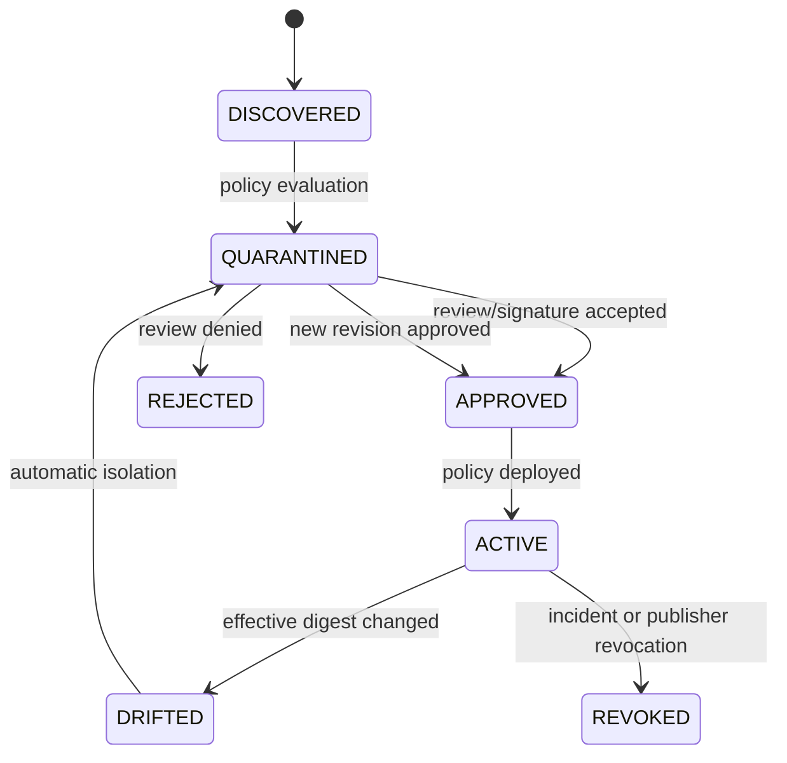

# Agent Interlock MCP Tool Gateway 기술 명세

> English version: [04-mcp-tool-gateway-spec.md](04-mcp-tool-gateway-spec.md)

> 대상: Runtime, Policy Engine, SDK, Connector, Ledger 구현자<br>
> 범위: `tools/list`, `tools/list_changed`, `tools/call`, Tool result, OAuth/credential, Connector 실행 경계

## 1. 책임과 비책임

MCP Tool Gateway는 MCP Host/Client와 Server 사이의 정책 집행점이다. 다음을 책임진다.

- Server와 Tool의 안정적인 Actor identity 부여
- Tool 정의 정규화, digest, 승인 상태와 drift 관리
- 호출 인수의 schema·데이터·목적지·부작용 판정
- hop별 credential binding과 token passthrough 차단
- Connector의 URL·process·filesystem·network 제한
- 반환 데이터의 schema·taint·secret 검사
- 판정, 집행, 결과를 분리한 Ledger 이벤트 생성

Gateway는 LLM malware detector, 범용 endpoint security, package scanner 전체를 대체하지 않는다. Remote Server 내부의 보이지 않는 행동은 downstream audit와 egress reconciliation으로 보완한다.

## 2. 논리 컴포넌트

| 컴포넌트 | 입력 | 출력 | 주요 위협 |
|---|---|---|---|
| Server Registry | endpoint, publisher, transport, artifact | server actor, trust state | M2, M4, M7 |
| Definition Registry | `tools/list` D1 | canonical definition, digest, state | M1–M3 |
| Tool Discovery Guard | raw D1 | model-visible sanitized D1 | M1, M3 |
| Tool Call Guard | D2, D3, Actor/LinkPolicy | decision, sanitized args | M1, M3, M8, M9 |
| Identity Guard | D5 claims, link context | bound/downscoped credential | M5 |
| Connector Sandbox | URL, command, request | constrained execution evidence | M4, M6 |
| Result Guard | D4 | sanitized/tainted result | M1, M6, M8 |
| Egress/Transaction Guard | destination, D7, side effect | allow/hold/block, receipt | M9 |
| Ledger Adapter | all stages | normalized events | M1–M9 |

## 3. 안정적인 식별자

```text
server_id = tenant/environment/registry-key
tool_id   = server_id + ":" + tool_name
definition_revision_id = tool_id + "@" + canonical_digest
```

표시 이름, title, endpoint만으로 Actor를 식별하지 않는다. Server가 같은 이름의 Tool을 제공해도 namespace가 다르면 다른 Actor다.

## 4. Tool 정의의 정규화와 상태

### 4.1 Canonical definition

Digest에는 최소 다음 필드를 포함한다.

```yaml
serverId: tenant-a/prod/trusted-mail
toolName: send_email
title: Send email
description: Send a message to approved recipients.
inputSchema: { canonical-json-schema: true }
outputSchema: { canonical-json-schema: true }
annotations: {}
endpoint: https://mcp.example.com
transport: streamable-http
publisher: platform-team
artifactDigest: sha256:...
```

- JSON object key를 정렬하고 숫자·Unicode·line ending을 정규화한다.
- 보안 의미가 있는 description 공백·비가시 문자를 제거하지 않은 raw digest도 별도로 보존한다.
- secret이 포함될 수 있는 값은 원문 대신 암호화된 evidence reference 또는 hash를 저장한다.
- canonicalizer 버전을 digest 입력에 포함해 버전 변경을 감사할 수 있게 한다.

### 4.2 상태 머신



`ACTIVE` revision만 호출할 수 있다. `tools/list_changed`는 자동 승인 신호가 아니라 새 `DISCOVERED` revision 생성 신호다.

## 5. ActorSpec 확장

기본 ActorSpec에 MCP 전용 필드를 추가한다.

```yaml
apiVersion: interlock.dev/v1alpha1
kind: Actor
metadata:
  id: tool.trusted-mail.send-email
  owner: customer-platform
  tenant: tenant-a
spec:
  type: TOOL
  identity: spiffe://prod.example/mcp/trusted-mail/send-email
  capabilities: [EMAIL_SEND]
  dataAccess: [D2, D3, D7]
  sideEffects: [EXTERNAL_WRITE]
  tenantMode: REQUIRED
  failureMode: FAIL_CLOSED
  mcp:
    serverId: tenant-a/prod/trusted-mail
    toolName: send_email
    transport: streamable-http
    endpoint: https://mcp.example.com
    publisher: platform-team
    artifactDigest: sha256:...
    definitionDigest: sha256:...
    credentialMode: TOKEN_EXCHANGE
    sandboxProfile: remote-mcp-restricted
  destinations:
    allowedDomains: [customer.example]
  schemas:
    input: schemas/send-email-input.json
    output: schemas/send-email-output.json
```

`definitionDigest`는 승인 revision을 가리킨다. 실제 `tools/list`에서 관측된 digest는 Registry가 관리하고 실행 전에 둘을 비교한다.

`dataAccess`는 [03 §4](03-l1-mcp-tool-security-profile.ko.md)의 `D1`–`D9` 코드를 쓰며, 아래 LinkPolicy `data.allowedClasses`와 같은 어휘다. 이 Actor를 대상으로 하는 모든 link policy의 **상위집합**이어야 하고, 아니면 `ARCH-DATA-CLASS-EXCEEDS-ACTOR`가 컴파일을 거부한다. 다만 이것은 설계 시점 선언일 뿐이다. `ActorSpec.data_access`를 읽는 런타임 check는 없다.

## 6. LinkPolicy 확장

```yaml
apiVersion: interlock.dev/v1alpha1
kind: LinkPolicy
metadata:
  id: mcp-tool-invoke-default
  version: 1.0.0
spec:
  sourceTypes: [AGENT, SUBAGENT]
  targetTypes: [TOOL]
  relationship: INVOKES
  mode: SHADOW
  toolDefinition:
    requireState: ACTIVE
    requireDigestPin: true
    allowCrossServerReferences: false
  data:
    allowedClasses: [D2, D3, D7]
    deniedClasses: [D5, D8]
    propagateTaint: true
    secretAction: BLOCK
  destination:
    requireExplicit: true
    newDestinationAction: HOLD
  authorization:
    tokenPassthrough: false
    requireAudience: true
    requireResource: true
    requireActorBinding: true
    maxDelegationDepth: 1
  sideEffects:
    externalWrite: REQUIRE_APPROVAL
    destructiveWrite: BLOCK
    undeclared: BLOCK        # 관측된 부작용이 ActorSpec 선언 집합에 없으면 차단
  failureMode: FAIL_CLOSED
```

정책은 Tool description이 안전하다고 판정했더라도 D3와 실제 목적지를 독립적으로 평가한다. `mode`는 `OBSERVE`, `SHADOW`, `ENFORCE` 중 하나이며 이벤트에는 평가 모드와 실제 집행 여부를 모두 기록한다.

> **이 중 loader가 실제로 읽는 것.** `src/`에는 `kind: LinkPolicy` manifest loader가 없다. 문서에서 `LinkPolicy`로 가는 유일한 경로는 Architecture manifest의 `edge.policy` 블록이며, `_parse_edge`(`architecture.py:1236-1261`)가 고정된 키 목록만 읽는다: `id`, `version`, `mode`, `relationship`, `allowedPurposes`, `allowedDataClasses`, `deniedDataClasses`, `requireActiveDefinition`, `requireDigestPin`, `requireExplicitDestination`, `newDestinationAction`, `tokenPassthrough`, `requireAudience`, `requireResource`, `requireActorBinding`, `maxDelegationDepth`, `externalWriteRequiresApproval`, `failureMode`, `decisionTtlSeconds`.
>
> 위 YAML의 나머지는 전부 **조용히 무시된다** — `data.secretAction`, `data.propagateTaint`, `toolDefinition.allowCrossServerReferences`, 그리고 `sideEffects` 블록 전체가 그렇다. 이 통제들은 존재하고 실제로 동작하지만 Python 기본값(`secret_action=BLOCK`, `destructive_write_action=BLOCK`, `undeclared_side_effect_action=BLOCK`)으로만 동작하며, 용량 상한 `max_export_records`/`max_export_bytes`는 기본값이 `0`이라 manifest로 만든 정책에서는 check 두 개가 **비활성** 상태로 남는다: `L1-M9-VOLUME-EXCEEDED`(레코드 수)와 `L1-M9-VOLUME-BYTES-EXCEEDED`(바이트). 여기에 `secretAction: ALLOW`를 써도 secret 통제가 꺼지지 않고, `undeclared: BLOCK`을 써도 이미 켜져 있지 않던 무언가가 켜지지는 않는다. parser와 `schemas/architecture.schema.json`이 이 값들을 지원하기 전까지는 Python에서 `LinkPolicy`를 직접 구성해 설정한다.

## 7. 처리 파이프라인

### 7.1 `tools/list`

```text
Server 인증 → raw 응답 크기·schema 제한 → Tool별 namespace 부여
→ raw/canonical digest 계산 → 기존 승인 revision 비교
→ metadata injection·cross-server reference·권한 과장 검사
→ 상태 결정 → model-visible D1 생성 → Registry·Ledger 기록
```

규칙 위반 Tool만 격리할 수 있으나 응답 전체의 무결성이 의심되거나 Server identity가 불명확하면 Server 전체를 격리한다.

### 7.2 `tools/call`

```text
D2 purpose·provenance 수신 → source/target Actor resolve
→ ACTIVE/approved digest 확인 → D3 schema 검증
→ taint·secret·데이터 등급 분류 → 목적지 canonicalization
→ token binding·scope 검증 → side effect·approval 판정
→ Ledger에 CONTROL_EVALUATED 기록
→ ALLOW 시 Connector 실행 → ACTION_EXECUTED 기록
```

판정 후 실제 전송 전까지 D3가 바뀌지 않도록 `arguments_hash`를 Connector에 결합한다. 승인도 같은 hash와 destination set에 결합하며 인수가 바뀌면 승인을 무효화한다.

### 7.3 Tool result

```text
응답 크기·content type 제한 → output schema 검증
→ URL/resource 안전성 검사 → secret·PII·instruction-like content 탐지
→ provenance·taint 부여 → 허용 필드만 Host에 반환
→ INTERACTION_COMPLETED와 DATA_FLOW_OBSERVED 기록
```

Tool result를 다음 모델 turn에 넣을 때 `UNTRUSTED_TOOL_RESULT` taint를 유지한다. 결과 안의 지시는 정책이나 시스템 명령으로 승격되지 않는다.

### 7.4 OAuth와 authorization URL

- authorization endpoint는 등록 metadata와 일치해야 한다.
- `https` 이외 scheme은 기본 거부한다. loopback은 명시된 local 개발 profile에서만 허용한다.
- redirect chain마다 scheme, host, port, resolved IP를 다시 검증한다.
- URL은 shell command로 조립하지 않으며 argument array 또는 OS 안전 API를 사용한다.
- token은 hop별 교환하고 audience/resource가 다른 downstream에 그대로 전달하지 않는다.

### 7.5 선언–관측 대사 (declaration reconciliation)

Gateway는 개발자가 선언한 ActorSpec을 무조건 신뢰하지 않는다. 관측한 행동이 선언 집합의 부분집합인지 검사하되, **집행 시점을 반드시 구분한다.** 실행 전에 예측 가능한 초과만 사전 차단할 수 있고, 실행 후에야 드러나는 초과는 탐지·회수·보상 대상이다. "관측했으니 막았다"로 뭉치면 이미 나간 외부 쓰기를 못 막은 사건을 숨긴다.

| 시점 | 근거 | 초과 시 처리 |
|---|---|---|
| 실행 전 (`estimatedSideEffect`, D3 기준) | `tools/call` 평가 단계(§7.2) | `BLOCK` — dispatch 안 되므로 receipt 0 |
| 실행 후 (`observed`/`completed`, downstream receipt) | 결과·reconciliation 단계(§8.1) | `DETECTION_RAISED` → `REVOKE`/`KILL`/보상 — 외부 쓰기가 이미 발생했을 수 있음 |

```text
estimated sideEffect  ⊄ ActorSpec.sideEffects  (실행 전) → L1-UNDECLARED-SIDE-EFFECT / BLOCK
estimated destination ⊄ ActorSpec.destinations (실행 전) → L1-M9-NEW-DESTINATION / HOLD
observed  sideEffect  ⊄ ActorSpec.sideEffects  (실행 후) → L1-UNDECLARED-SIDE-EFFECT / REVOKE·보상
```

- 실행 전 estimated 초과는 `tools/list` 정의 검사(§7.1)를 통과했더라도 평가 단계(§7.2)에서 막는다. `ExecuteApprovedCall`(§10)이 유효 decision 없이는 dispatch하지 않으므로 receipt는 0이다.
- Remote Server 내부의 보이지 않는 egress는 실행 전에 못 보므로(§1) **사전 차단을 보장할 수 없다.** downstream receipt reconciliation(§8.1)으로 사후 탐지하고 토큰 회수·보상 트랜잭션으로 처리한다.
- 이 대사가 없으면 미선언(under-declaration)이 통제 우회 경로가 된다. 신뢰 근거는 "무엇을 사전에 막고 무엇을 사후에 회수하는지"를 분리해 기록하는 것이다.

## 8. 이벤트 계약

공통 Envelope는 [01 프로젝트 기획](01-project-plan.ko.md#61-공통-event-envelope)을 따른다. MCP payload 최소 필드는 다음과 같다.

```yaml
payload:
  mcp:
    protocolVersion: "2025-11-25"
    serverId: tenant-a/prod/trusted-mail
    transport: streamable-http
    method: tools/call
  toolDefinition:
    toolId: tenant-a/prod/trusted-mail:send_email
    revisionId: "...@sha256:..."
    observedDigest: sha256:...
    approvedDigest: sha256:...
    state: ACTIVE
  invocation:
    callId: call-...
    purpose: customer-case-reply
    argumentsHash: sha256:...
    destinationIds: [email:customer@example.com]
    dataClasses: [D3, D7]
    sensitivity: CONFIDENTIAL
    estimatedSideEffect: EXTERNAL_WRITE
  authorization:
    credentialFingerprint: sha256:...
    issuer: https://idp.example
    subject: user-123
    actor: agent.support
    audience: https://mail-api.example
    resource: mail
    scopes: [mail.send]
    delegationParentId: null
  control:
    policyId: mcp-tool-invoke-default
    policyVersion: 1.0.0
    mode: ENFORCE
    decision: HOLD
    reasonCodes: [L1-M9-NEW-DESTINATION]
  action:
    result: COMPLETED
    connectorExecutionId: null
  outcome:
    securityOutcome: BLOCKED
    downstreamTransactionId: null
```

### 8.1 이벤트 시퀀스

| 단계 | 이벤트 | 완료 조건 |
|---|---|---|
| 요청 접수 | `INTERACTION_REQUESTED` | toolId, revision, D3 hash 존재 |
| 데이터 경계 통과 | `DATA_FLOW_OBSERVED` | source, destination, data class, taint 존재 |
| 정책 평가 | `CONTROL_EVALUATED` | policy version, decision, reason code 존재 |
| 실제 집행 | `ACTION_EXECUTED` | action result와 connector ID 존재 |
| 호출 완료 | `INTERACTION_COMPLETED` | protocol status, latency, result hash 존재 |
| 보안 결과 | `SECURITY_OUTCOME_SET` | 공격 성공/차단/부분 실행 여부 확정 |

동일 `interaction_id`로 묶고, Server 내부 transaction은 `downstream_transaction_id`로 reconciliation한다.

## 9. Reason code

### 9.1 Gateway 정책 엔진이 방출하는 코드

`GATEWAY_PROFILE`이 실제로 내보낼 수 있는 코드의 전체 집합이다 — check 20개가 코드 19개를 만든다(`policy.py`); check 수는 늘었지만 wire 코드 수는 그대로다. “기본 판정”은 기본 `LinkPolicy`에서 해당 check가 반환하는 값이다. 운영자가 설정할 수 있는 `LinkPolicy` action 필드가 판정을 좌우하는 경우에는 그 필드를 Python 표기로 적었다. 대부분은 애초에 manifest로 설정할 수 없기 때문이다(§6 참고).

| Code | 조건 | 기본 판정 |
|---|---|---|
| `INTERLOCK-ACTOR-TYPE-DENIED` | source 또는 target Actor type이 `sourceTypes`/`targetTypes` 밖 | `BLOCK` |
| `INTERLOCK-PURPOSE-DENIED` | purpose가 `allowedPurposes` 밖 (해당 집합이 비어 있지 않을 때만 활성화) | `BLOCK` |
| `L1-M2-DEFINITION-NOT-ACTIVE` | revision이 `ACTIVE`가 아님. `revision.reason_codes`가 있으면 그대로 전달 | `QUARANTINE` |
| `L1-M2-DEFINITION-DRIFT` | observed와 approved digest 불일치 | `QUARANTINE` |
| `INTERLOCK-INPUT-SCHEMA-INVALID` | 인수가 revision의 input schema 검증에 실패, 없으면 `ActorSpec.input_schema`로 fallback | `BLOCK` |
| `INTERLOCK-DATA-CLASS-DENIED` | intent가 거부 등급을 담고 있거나 `allowedDataClasses` 밖의 등급을 담고 있음 | `BLOCK` |
| `L1-M9-SENSITIVE-EGRESS` | 위와 같은 check. *거부된* 등급이 `D7`일 때 대신 방출 | `BLOCK` |
| `L1-M8-CREDENTIAL-DETECTED` | 인수에서 D5 fingerprint 탐지 | `secret_action` (`BLOCK`) |
| `L1-M9-NEW-DESTINATION` | 목적지를 파싱할 수 없거나, target의 `allowedDomains` 밖이거나, 필수인데 없음 | `new_destination_action` (`HOLD`) |
| `L1-M9-VOLUME-EXCEEDED` | 예상 레코드 수가 상한 초과 (`max_export_records`로만 활성화) | `volume_action` (`BLOCK`) |
| `L1-M9-VOLUME-BYTES-EXCEEDED` | 예상 바이트가 상한 초과 (`max_export_bytes`로만 활성화); `L1-M9-VOLUME-EXCEEDED` wire 코드로 rename됨 | `volume_action` (`BLOCK`) |
| `L1-UNDECLARED-SIDE-EFFECT` | 부작용이 ActorSpec 선언 `sideEffects`를 초과 | `undeclared_side_effect_action` (`BLOCK`) |
| `INTERLOCK-DESTRUCTIVE-WRITE` | intent가 `DESTRUCTIVE_WRITE` | `destructive_write_action` (`BLOCK`) |
| `INTERLOCK-TAINTED-EXTERNAL-WRITE` | `EXTERNAL_WRITE`에 taint label이 있음 | `BLOCK`, 무조건 |
| `INTERLOCK-APPROVAL-REQUIRED` | 유효한 승인 없는 `EXTERNAL_WRITE` (`externalWriteRequiresApproval`로 활성화) | `HOLD` |
| `L1-M5-CREDENTIAL-MISSING` | intent가 audience 또는 resource를 요구하는데 **인증된** credential이 없음 | `BLOCK` |
| `L1-M5-TOKEN-PASSTHROUGH` | 교환 없는 downstream 전달 (`tokenPassthrough`가 false일 때 활성화) | `BLOCK` |
| `L1-M5-TOKEN-AUDIENCE-MISMATCH` | token audience 불일치 (`requireAudience`로만 활성화) | `BLOCK` |
| `L1-M5-TOKEN-RESOURCE-MISMATCH` | token resource 불일치 (`requireResource`로만 활성화); `L1-M5-TOKEN-AUDIENCE-MISMATCH` wire 코드로 rename됨 | `BLOCK` |
| `L1-M5-TOKEN-ACTOR-MISMATCH` | acting subject가 source Actor에 결합되지 않음 (`requireActorBinding`으로 활성화) | `BLOCK` |
| `L1-M5-DELEGATION-DEPTH` | 위임 깊이가 `maxDelegationDepth` 초과 | `BLOCK` |

이 표가 담고 있지만 틀리기 쉬운 것이 셋 있다.

- **`INTERLOCK-DATA-CLASS-DENIED`와 `L1-M9-SENSITIVE-EGRESS`는 하나의 check**, `_data_classes`가 두 reason key 중 하나를 고르는 것이다. `deniedDataClasses`에 `D7`이 있을 **때에만** `L1-M9-SENSITIVE-EGRESS`를 선택하며, `estimated_side_effect`는 아예 읽지 않는다. 즉 “민감 데이터가 외부 쓰기로 이동”은 이 check의 조건이 아니다. 기본 `LinkPolicy`에서 `D7`은 *허용* 쪽에 있고 거부 쪽에는 없으므로 **`L1-M9-SENSITIVE-EGRESS`는 기본 설정에서 도달할 수 없다.** D7 egress를 잡으려는 배포는 `deniedDataClasses`에 `D7`을 명시적으로 넣어야 한다.
- **`L1-M5-TOKEN-AUDIENCE-MISMATCH`/`L1-M5-TOKEN-RESOURCE-MISMATCH`와 `L1-M9-VOLUME-EXCEEDED`/`L1-M9-VOLUME-BYTES-EXCEEDED`는 이제 각각 독립적으로 armed되는 check id 두 개다.** 플래그 하나를 켜면 통제 둘 다 armed되고 끄면 RAN_CLEAN으로 보고되던 문제 때문에 정확히 이 지점에서 분리했다. wire는 그대로다 — 새 check id는 각각 기존 코드(`L1-M5-TOKEN-AUDIENCE-MISMATCH`, `L1-M9-VOLUME-EXCEEDED`)로 rename된다.
- **`L1-M2-DEFINITION-NOT-ACTIVE`는 `revision.reason_codes`의 임의 registry 문자열을 그대로 전달**하므로, 이 행에서 방출되는 key 집합은 닫혀 있지 않다.

### 9.2 MCP 경로의 다른 곳에서 방출되는 코드

Gateway 집행 전체의 일부이지만 공유 check 표의 어떤 `Check`도 아닌 다른 컴포넌트가 만들어내는 코드다.

**그중 둘은 전달(forwarding)을 통해 여전히 `payload.control.reasonCodes`에 도달한다.** `registry.py`가 `L1-M1-METADATA-INSTRUCTION`과 `L1-M3-CROSS-SERVER-REFERENCE`를 `ToolRevision.reason_codes`에 기록하고, `_definition_state`가 revision이 `ACTIVE`가 아닐 때마다 그 tuple을 그대로 전달한다. 그래서 격리된 revision은 check id `L1-M2-DEFINITION-NOT-ACTIVE` 아래에서 `reasonCodes: ["L1-M1-METADATA-INSTRUCTION"]`을 낸다. 이 표의 나머지 코드는 각자의 경로에서 방출되며 `CONTROL_EVALUATED` control 블록에는 나타나지 않는다.

이 전달은 통계에 영향을 준다. 방출된 key가 그것을 만든 check id와 다를 수 있고, key 집합이 **닫혀 있지 않다** — registry가 기록한 것이 곧 key다. profile의 `reason_codes` map은 그런 문자열이 rename key와 우연히 겹치면 그대로 rename해버린다. 커버리지와 reason code의 join은 `Profile.reason_codes`를 거치고, 이 표에 대한 문자열 매칭으로 하지 않는다.

| Code | 생성 주체 | 조건 | 기본 판정 |
|---|---|---|---|
| `L1-M1-METADATA-INSTRUCTION` | `registry.py` | D1에 기능과 무관한 명령·데이터 접근 요구 | `QUARANTINE` |
| `L1-M3-CROSS-SERVER-REFERENCE` | `registry.py` | D1이 다른 namespace Tool을 조종 | `BLOCK` |
| `L1-M4-UNTRUSTED-PUBLISHER` | `supply_chain.py` | provenance/signature 정책 실패 | `QUARANTINE` |
| `L1-M4-SIGNATURE-INVALID` | `supply_chain.py` | trusted publisher의 provenance 서명 누락·불일치 | `QUARANTINE` |
| `L1-M4-PROVENANCE-DENIED` | `supply_chain.py` | repository·revision·build provenance 정책 실패 | `QUARANTINE` |
| `L1-M4-EGRESS-DENIED` | `egress.py` | runtime 목적지가 exact egress allowlist 밖 | `BLOCK`+workload 종료 |
| `L1-M4-EGRESS-BINDING-MISMATCH` | `egress.py` | tenant·workload·artifact·provenance·sandbox profile 불일치 | `BLOCK`+workload 종료 |
| `L1-M4-PROCESS-TERMINATION-FAILED` | `egress.py` | egress 차단 뒤 workload 종료 확인 실패 | `BLOCK`+Incident |
| `L1-M6-UNSAFE-AUTH-URL` | `security.py` | scheme/host/redirect/IP 정책 실패 | `BLOCK` |
| `L1-M7-CONFIG-DRIFT` | `config_guard.py` | runtime과 승인 config digest 불일치 | `BLOCK` |
| `MCP-OAUTH-CHALLENGE-SCOPE-MISMATCH` | `mcp_oauth.py` | challenge가 보유한 것보다 넓은 scope를 요구 | challenge 시점에 거부 |

### 9.3 Namespace와 안정성

`L1-Mn-*`는 특정 위협에 묶인 코드이고, `L1-UNDECLARED-*`처럼 여러 위협에 걸치는 교차 코드는 `L1-*` 형식을 쓴다. `INTERLOCK-*`는 단일 L1 위협에 매핑되지 않는 집행 엔진 판정이다. Reason code는 안정적인 분석 키다. 사람용 설명은 별도 필드로 지역화하며 code 의미를 재사용해 바꾸지 않는다.

**Reason code는 집행점마다 다르며 집행점 간에 비교할 수 없다.** A2A broker는 같은 통제를 `A2A-*` 이름으로 방출한다 — gateway의 `L1-M5-TOKEN-AUDIENCE-MISMATCH`가 broker에서는 `A2A-AUDIENCE-MISMATCH`이고, `INTERLOCK-DATA-CLASS-DENIED`와 `L1-M9-SENSITIVE-EGRESS`는 둘 다 `A2A-DATA-CLASS-DENIED` 하나로 합쳐진다. SDK는 gateway와 같은 이름을 방출하되 `L1-M9-SENSITIVE-EGRESS`를 `INTERLOCK-DATA-CLASS-DENIED`로 접어 넣고 M2 코드 2개는 전혀 방출하지 않는다. 집행점 간 비교는 canonical check id를 기준으로 집계하고, reason code와의 join은 반드시 `Profile.reason_codes`를 거친다.

## 10. 내부 API 경계

```text
RegisterServer(serverSpec) -> serverId, trustState
ObserveDefinitions(serverId, rawToolsList) -> revisions[], decisions[]
EvaluateInvocation(actor, toolRevision, intent, arguments, credentialRef) -> decision
ExecuteApprovedCall(decisionId, argumentsHash) -> connectorExecutionId
InspectResult(connectorExecutionId, rawResult) -> sanitizedResult, labels[]
ReconcileTransaction(connectorExecutionId, downstreamReceipt) -> securityOutcome
```

- `ExecuteApprovedCall`은 만료되지 않은 decision과 동일 `argumentsHash`가 없으면 실행하지 않는다.
- 호출자는 credential 원문을 Policy Engine에 보내지 않고 Identity Guard의 opaque reference를 사용한다.
- 모든 mutation API는 idempotency key와 tenant를 요구한다.

## 11. 장애와 우회 방지

| 실패 | 기본 동작 | 필수 이벤트 |
|---|---|---|
| Policy Engine timeout | 고위험/외부 쓰기 `FAIL_CLOSED` | `CONTROL_HEALTH_CHANGED`, `CONTROL_EVALUATED(ERROR)` |
| Ledger 지연·중단 | 읽기만 제한 허용, 외부 쓰기 `DEGRADE_READ_ONLY` | local spool 상태 |
| Definition Registry 불가 | 새 Tool·변경 Tool 차단, cache된 ACTIVE만 TTL 내 허용 | cache revision/age |
| Identity Provider 불가 | token 재사용 확대 금지, 쓰기 차단 | issuer health |
| Connector sandbox 실패 | 실행 금지 | sandbox start error |
| 결과 검사 실패 | 결과를 모델에 주입하지 않고 격리 | result evidence ref |

Gateway를 우회한 direct Server 연결은 네트워크 정책과 SDK trace gap 규칙으로 탐지한다. Agent 로그는 있는데 Gateway `INTERACTION_REQUESTED`가 없으면 bypass incident를 생성한다.

## 12. 개인정보와 증거

- D5 원문, 전체 prompt, 전체 D7 payload를 기본 Ledger에 저장하지 않는다.
- hash만으로 분석할 수 없는 사례는 암호화 evidence store에 TTL과 접근 승인을 두고 reference만 기록한다.
- URL query, header, error message도 credential 가능성이 있으므로 redaction 후 저장한다.
- 목적지 email·account는 운영 검색용 tokenization과 forensic 암호화를 분리한다.
- canonical digest 재현에 필요한 원본은 접근 통제된 registry evidence에 저장한다.

## 13. 구현 순서

1. Definition Registry와 canonical digest, `ACTIVE/DRIFTED` gate
2. `tools/call` schema·목적지·side effect 판정과 이벤트
3. Identity Guard와 token exchange/binding
4. URL validator와 Connector sandbox
5. Result Guard, taint, secret DLP
6. downstream receipt reconciliation과 Graph 상관분석

각 단계는 [05 L1 검증 계획](05-l1-security-validation-plan.ko.md)의 해당 시험이 자동화된 뒤 `ENFORCE`로 승격한다.
