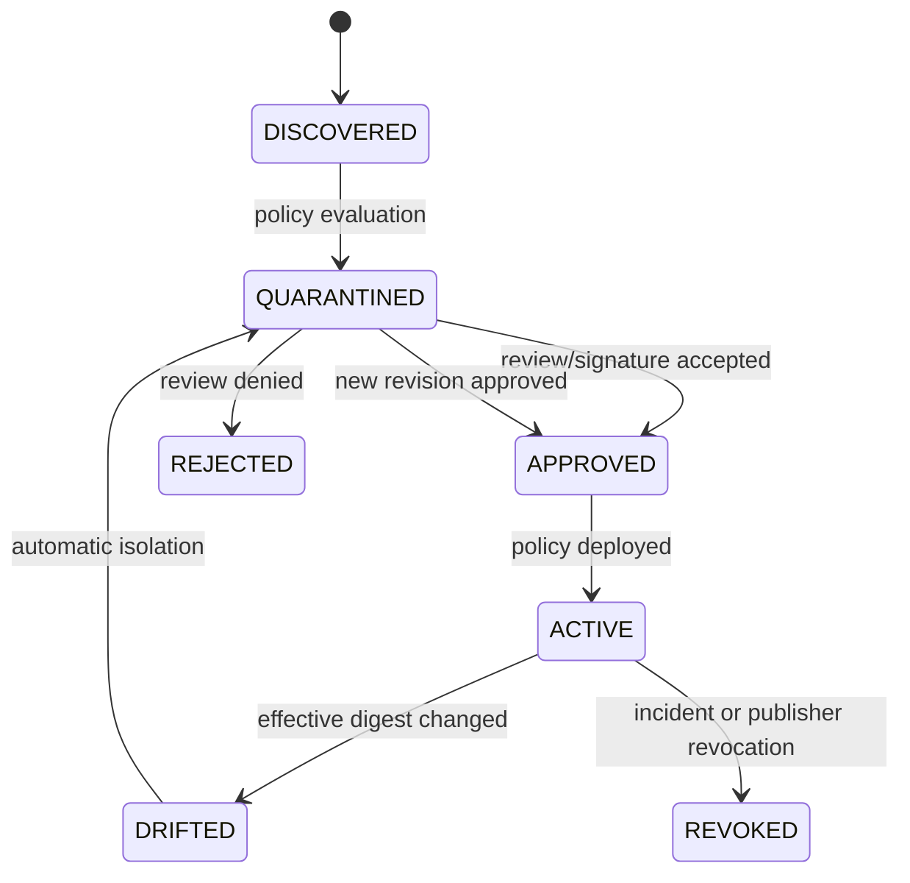

# Agent Interlock MCP Tool Gateway Technical Specification

> 한국어 원문: [04-mcp-tool-gateway-spec.ko.md](04-mcp-tool-gateway-spec.ko.md)

> Audience: Implementers of Runtime, Policy Engine, SDK, Connector, Ledger<br>
> Scope: `tools/list`, `tools/list_changed`, `tools/call`, Tool result, OAuth/credential, Connector execution boundary

## 1. Responsibilities and Non-Responsibilities

The MCP Tool Gateway is the policy enforcement point between the MCP Host/Client and the Server. It is responsible for the following:

- Assigning stable Actor identity to Servers and Tools
- Managing Tool definition canonicalization, digest, approval state, and drift
- Rendering verdicts on call arguments' schema, data, destination, and side effects
- Per-hop credential binding and blocking token passthrough
- Restricting the Connector's URL, process, filesystem, and network
- Inspecting returned data's schema, taint, and secrets
- Generating Ledger events that separate verdict, enforcement, and outcome

The Gateway does not replace LLM malware detectors, general-purpose endpoint security, or package scanners entirely. Invisible behavior inside the Remote Server is compensated for with downstream audit and egress reconciliation.

## 2. Logical Components

| Component | Input | Output | Key Threats |
|---|---|---|---|
| Server Registry | endpoint, publisher, transport, artifact | server actor, trust state | M2, M4, M7 |
| Definition Registry | `tools/list` D1 | canonical definition, digest, state | M1–M3 |
| Tool Discovery Guard | raw D1 | model-visible sanitized D1 | M1, M3 |
| Tool Call Guard | D2, D3, Actor/LinkPolicy | decision, sanitized args | M1, M3, M8, M9 |
| Identity Guard | D5 claims, link context | bound/downscoped credential | M5 |
| Connector Sandbox | URL, command, request | constrained execution evidence | M4, M6 |
| Result Guard | D4 | sanitized/tainted result | M1, M6, M8 |
| Egress/Transaction Guard | destination, D7, side effect | allow/hold/block, receipt | M9 |
| Ledger Adapter | all stages | normalized events | M1–M9 |

## 3. Stable Identifiers

```text
server_id = tenant/environment/registry-key
tool_id   = server_id + ":" + tool_name
definition_revision_id = tool_id + "@" + canonical_digest
```

Actors are not identified solely by display name, title, or endpoint. Even if a Server offers a Tool with the same name, it is a different Actor if the namespace differs.

## 4. Tool Definition Canonicalization and State

### 4.1 Canonical definition

The digest includes at minimum the following fields:

```yaml
serverId: tenant-a/prod/trusted-mail
toolName: send_email
title: Send email
description: Send a message to approved recipients.
inputSchema: { canonical-json-schema: true }
outputSchema: { canonical-json-schema: true }
annotations: {}
endpoint: https://mcp.example.com
transport: streamable-http
publisher: platform-team
artifactDigest: sha256:...
```

- Sort JSON object keys and normalize numbers, Unicode, and line endings.
- Also separately retain a raw digest that does not strip security-relevant whitespace or invisible characters from the description.
- For values that might contain secrets, store an encrypted evidence reference or hash instead of the raw value.
- Include the canonicalizer version in the digest input so version changes can be audited.

### 4.2 State Machine



Only an `ACTIVE` revision can be called. `tools/list_changed` is not an automatic-approval signal; it is a signal that a new `DISCOVERED` revision has been created.

## 5. ActorSpec Extension

MCP-specific fields are added to the base ActorSpec.

```yaml
apiVersion: interlock.dev/v1alpha1
kind: Actor
metadata:
  id: tool.trusted-mail.send-email
  owner: customer-platform
  tenant: tenant-a
spec:
  type: TOOL
  identity: spiffe://prod.example/mcp/trusted-mail/send-email
  capabilities: [EMAIL_SEND]
  dataAccess: [CUSTOMER_NAME, CUSTOMER_EMAIL]
  sideEffects: [EXTERNAL_WRITE]
  tenantMode: REQUIRED
  failureMode: FAIL_CLOSED
  mcp:
    serverId: tenant-a/prod/trusted-mail
    toolName: send_email
    transport: streamable-http
    endpoint: https://mcp.example.com
    publisher: platform-team
    artifactDigest: sha256:...
    definitionDigest: sha256:...
    credentialMode: TOKEN_EXCHANGE
    sandboxProfile: remote-mcp-restricted
  destinations:
    allowedDomains: [customer.example]
  schemas:
    input: schemas/send-email-input.json
    output: schemas/send-email-output.json
```

`definitionDigest` points to the approved revision. The digest actually observed from `tools/list` is managed by the Registry, and the two are compared before execution.

## 6. LinkPolicy Extension

```yaml
apiVersion: interlock.dev/v1alpha1
kind: LinkPolicy
metadata:
  id: mcp-tool-invoke-default
  version: 1.0.0
spec:
  sourceTypes: [AGENT, SUBAGENT]
  targetTypes: [TOOL]
  relationship: INVOKES
  mode: SHADOW
  toolDefinition:
    requireState: ACTIVE
    requireDigestPin: true
    allowCrossServerReferences: false
  data:
    allowedClasses: [D2, D3, D7]
    deniedClasses: [D5, D8]
    propagateTaint: true
    secretAction: BLOCK
  destination:
    requireExplicit: true
    newDestinationAction: HOLD
  authorization:
    tokenPassthrough: false
    requireAudience: true
    requireResource: true
    requireActorBinding: true
    maxDelegationDepth: 1
  sideEffects:
    externalWrite: REQUIRE_APPROVAL
    destructiveWrite: BLOCK
    undeclared: BLOCK        # Block if the observed side effect is not in the ActorSpec's declared set
  failureMode: FAIL_CLOSED
```

Even if the Tool description asserts it is safe, the policy independently evaluates D3 and the actual destination. `mode` is one of `OBSERVE`, `SHADOW`, or `ENFORCE`, and events record both the evaluation mode and whether enforcement actually occurred.

## 7. Processing Pipeline

### 7.1 `tools/list`

```text
Authenticate Server → limit raw response size/schema → assign per-Tool namespace
→ compute raw/canonical digest → compare against existing approved revision
→ check for metadata injection, cross-server reference, capability exaggeration
→ determine state → generate model-visible D1 → record to Registry/Ledger
```

Only the rule-violating Tool can be quarantined individually, but if the integrity of the entire response is suspect or the Server identity is unclear, the entire Server is quarantined.

### 7.2 `tools/call`

```text
Receive D2 purpose/provenance → resolve source/target Actor
→ verify ACTIVE/approved digest → validate D3 schema
→ classify taint/secret/data class → canonicalize destination
→ verify token binding/scope → render side effect/approval verdict
→ record CONTROL_EVALUATED to the Ledger
→ on ALLOW, execute Connector → record ACTION_EXECUTED
```

The `arguments_hash` is bound to the Connector so that D3 cannot change between the verdict and the actual transmission. Approval is likewise bound to the same hash and destination set, and the approval is invalidated if the arguments change.

### 7.3 Tool result

```text
Limit response size/content type → validate output schema
→ check URL/resource safety → detect secret/PII/instruction-like content
→ attach provenance/taint → return only the allowed fields to the Host
→ record INTERACTION_COMPLETED and DATA_FLOW_OBSERVED
```

When the Tool result is placed into the next model turn, the `UNTRUSTED_TOOL_RESULT` taint is retained. Instructions inside the result are never promoted to policy or system commands.

### 7.4 OAuth and Authorization URL

- The authorization endpoint must match the registered metadata.
- Schemes other than `https` are denied by default. loopback is allowed only in an explicitly designated local development profile.
- scheme, host, port, and resolved IP are re-validated at every redirect in the chain.
- URLs are never assembled via shell commands; an argument array or an OS-safe API is used instead.
- Tokens are exchanged per hop and are never passed through as-is to a downstream with a different audience/resource.

### 7.5 Declaration–Observation Reconciliation (declaration reconciliation)

The Gateway does not unconditionally trust the ActorSpec declared by the developer. It checks whether the observed behavior is a subset of the declared set, but **it must distinguish the point of enforcement.** Only predictable excesses can be pre-blocked before execution; excesses that only surface after execution are subject to detection, revocation, and compensation. Lumping these together as "observed it, so we blocked it" hides incidents where an external write that had already gone out could not be stopped.

| Point | Basis | Handling on Excess |
|---|---|---|
| Pre-execution (`estimatedSideEffect`, based on D3) | `tools/call` evaluation stage (§7.2) | `BLOCK` — receipt is 0 since dispatch never happens |
| Post-execution (`observed`/`completed`, downstream receipt) | Result/reconciliation stage (§8.1) | `DETECTION_RAISED` → `REVOKE`/`KILL`/compensation — the external write may have already occurred |

```text
estimated sideEffect  ⊄ ActorSpec.sideEffects  (pre-execution)  → L1-UNDECLARED-SIDE-EFFECT / BLOCK
estimated destination ⊄ ActorSpec.destinations (pre-execution)  → L1-M9-NEW-DESTINATION / HOLD
observed  sideEffect  ⊄ ActorSpec.sideEffects  (post-execution) → L1-UNDECLARED-SIDE-EFFECT / REVOKE + compensation
```

- A pre-execution estimated excess is blocked at the evaluation stage (§7.2) even if it passed the `tools/list` definition check (§7.1). Since `ExecuteApprovedCall` (§10) does not dispatch without a valid decision, the receipt is 0.
- Invisible egress inside the Remote Server cannot be seen before execution (§1), so **pre-execution blocking cannot be guaranteed.** It is detected after the fact through downstream receipt reconciliation (§8.1) and handled via token revocation and compensating transactions.
- Without this reconciliation, under-declaration becomes a control-bypass path. The basis for trust is recording, separately, "what is blocked in advance and what is revoked after the fact."

## 8. Event Contract

The common Envelope follows [01 Project Plan](01-project-plan.md#61-common-event-envelope). The minimum MCP payload fields are as follows:

```yaml
payload:
  mcp:
    protocolVersion: "2025-11-25"
    serverId: tenant-a/prod/trusted-mail
    transport: streamable-http
    method: tools/call
  toolDefinition:
    toolId: tenant-a/prod/trusted-mail:send_email
    revisionId: "...@sha256:..."
    observedDigest: sha256:...
    approvedDigest: sha256:...
    state: ACTIVE
  invocation:
    callId: call-...
    purpose: customer-case-reply
    argumentsHash: sha256:...
    destinationIds: [email:customer@example.com]
    dataClasses: [D3, D7]
    sensitivity: CONFIDENTIAL
    estimatedSideEffect: EXTERNAL_WRITE
  authorization:
    credentialFingerprint: sha256:...
    issuer: https://idp.example
    subject: user-123
    actor: agent.support
    audience: https://mail-api.example
    resource: mail
    scopes: [mail.send]
    delegationParentId: null
  control:
    policyId: mcp-tool-invoke-default
    policyVersion: 1.0.0
    mode: ENFORCE
    decision: HOLD
    reasonCodes: [L1-M9-NEW-DESTINATION]
  action:
    result: COMPLETED
    connectorExecutionId: null
  outcome:
    securityOutcome: BLOCKED
    downstreamTransactionId: null
```

### 8.1 Event Sequence

| Stage | Event | Completion Condition |
|---|---|---|
| Request received | `INTERACTION_REQUESTED` | toolId, revision, D3 hash present |
| Data boundary crossed | `DATA_FLOW_OBSERVED` | source, destination, data class, taint present |
| Policy evaluated | `CONTROL_EVALUATED` | policy version, decision, reason code present |
| Actual enforcement | `ACTION_EXECUTED` | action result and connector ID present |
| Call completed | `INTERACTION_COMPLETED` | protocol status, latency, result hash present |
| Security outcome | `SECURITY_OUTCOME_SET` | Attack success/block/partial-execution status finalized |

Events are grouped by the same `interaction_id`, and internal Server transactions are reconciled via `downstream_transaction_id`.

## 9. Reason Codes

| Code | Condition | Default Verdict |
|---|---|---|
| `L1-M1-METADATA-INSTRUCTION` | D1 requests commands or data access unrelated to its function | `QUARANTINE` |
| `L1-M2-DEFINITION-DRIFT` | Mismatch between observed and approved digest | `QUARANTINE` |
| `L1-M3-CROSS-SERVER-REFERENCE` | D1 manipulates a Tool in another namespace | `BLOCK` |
| `L1-M4-UNTRUSTED-PUBLISHER` | provenance/signature policy failure | `QUARANTINE` |
| `L1-M4-SIGNATURE-INVALID` | Missing or mismatched provenance signature from a trusted publisher | `QUARANTINE` |
| `L1-M4-PROVENANCE-DENIED` | repository/revision/build provenance policy failure | `QUARANTINE` |
| `L1-M4-EGRESS-DENIED` | Runtime destination is outside the exact egress allowlist | `BLOCK`+workload termination |
| `L1-M4-EGRESS-BINDING-MISMATCH` | Mismatch among tenant/workload/artifact/provenance/sandbox profile | `BLOCK`+workload termination |
| `L1-M4-PROCESS-TERMINATION-FAILED` | Failure to confirm workload termination after egress block | `BLOCK`+Incident |
| `L1-M5-TOKEN-AUDIENCE-MISMATCH` | Token audience/resource mismatch | `BLOCK` |
| `L1-M5-TOKEN-PASSTHROUGH` | Downstream forwarding without exchange | `BLOCK` |
| `L1-M6-UNSAFE-AUTH-URL` | scheme/host/redirect/IP policy failure | `BLOCK` |
| `L1-M7-CONFIG-DRIFT` | Mismatch between runtime and approved config digest | `BLOCK` |
| `L1-M8-CREDENTIAL-DETECTED` | D5 fingerprint detected in D3/D4/context | `SANITIZE`/`BLOCK` |
| `L1-M9-NEW-DESTINATION` | Unapproved external destination | `HOLD` |
| `L1-M9-SENSITIVE-EGRESS` | Sensitive D7 moves via an external write | `BLOCK`/`HOLD` |
| `L1-UNDECLARED-SIDE-EFFECT` | Side effect exceeds the ActorSpec's declared sideEffects | Pre-execution `BLOCK` · post-execution `REVOKE`+compensation |

`L1-Mn-*` codes are tied to a specific threat, while cross-cutting codes spanning multiple threats, like `L1-UNDECLARED-*`, use the `L1-*` format. Reason codes are stable analytic keys. Human-readable descriptions are localized in a separate field, and the meaning of a code is never reused or changed.

## 10. Internal API Boundary

```text
RegisterServer(serverSpec) -> serverId, trustState
ObserveDefinitions(serverId, rawToolsList) -> revisions[], decisions[]
EvaluateInvocation(actor, toolRevision, intent, arguments, credentialRef) -> decision
ExecuteApprovedCall(decisionId, argumentsHash) -> connectorExecutionId
InspectResult(connectorExecutionId, rawResult) -> sanitizedResult, labels[]
ReconcileTransaction(connectorExecutionId, downstreamReceipt) -> securityOutcome
```

- `ExecuteApprovedCall` does not execute unless there is a non-expired decision with the same `argumentsHash`.
- Callers do not send the raw credential to the Policy Engine; they use an opaque reference from the Identity Guard.
- All mutation APIs require an idempotency key and tenant.

## 11. Failure and Bypass Prevention

| Failure | Default Behavior | Required Event |
|---|---|---|
| Policy Engine timeout | `FAIL_CLOSED` for high-risk/external writes | `CONTROL_HEALTH_CHANGED`, `CONTROL_EVALUATED(ERROR)` |
| Ledger delay/outage | Allow reads only in limited form; `DEGRADE_READ_ONLY` for external writes | local spool status |
| Definition Registry unavailable | Block new/changed Tools; allow only cached ACTIVE within TTL | cache revision/age |
| Identity Provider unavailable | Prohibit expanded token reuse; block writes | issuer health |
| Connector sandbox failure | Execution prohibited | sandbox start error |
| Result inspection failure | Quarantine the result instead of injecting it into the model | result evidence ref |

Direct Server connections that bypass the Gateway are detected via network policy and SDK trace-gap rules. If an Agent log exists but there is no Gateway `INTERACTION_REQUESTED`, a bypass incident is generated.

## 12. Privacy and Evidence

- The raw D5, the full prompt, and the full D7 payload are not stored in the default Ledger.
- For cases that cannot be analyzed by hash alone, only a reference is recorded, with the actual data held in an encrypted evidence store under TTL and access approval.
- URL queries, headers, and error messages may also contain credentials, so they are stored after redaction.
- Destination email/account values separate operational-search tokenization from forensic encryption.
- The originals needed to reproduce the canonical digest are stored in access-controlled registry evidence.

## 13. Implementation Order

1. Definition Registry, canonical digest, and the `ACTIVE/DRIFTED` gate
2. `tools/call` schema, destination, and side-effect verdicts and events
3. Identity Guard and token exchange/binding
4. URL validator and Connector sandbox
5. Result Guard, taint, secret DLP
6. downstream receipt reconciliation and Graph correlation analysis

Each stage is promoted to `ENFORCE` after its corresponding test in the [05 L1 Security Validation Plan](05-l1-security-validation-plan.md) has been automated.
