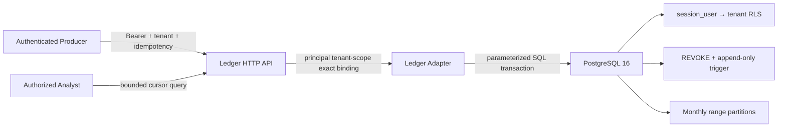

# PostgreSQL Interaction Ledger와 Query API

## 1. 구현 결과

이번 단계는 메모리 Ledger 계약을 유지하면서 운영 경계를 다음 박스로 분리했다.



| 박스 | 조작 가능한 보안 설정 | 항상 강제되는 경계 |
|---|---|---|
| HTTP API | 최대 body, timeout, page 크기, 허용 browser Origin | 인증 principal과 header/body tenant exact match, scope, source Actor allowlist, idempotency |
| Authenticator | 조직 IdP·mTLS adapter로 교체 | 검증되지 않은 JWT claim을 신뢰하지 않음 |
| PostgreSQL adapter | 연결 factory, tenant별 DSN, unpaged 내부 조회 상한 | DSN 비노출, parameter binding, transaction rollback, DB role tenant 확인 |
| PostgreSQL | tenant별 login role, retention, 월 partition | FORCE RLS, `session_user` binding, UPDATE/DELETE 권한 회수와 trigger |

`InMemoryLedger`와 `PostgreSQLLedger`는 같은 `Ledger` protocol을 구현한다. SDK·Gateway·Architecture compiler는 구체 저장소가 아니라 이 계약을 받는다.

## 2. PostgreSQL 보안 모델

Migration은 [`0001_interaction_ledger.sql`](../migrations/postgresql/0001_interaction_ledger.sql)에 있다.

- `security_events`는 `occurred_at` 월 범위로 partition한다. 현재·다음 달 partition과 default partition을 만들고, 운영자는 다음 달 partition을 미리 생성한다.
- partitioned table의 primary key는 PostgreSQL 제약에 맞춰 partition key인 `occurred_at`을 포함한다.
- application login은 `NOSUPERUSER`, `NOBYPASSRLS`여야 하며 `interlock_event_api` 권한을 상속한다.
- `role_tenant`는 로그인 역할을 tenant 하나에 결합한다. RLS가 사용하는 값은 앱이 `SET`할 수 있는 custom GUC가 아니라 인증 연결의 `session_user`다.
- `FORCE ROW LEVEL SECURITY`가 table owner에도 정책을 적용한다. 단 superuser·`BYPASSRLS`는 우회할 수 있으므로 application credential에 금지한다.
- API 역할에는 parent table의 `SELECT`, `INSERT`만 준다. UPDATE/DELETE는 권한으로 막고, migration owner처럼 권한이 넓은 역할도 trigger가 다시 거부한다.
- `event_ingest_keys`는 `(tenant_id, idempotency_key)`를 event와 한 transaction에 결합하며 같은 key의 다른 정규화 event는 `409`다.
- 검색·index에는 `payload jsonb`를 사용하되 hash 재현에는 `payload_canonical` text를 사용한다. DB CHECK가 두 표현의 JSON 의미가 같은지 강제해 `jsonb`의 숫자 표기 정규화로 인한 hash 오탐을 피한다.
- 저장 이벤트를 읽을 때 canonical `integrity_hash`를 다시 계산해 불일치 row를 반환하지 않는다.

PostgreSQL 공식 문서상 partitioned table의 unique/primary key는 모든 partition key column을 포함해야 하며, RLS는 정책이 없으면 default deny이고 `WITH CHECK`가 새 row를 검사한다. 구현은 [PostgreSQL 16 Partitioning](https://www.postgresql.org/docs/16/ddl-partitioning.html)과 [CREATE POLICY](https://www.postgresql.org/docs/16/sql-createpolicy.html)를 따른다.

### 2.1 tenant role provision 예시

아래 작업은 migration owner가 수행한다. 비밀번호는 secret manager에서 주입하고 SQL·shell history에 남기지 않는다.

```sql
INSERT INTO interlock.tenants (tenant_id, name)
VALUES ('tenant-a', 'Tenant A');

CREATE ROLE tenant_a_app LOGIN NOSUPERUSER NOBYPASSRLS;
GRANT interlock_event_api TO tenant_a_app;

INSERT INTO interlock.role_tenant (role_name, tenant_id)
VALUES ('tenant_a_app', 'tenant-a');
```

연결 pool이 여러 tenant credential을 섞으면 adapter의 `SELECT interlock.current_tenant()`가 실제 SQL 전에 불일치를 차단한다. 하나의 강한 DB login에 tenant header만 바꾸는 구성은 지원하지 않는다.

## 3. Python adapter

Core는 외부 의존성이 없고 PostgreSQL 사용 시에만 optional extra를 설치한다.

```bash
python3 -m pip install -e '.[postgres]'
```

```python
import os

from agent_interlock import PostgreSQLLedger

ledger = PostgreSQLLedger.from_dsn(
    os.environ["INTERLOCK_POSTGRES_DSN"],
    bound_tenant_id="tenant-a",
)
```

Psycopg connection은 명시적으로 commit/rollback/close한다. 읽기 역시 transaction을 종료해 idle-in-transaction 상태를 남기지 않는다. 이 동작은 [Psycopg transaction 문서](https://www.psycopg.org/psycopg3/docs/basic/transactions.html)의 권고와 맞춘 것이다.

## 4. HTTP API

실행 계약은 [`ledger-api.openapi.yaml`](../schemas/ledger-api.openapi.yaml)에 있다.

| Method | Path | Scope | 핵심 제한 |
|---|---|---|---|
| `POST` | `/v1/events` | `events:write` | Bearer, tenant header/body, `Idempotency-Key`, JSON 256 KiB 기본 상한 |
| `GET` | `/v1/traces/{trace_id}` | `events:read` | tenant 격리, `limit≤500`, opaque cursor, body 금지 |
| `POST` | `/v1/traces` | `telemetry:write` | OTLP/HTTP JSON decode, principal tenant/header binding, context 누락 issue 반환, body 상한; Ledger append 없음 |

공통으로 `X-Interlock-Tenant-Id`가 인증 principal tenant와 정확히 같아야 한다. Event producer는 principal의 `allowed_source_actor_ids` 안에 있는 `source_actor_id`만 기록할 수 있어 같은 tenant 안의 다른 Actor를 사칭할 수 없다. API는 producer가 덮어쓸 수 없는 `payload._interlock.producerSubject`를 추가하고 이 값을 integrity hash와 idempotency binding에 포함한다. 다른 tenant의 동일 trace ID 조회는 존재 여부를 누설하지 않고 빈 page를 반환한다. 응답은 `Cache-Control: no-store`, `nosniff`, restrictive CSP를 포함한다.

```python
from agent_interlock import (
    LedgerAPIPrincipal,
    LedgerHTTPAPI,
    StaticBearerAuthenticator,
    create_ledger_http_server,
)

authenticator = StaticBearerAuthenticator.from_tokens({
    development_token: LedgerAPIPrincipal(
        subject="audit-producer",
        tenant_id="tenant-a",
        scopes=frozenset({"events:read", "events:write"}),
        allowed_source_actor_ids=frozenset({"gateway.customer-support"}),
    )
})
api = LedgerHTTPAPI(ledger, authenticator)
server = create_ledger_http_server(api)  # loopback only
server.serve_forever()
```

`StaticBearerAuthenticator`는 reference·test용이며 token 원문 대신 SHA-256 digest만 보관한다. 운영에서는 조직 IdP의 서명 검증/JWKS 또는 introspection, audience·issuer·expiry 확인, workload mTLS를 수행하는 `LedgerAPIAuthenticator`로 교체해야 한다. reference server는 loopback만 허용하므로 외부 공개 시 신뢰 TLS reverse proxy, request rate limit, verified forwarding 설정이 별도로 필요하다.

## 5. 검증

자동 시험은 다음을 포함한다.

- 실제 HTTP socket에서 인증 누락, tenant mismatch, scope 부족, browser Origin, body 상한 차단
- secret redaction, exact idempotent replay, conflicting replay `409`
- tenant별 빈 결과와 cursor pagination, invalid cursor 차단
- DB role tenant 불일치 시 event SQL 0회
- PostgreSQL 16 임시 DB에 migration 적용
- tenant A가 `SET app.tenant_id='tenant-b'`를 실행해도 A row만 보이는 RLS
- tenant B에서 A trace 0 row
- 관리자 UPDATE를 append-only trigger가 거부
- 실제 psycopg adapter의 append, replay, conflict, pagination
- OTLP/HTTP JSON receiver의 인증·tenant/scope·context 누락 처리
- `SignedAuditSink`의 integrity 선검증, detached seal·tamper·record swap 거부

## 6. 현재 경계

- Migration runner는 `postgres_ops.py` `PostgreSQLMigrationRunner`로 제공한다. `migrations/postgresql`의 4-digit `NNNN_*.sql`을 순서대로 멱등 적용하고 `public.interlock_schema_migrations`에 checksum과 함께 기록하며, 적용 후 파일이 바뀌면(checksum drift) 거부한다. 자동 partition/retention은 `PartitionMaintenance`(월별 partition ensure, cutoff보다 오래된 월 partition을 DETACH·ingest-key prune 후 drop)로 제공한다. 실행은 RLS를 bypass하는 migration owner/superuser 연결을 전제한다.
- connection pool은 `postgres_ops.py` `PostgreSQLConnectionPool`로 제공한다. bounded pool이 `ConnectionFactory` 프록시를 반환하므로 `PostgreSQLLedger(pool.factory, ...)`처럼 기존 adapter에 그대로 주입되고, 반납 시 rollback해 열린 트랜잭션이 다음 borrower로 새지 않는다. tenant별 인증 credential 분리는 여전히 tenant마다 별도 pool을 쓴다.
- reference API는 sync HTTP이며 HA, distributed rate limit, TLS termination을 제공하지 않는다.
- producer 비대칭 서명은 `signing.py`의 Ed25519로, hash chain WORM 보존은 `audit_sink.py` `WORMAuditStore`(append-only·해시체인)로 제공한다. mTLS, 외부 KMS/HSM key 관리, S3 Object-Lock 기반 durable 복제·export pipeline은 아직 운영 단계다.
- PostgreSQL live 검증은 `ci/docker-compose.postgres.yml` + `ci/postgres_provision.sql` + `ci/run_postgres_live.sh`로 로컬에서 실행하며(store/ledger live 시험 6개 통과 확인), `.github/workflows/ci.yml`의 `postgres-live` job이 postgres:16 서비스에 migration 0001–0003과 프로비저닝을 적용해 CI에서 실행한다. DSN(`INTERLOCK_TEST_POSTGRES_DSN_TENANT_A/B`)이 없으면 해당 integration test만 skip한다.
