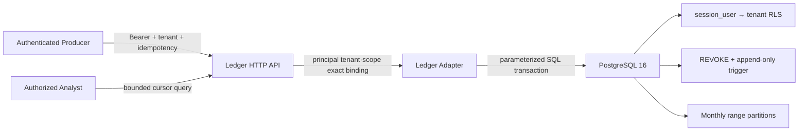

# PostgreSQL Interaction Ledger and Query API

> 한국어 원문: [12-postgresql-ledger-api.ko.md](12-postgresql-ledger-api.ko.md)

## 1. Implementation Result

This stage keeps the in-memory Ledger contract while separating the operational boundary into the following boxes.



| Box | Configurable Security Settings | Always-Enforced Boundary |
|---|---|---|
| HTTP API | max body, timeout, page size, allowed browser Origin | exact match between the authenticated principal and header/body tenant, scope, source Actor allowlist, idempotency |
| Authenticator | swappable for an organizational IdP/mTLS adapter | never trusts an unverified JWT claim |
| PostgreSQL adapter | connection factory, per-tenant DSN, unpaged internal query cap | DSN never exposed, parameter binding, transaction rollback, DB role tenant verification |
| PostgreSQL | per-tenant login role, retention, monthly partitions | FORCE RLS, `session_user` binding, UPDATE/DELETE privilege revocation and trigger |

`InMemoryLedger` and `PostgreSQLLedger` implement the same `Ledger` protocol. The SDK, Gateway, and Architecture compiler depend on this contract, not on a concrete store.

## 2. PostgreSQL Security Model

The migration is at [`0001_interaction_ledger.sql`](../migrations/postgresql/0001_interaction_ledger.sql).

- `security_events` is partitioned by `occurred_at` monthly range. It creates the current-month, next-month, and default partitions, and the operator pre-creates the next month's partition.
- The primary key of the partitioned table includes the partition key `occurred_at`, in line with PostgreSQL's constraints.
- The application login must be `NOSUPERUSER` and `NOBYPASSRLS`, and it inherits the `interlock_event_api` privilege.
- `role_tenant` binds a login role to exactly one tenant. The value RLS uses is the authenticated connection's `session_user`, not a custom GUC the app could `SET`.
- `FORCE ROW LEVEL SECURITY` applies the policy even to the table owner. Because superuser/`BYPASSRLS` can still bypass it, these are forbidden for the application credential.
- The API role is granted only `SELECT` and `INSERT` on the parent table. UPDATE/DELETE are blocked by privilege, and even a broadly privileged role such as the migration owner is rejected again by trigger.
- `event_ingest_keys` binds `(tenant_id, idempotency_key)` to the event within a single transaction, and a differently normalized event under the same key returns `409`.
- Search/indexing uses `payload jsonb`, while hash reproduction uses the `payload_canonical` text. A DB CHECK enforces that the two representations have the same JSON meaning, avoiding hash false-mismatches caused by `jsonb`'s numeric-notation normalization.
- When a stored event is read, the canonical `integrity_hash` is recomputed, and a mismatched row is never returned.

Per the official PostgreSQL documentation, a partitioned table's unique/primary key must include every partition key column, RLS defaults to deny when no policy exists, and `WITH CHECK` validates new rows. The implementation follows [PostgreSQL 16 Partitioning](https://www.postgresql.org/docs/16/ddl-partitioning.html) and [CREATE POLICY](https://www.postgresql.org/docs/16/sql-createpolicy.html).

### 2.1 Tenant Role Provisioning Example

The following operations are performed by the migration owner. Passwords are injected from a secret manager and never left in SQL/shell history.

```sql
INSERT INTO interlock.tenants (tenant_id, name)
VALUES ('tenant-a', 'Tenant A');

CREATE ROLE tenant_a_app LOGIN NOSUPERUSER NOBYPASSRLS;
GRANT interlock_event_api TO tenant_a_app;

INSERT INTO interlock.role_tenant (role_name, tenant_id)
VALUES ('tenant_a_app', 'tenant-a');
```

If a connection pool mixes credentials from multiple tenants, the adapter's `SELECT interlock.current_tenant()` blocks the mismatch before any real SQL runs. A configuration that changes only the tenant header on a single strong DB login is not supported.

## 3. Python Adapter

The core has no external dependencies; the optional extra is installed only when using PostgreSQL.

```bash
python3 -m pip install -e '.[postgres]'
```

```python
import os

from agent_interlock import PostgreSQLLedger

ledger = PostgreSQLLedger.from_dsn(
    os.environ["INTERLOCK_POSTGRES_DSN"],
    bound_tenant_id="tenant-a",
)
```

Psycopg connections are explicitly committed/rolled back/closed. Reads also end their transaction so no idle-in-transaction state is left behind. This behavior follows the recommendation in the [Psycopg transaction documentation](https://www.psycopg.org/psycopg3/docs/basic/transactions.html).

## 4. HTTP API

The executable contract is at [`ledger-api.openapi.yaml`](../schemas/ledger-api.openapi.yaml).

| Method | Path | Scope | Key Limits |
|---|---|---|---|
| `POST` | `/v1/events` | `events:write` | Bearer, tenant header/body, `Idempotency-Key`, JSON 256 KiB default cap |
| `GET` | `/v1/traces/{trace_id}` | `events:read` | tenant isolation, `limit≤500`, opaque cursor, body prohibited |
| `POST` | `/v1/traces` | `telemetry:write` | OTLP/HTTP JSON decode, principal tenant/header binding, returns an issue on missing context, body cap; no Ledger append |

Across all endpoints, `X-Interlock-Tenant-Id` must exactly match the authenticated principal's tenant. An event producer can only record a `source_actor_id` within the principal's `allowed_source_actor_ids`, so it cannot impersonate a different Actor within the same tenant. The API adds `payload._interlock.producerSubject`, which the producer cannot overwrite, and includes this value in the integrity hash and idempotency binding. Looking up the same trace ID under a different tenant returns an empty page without leaking whether it exists. Responses include `Cache-Control: no-store`, `nosniff`, and a restrictive CSP.

```python
from agent_interlock import (
    LedgerAPIPrincipal,
    LedgerHTTPAPI,
    StaticBearerAuthenticator,
    create_ledger_http_server,
)

authenticator = StaticBearerAuthenticator.from_tokens({
    development_token: LedgerAPIPrincipal(
        subject="audit-producer",
        tenant_id="tenant-a",
        scopes=frozenset({"events:read", "events:write"}),
        allowed_source_actor_ids=frozenset({"gateway.customer-support"}),
    )
})
api = LedgerHTTPAPI(ledger, authenticator)
server = create_ledger_http_server(api)  # loopback only
server.serve_forever()
```

`StaticBearerAuthenticator` is for reference/testing only and stores just a SHA-256 digest instead of the raw token. In production, it must be replaced with a `LedgerAPIAuthenticator` that performs the organization's IdP signature verification/JWKS or introspection, audience/issuer/expiry checks, and workload mTLS. The reference server allows loopback only, so exposing it externally requires a separately configured trusted TLS reverse proxy, request rate limiting, and verified forwarding.

## 5. Verification

Automated tests include the following.

- missing authentication, tenant mismatch, insufficient scope, browser Origin, and body-cap rejection over a real HTTP socket
- secret redaction, exact idempotent replay, conflicting replay `409`
- per-tenant empty results and cursor pagination, invalid-cursor rejection
- zero event SQL executions on DB role tenant mismatch
- migration applied to an ephemeral PostgreSQL 16 DB
- RLS that shows only tenant A's rows even when tenant A runs `SET app.tenant_id='tenant-b'`
- zero rows for A's trace when queried from tenant B
- the append-only trigger rejects an admin UPDATE
- append, replay, conflict, and pagination on the real psycopg adapter
- the OTLP/HTTP JSON receiver's authentication · tenant/scope · missing-context handling
- `SignedAuditSink`'s pre-verification of integrity, and rejection of detached seal · tamper · record swap

## Packaged migrations and operating responsibilities

The wheel includes the canonical `src/agent_interlock/migrations/postgresql/NNNN_*.sql` files. The repository's `migrations/postgresql` is a symlink to those files; previously applied SQL bytes and checksums are unchanged. A source checkout is not required:

```python
import os
from agent_interlock import PostgreSQLMigrationRunner

PostgreSQLMigrationRunner.from_dsn(None, os.environ["INTERLOCK_MIGRATION_DSN"]).apply()
```

The release operator runs migrations once with a migration-owner connection before starting application workers. Use a separate tenant-scoped credential for application traffic. Never edit an applied migration; add the next four-digit version.

The database operator must schedule `PartitionMaintenance.ensure_partitions(today=..., months_ahead=1)` before each month starts. Retention is explicit: verify the longest tenant retention and a restorable backup before calling `drop_partitions_older_than(cutoff_month=...)`. These helpers do not schedule themselves. The database operator owns backups, retention schedules and restore drills; restore into an isolated database and verify ledger integrity before switching traffic.

## 6. Current Boundaries

- The migration runner is provided as `postgres_ops.py` `PostgreSQLMigrationRunner`. It idempotently applies the 4-digit `NNNN_*.sql` files under `migrations/postgresql` in order, records them with a checksum in `public.interlock_schema_migrations`, and rejects if a file changes after being applied (checksum drift). Automated partition/retention is provided by `PartitionMaintenance` (ensures monthly partitions, and DETACHes + ingest-key prunes month partitions older than the cutoff before dropping them). Execution assumes an RLS-bypassing migration owner/superuser connection.
- The connection pool is provided as `postgres_ops.py` `PostgreSQLConnectionPool`. Because the bounded pool returns a `ConnectionFactory` proxy, it plugs directly into existing adapters such as `PostgreSQLLedger(pool.factory, ...)`, and it rolls back on return so an open transaction never leaks to the next borrower. Per-tenant authentication credential separation still uses a separate pool per tenant.
- The reference API is synchronous HTTP and provides no HA, distributed rate limiting, or TLS termination.
- Producer asymmetric signing is provided via Ed25519 in `signing.py`, and hash-chain WORM retention via `audit_sink.py` `WORMAuditStore` (append-only · hash chain). mTLS, external KMS/HSM key management, and an S3 Object-Lock–based durable replication/export pipeline remain a production-stage item.
- PostgreSQL live verification runs locally via `ci/docker-compose.postgres.yml` + `ci/postgres_provision.sql` + `ci/run_postgres_live.sh` (confirmed passing for 6 live store/ledger tests), and the `postgres-live` job in `.github/workflows/ci.yml` applies migrations 0001–0004 and provisioning to a postgres:16 service and runs it in CI. Without the DSN (`INTERLOCK_TEST_POSTGRES_DSN_TENANT_A/B`), only that integration test is skipped.
