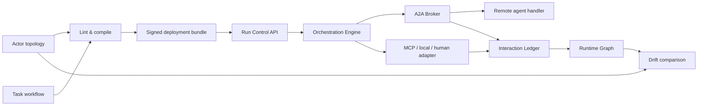

# Trust Boundary 기반 A2A 멀티에이전트 오케스트레이션

## 1. 결론

Agent Interlock의 멀티에이전트 모델은 Actor를 선으로만 연결하지 않는다. **Actor topology**, **방향성 Trust Boundary**, **Task workflow**, **컴파일된 정책**, **A2A/MCP 실행**, **Ledger 증거**를 하나의 revision으로 묶는다.

현재 저장소에는 이 흐름을 실행할 수 있는 reference platform core가 있다.

- Studio에서 INTERNAL/EXTERNAL zone, Actor, 방향성 boundary, 통신 Edge를 편집한다.
- 별도의 Task workflow에서 coordinator, task, dependency, transport, retry, timeout, approval, budget을 편집한다.
- compiler가 cross-zone Edge와 boundary, A2A REL-06, task transport를 함께 검증한다.
- A2A 1.0 JSON-RPC core가 Agent Card, Message, Part, Task, Artifact를 처리한다.
- A2A Broker가 호출 전 REL-06과 Trust Boundary를 fail-closed로 집행한다.
- Orchestration Engine이 검증된 DAG를 dependency wave로 실행하고 A2A task를 Broker에 전달한다.
- Run Control API가 active ENFORCE bundle의 exact Architecture만 로드해 비동기 run을 생성·조회·승인·취소한다.
- 모든 요청·데이터 흐름·판정·task 상태·결과를 Ledger에 남긴다.

이 구현은 단일 프로세스에서 실제로 실행 가능한 플랫폼 코어다. 운영형 분산 플랫폼으로 승격하려면 영속 task/run store, 외부 IdP, 원격 Agent Card 서명·admission, queue/worker HA, streaming/push가 추가로 필요하다.

## 2. 설계는 두 그래프로 나눈다

| 설계 화면 | 질문 | 구성요소 |
|---|---|---|
| Actor topology | 누가 누구와 어떤 경계를 넘어 통신할 수 있는가? | Actor, Trust Zone, Trust Boundary, Relationship Edge, Control |
| Task workflow | 어떤 목표를 어떤 순서와 전송 방식으로 수행하는가? | Coordinator, Task, Dependency, A2A/MCP/LOCAL/HUMAN, approval, retry, budget |

Topology Edge와 workflow task는 서로 연결되지만 같은 것은 아니다. 예를 들어 `task.research`가 `agent.support → agent.research` A2A 전송을 사용하면 compiler는 topology에 해당 `REL-06` Edge가 있는지, Edge가 zone을 넘는다면 방향에 맞는 `A2A_BROKER` boundary가 있는지 확인한다.



## 3. Zone과 Boundary의 책임

### 3.1 Trust Zone

Zone은 배경 장식이 아니라 Actor의 실행 신뢰 범위다. 각 Actor는 정확히 하나의 `trustZoneId`에 속한다. Studio에서 다음을 조절할 수 있다.

- INTERNAL/EXTERNAL zone 추가, 이름·종류·설명 변경
- zone 이동·크기 조절
- zone 이동 시 소속 Actor 함께 이동
- Actor drag/drop 또는 Inspector를 통한 zone 재배치
- 소속 Actor를 감싸도록 zone 크기 맞춤

Actor가 다른 zone으로 이동해 기존 Edge가 새 경계를 넘게 되면 정책을 자동 승인하지 않는다. Studio finding과 compiler 오류로 표시하고 사용자가 boundary를 명시적으로 검토하게 한다.

### 3.2 Trust Boundary

Boundary는 `sourceZoneId → targetZoneId` 방향을 가진 실행 계약이다. 반대 방향은 별도 boundary다.

```json
{
  "id": "boundary.control-worker-a2a",
  "sourceZoneId": "zone.control",
  "targetZoneId": "zone.worker",
  "enforcementPoint": "A2A_BROKER",
  "allowedRelationships": ["DELEGATES"],
  "allowedDataClasses": ["D2", "D3", "D7"],
  "deniedDataClasses": ["D5", "D8"],
  "mode": "ENFORCE",
  "failureMode": "FAIL_CLOSED",
  "requireIdentity": true,
  "requireTenantBinding": true,
  "maxPayloadBytes": 1048576
}
```

Cross-zone Edge에는 `boundaryId`가 반드시 있어야 한다. compiler는 방향, relationship, data class, enforcement point, failure mode, identity/tenant binding을 확인한다. A2A runtime은 같은 계약을 다시 검사하므로 Canvas 선언만 있고 집행이 빠지는 상태를 허용하지 않는다.

## 4. A2A 실행 흐름

현재 wire profile은 공식 최신 [A2A 1.0 specification](https://a2a-protocol.org/latest/specification)의 JSON-RPC core를 기준으로 한다. 0.3 method/shape은 명시적인 `0.3` 호환 profile에서만 허용한다.

1. Agent는 `/.well-known/agent-card.json`에 skill과 JSON-RPC 1.0 interface를 게시한다.
2. 호출자는 `A2A-Version: 1.0`과 인증 credential을 보낸다.
3. `SendMessage` 요청의 Interlock metadata에 purpose, data class, idempotency key를 결합한다.
4. HTTP carrier가 Origin, auth, content type, body size, protocol version을 검사한다.
5. Broker가 source/target의 compiled `REL-06`을 찾는다.
6. actor, audience, resource, exchanged token, delegation depth, purpose, data, schema, secret을 검사한다.
7. cross-zone이면 boundary의 방향, data, payload, identity, tenant 조건을 추가 검사한다.
8. 위반이 ENFORCE 또는 boundary ENFORCE에 해당하면 handler dispatch 전에 거부한다.
9. 허용되면 Task를 `SUBMITTED → WORKING → terminal state`로 전이하고 Artifact를 보존한다.
10. `GetTask`, `CancelTask`는 tenant와 참여 Actor 범위 안에서만 Task를 노출한다.

구현 위치:

- `src/agent_interlock/a2a.py`: protocol model, task store, policy-bound broker, JSON-RPC router
- `src/agent_interlock/a2a_http.py`: authenticated HTTP carrier와 Agent Card endpoint
- `tests/test_a2a.py`: boundary, policy, v1/v0.3 wire, 실제 HTTP socket, orchestration 회귀 시험

현재 A2A 1.0 범위는 `SendMessage`, `GetTask`, `CancelTask`, Agent Card와 동기 Task 처리다. `ListTasks`, SSE streaming/subscription, push notification, authenticated extended card, JWS Agent Card admission은 운영 확장 항목이다.

## 5. Orchestration 실행 흐름

Manifest의 `spec.orchestration`은 실행 DAG다.

```json
{
  "coordinatorActorId": "agent.support",
  "pattern": "HYBRID",
  "runPolicy": {
    "maxParallelism": 4,
    "maxTasks": 50,
    "maxDurationSeconds": 1800,
    "maxMessages": 200,
    "failFast": true
  },
  "tasks": [
    {
      "id": "task.research",
      "sourceActorId": "agent.support",
      "targetActorId": "agent.research",
      "transport": "A2A",
      "purpose": "SUPPORT_RESEARCH",
      "dataClasses": ["D2", "D3"],
      "acceptanceCriteria": ["Tenant-scoped evidence가 있어야 한다"],
      "maxAttempts": 2,
      "timeoutSeconds": 120
    }
  ]
}
```

Engine은 다음을 수행한다.

- cycle 없는 dependency DAG 검증
- 준비된 task를 `maxParallelism` 범위에서 wave 실행
- A2A task를 `A2AOrchestrationAdapter`를 통해 Broker로 전달
- MCP/LOCAL/HUMAN을 교체 가능한 adapter로 연결
- per-task retry, timeout, on-failure와 workflow fail-fast 적용
- 승인 task에서 `WAITING_APPROVAL`로 멈추고 승인 후 resume
- 전체 task/message/duration budget 적용
- acceptance evaluator 실패를 task 실패로 처리
- run/task 상태를 tenant-scoped store와 Ledger에 기록

in-process 임의 adapter를 강제 종료하는 기능은 없다. deadline을 전달하고 전후로 검사하며, 운영 환경에서는 취소 가능한 worker/queue adapter가 실제 hard timeout을 담당해야 한다.

### 5.1 Deployment-bound Run Control API

`RunControlService`는 Studio draft나 클라이언트가 보낸 Architecture를 실행하지 않는다. `GitBundleStore.active()`가 가리키는 ENFORCE bundle에서 digest로 보호된 전체 Architecture를 읽고 다시 compile한 뒤, host가 명시적으로 주입한 transport adapter만 사용한다. 필요한 A2A/MCP/LOCAL/HUMAN adapter 중 하나라도 없으면 `RUN-ADAPTER-MISSING`으로 실행 전에 실패한다. 제품 코드에는 fake transport나 성공 fallback이 없다.

| API | scope | 의미 |
|---|---|---|
| `POST /v1/runs` | `run:create` | active ENFORCE workflow의 PENDING run을 만들고 worker resume를 시작한다. |
| `GET /v1/runs`, `GET /v1/runs/{id}` | `run:read` | 인증 principal의 tenant에 속한 run만 조회한다. |
| `GET /v1/runs/{id}/events` | `run:read` | 같은 run trace의 redacted Ledger event를 조회한다. |
| `POST /v1/runs/{id}/resume` | `run:create` | 비종료 run을 재개한다. 완료 task는 다시 실행하지 않는다. |
| `POST /v1/runs/{id}/tasks/{taskId}/approve` | `run:approve` | 실제 `WAITING_APPROVAL` task에만 승인 신호를 주고 재개한다. |
| `POST /v1/runs/{id}/cancel` | `run:cancel` | run을 CANCELED로 고정한다. 이미 시작된 외부 side effect의 중단·보상은 host adapter 책임이다. |

tenant ID는 request body가 아니라 인증 principal에서만 가져온다. run/trace ID는 안전한 문자와 최대 길이를 검사하고, run input과 output은 API 응답 전에 공통 redaction을 거친다. 현재 reference worker와 run store는 단일 프로세스 bounded memory 구현이므로 프로덕션에서는 durable store, queue lease, heartbeat, fencing, adapter idempotency를 구현해야 한다.

Studio의 Deploy와 Runs는 같은 Control Plane URL/token을 현재 React 세션 메모리에서 공유한다. 탭을 이동해도 연결 정보는 유지되지만 `localStorage`나 `sessionStorage`에는 기록하지 않으며, 페이지 reload 시 제거된다.

## 6. Design Graph는 Runtime Graph로 바뀌지 않는다

`Design Graph → Runtime Graph` 직접 변환은 허용하지 않는다.

```text
Design revision
  → lint / compile
  → review / SHADOW / approval
  → deployed policy
  → actual A2A·MCP execution
  → Ledger·OTLP telemetry
  → Runtime Graph
  → Drift
```

Design은 의도이고 Runtime은 관측 증거다. Design을 Runtime으로 복사하면 “실제로 호출되지 않은 Edge”와 “통제를 우회한 호출”을 구별할 수 없다. 반대로 Runtime에서 발견한 미선언 Edge도 Design에 자동 승인하지 않고 drift finding을 만든다.

## 7. Studio 탭의 역할

| 탭 | 동작 |
|---|---|
| Design | Actor topology와 Task workflow 작성, zone/boundary/Actor/task 조절, manifest export |
| Deploy | compile된 bundle의 propose, 2인 승인, SHADOW/ENFORCE 승격, rollback 상태 확인 |
| Runs | active ENFORCE bundle에서 run 시작, task 상태·승인 대기·취소·Ledger evidence 조회 |
| Runtime | Ledger·OTLP에서 실제 Actor 호출 그래프 재구성; 설계를 실행 그래프로 복제하지 않음 |
| Drift | 미선언 호출, 실행되지 않은 선언 Edge, control bypass 비교 |
| Statistics | interaction lifecycle을 정책·모드·판정·Actor·관계 기준으로 집계 |

Canvas 확대/축소는 포인터가 graph 안에 있을 때 wheel, macOS `Command + =/-`, Windows/Linux `Ctrl + =/-`로 동작한다. 이벤트의 `preventDefault()`와 non-passive wheel handler로 브라우저 페이지 zoom과 분리한다. Canvas 밖에서 브라우저 기본 shortcut을 가로채지 않는다.

## 8. 테스트 전용 가짜 데이터 전체 E2E

가짜 데이터와 fake adapter는 제품 실행 경로가 아니라 `tests/`와 `studio/tests/fixtures/`에서만 사용한다. `tests/test_platform_e2e.py`는 설계 manifest를 SHADOW bundle로 compile한 뒤, 전체 manifest가 포함된 digest를 서로 다른 두 Ed25519 identity로 승인하고 ENFORCE로 승격한다. 그 exact bundle에서 runtime을 재구성해 실제 localhost A2A HTTP carrier, approval pause/resume, test-only MCP transport, Ledger, Runtime/Statistics/Drift를 한 번에 검증한다.

`tests/test_run_control.py`는 실제 loopback Control Plane HTTP route를 통해 create → WAITING_APPROVAL → approve → COMPLETED, cancel-wins, scope, tenant 격리, active deployment/adapters 누락 fail-closed를 검증한다. 제품의 `RunControlService`는 transport를 자체 생성하지 않으며 시험만 adapter provider에 결정적 test double을 주입한다.

정상 경로뿐 아니라 D5 boundary 차단과 미선언·무통제 runtime call도 포함한다. fake MCP는 외부 네트워크를 열지 않고 `.invalid` 고객 주소에 대해 결정적 receipt만 반환한다. 상세 단계와 합격 기준은 [14 가짜 데이터 플랫폼 E2E](14-fake-platform-e2e-scenario.md)를 따른다.

## 9. 실행

```bash
# manifest lint/compile
PYTHONPATH=src python3 -m agent_interlock architecture lint \
  examples/secure_multi_agent_architecture.json
PYTHONPATH=src python3 -m agent_interlock architecture compile \
  examples/secure_multi_agent_architecture.json

# boundary -> A2A -> orchestration -> ledger 전체 실행
PYTHONPATH=src python3 examples/a2a_orchestration_vertical_slice.py

# fake-data design -> deploy -> execute -> evidence 전체 시험
.venv/bin/python -m pytest -q tests/test_platform_e2e.py

# Studio
cd studio
npm install
npm run dev
```

## 10. 운영형 플랫폼으로 가는 남은 계층

| 영역 | 현재 | 운영 확장 |
|---|---|---|
| A2A task/run 저장 | bounded in-memory contract | PostgreSQL/queue 기반 durable store, retention, fencing |
| 인증 | 교체 가능한 authenticator, dev static bearer | IdP JWT/JWKS rotation, mTLS/DPoP, workload identity |
| Agent discovery | 등록된 Agent Card와 well-known endpoint | signed card/JWS 검증, registry, digest admission, cache/ETag |
| A2A async | 동기 Send/Get/Cancel core | SSE stream, reconnect, subscription, push/webhook SSRF 방어 |
| Scheduler | dependency wave + bounded thread pool | distributed queue, worker lease, heartbeat, cancellation, HA |
| 상태 | tenant-scoped bounded store | durable run/task/event store와 exactly-once 대신 명시적 idempotency |
| 운영 | Ledger event와 Runtime/Drift/Statistics | SLO, queue pressure, cost budget, incident response, regional failover |

따라서 현재 결과는 “UI mockup”이 아니라 보안 경계부터 A2A와 task orchestration까지 이어지는 실행 가능한 vertical slice다. 동시에 분산 내구성과 외부 신원·비동기 운반까지 갖춘 최종 SaaS라고 표현해서는 안 된다.
