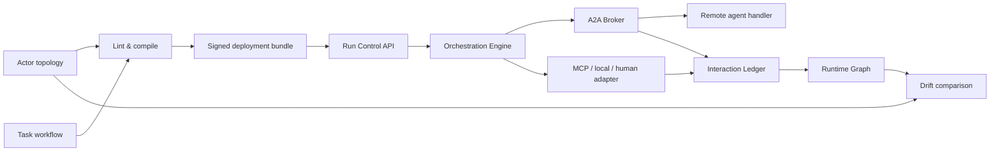

# Trust Boundary-Based A2A Multi-Agent Orchestration

> 한국어 원문: [13-a2a-orchestration-platform.ko.md](13-a2a-orchestration-platform.ko.md)

## 1. Conclusion

Agent Interlock's multi-agent model does not connect Actors with mere lines. It binds **Actor topology**, **directional Trust Boundaries**, **Task workflow**, **compiled policy**, **A2A/MCP execution**, and **Ledger evidence** into a single revision.

The current repository has a reference platform core that can actually run this flow.

- Studio edits INTERNAL/EXTERNAL zones, Actors, directional boundaries, and communication Edges.
- A separate Task workflow edits the coordinator, tasks, dependencies, transport, retry, timeout, approval, and budget.
- The compiler jointly validates cross-zone Edges and boundaries, A2A REL-06, and task transport.
- The A2A 1.0 JSON-RPC core processes the Agent Card, Message, Part, Task, and Artifact.
- The A2A Broker enforces REL-06 and the Trust Boundary fail-closed before invocation.
- The Orchestration Engine executes the validated DAG in dependency waves and forwards A2A tasks to the Broker.
- The Run Control API loads only the exact Architecture of the active ENFORCE bundle to create, query, approve, and cancel asynchronous runs.
- Every request, data flow, verdict, task state, and result is recorded in the Ledger.

This implementation is a platform core that actually runs in a single process. Promoting it to a production distributed platform additionally requires a durable task/run store, an external IdP, remote Agent Card signing/admission, queue/worker HA, and streaming/push.

## 2. Design Splits into Two Graphs

| Design surface | Question | Components |
|---|---|---|
| Actor topology | Who can communicate with whom, across which boundary? | Actor, Trust Zone, Trust Boundary, Relationship Edge, Control |
| Task workflow | Which goal is carried out, in what order, and over what transport? | Coordinator, Task, Dependency, A2A/MCP/LOCAL/HUMAN, approval, retry, budget |

A topology Edge and a workflow task are linked but are not the same thing. For example, if `task.research` uses the `agent.support → agent.research` A2A transport, the compiler checks whether the corresponding `REL-06` Edge exists in the topology, and if that Edge crosses a zone, whether an `A2A_BROKER` boundary exists in the matching direction.



## 3. Zone and Boundary Responsibilities

### 3.1 Trust Zone

A Zone is not background decoration; it is the execution trust scope of an Actor. Each Actor belongs to exactly one `trustZoneId`. In Studio you can adjust the following.

- add INTERNAL/EXTERNAL zones, change their name/type/description
- move/resize a zone
- when a zone moves, its member Actors move with it
- relocate zones by dragging/dropping Actors or via the Inspector
- fit a zone's size to enclose its member Actors

If an Actor moves to a different zone and an existing Edge now crosses a new boundary, the policy is not auto-approved. It is surfaced as a Studio finding and a compiler error, requiring the user to explicitly review the boundary.

### 3.2 Trust Boundary

A Boundary is an execution contract with a `sourceZoneId → targetZoneId` direction. The opposite direction is a separate boundary.

```json
{
  "id": "boundary.control-worker-a2a",
  "sourceZoneId": "zone.control",
  "targetZoneId": "zone.worker",
  "enforcementPoint": "A2A_BROKER",
  "allowedRelationships": ["DELEGATES"],
  "allowedDataClasses": ["D2", "D3", "D7"],
  "deniedDataClasses": ["D5", "D8"],
  "mode": "ENFORCE",
  "failureMode": "FAIL_CLOSED",
  "requireIdentity": true,
  "requireTenantBinding": true,
  "maxPayloadBytes": 1048576
}
```

A cross-zone Edge must have a `boundaryId`. The compiler checks the direction, relationship, data class, enforcement point, failure mode, and identity/tenant binding. The A2A runtime re-checks the same contract, so a state where only the Canvas declaration exists without enforcement is never allowed.

## 4. A2A Execution Flow

The current wire profile is based on the JSON-RPC core of the official, latest [A2A 1.0 specification](https://a2a-protocol.org/latest/specification). 0.3 methods/shapes are allowed only under an explicit `0.3` compatibility profile.

1. The Agent publishes its skills and JSON-RPC 1.0 interface at `/.well-known/agent-card.json`.
2. The caller sends `A2A-Version: 1.0` and authentication credentials.
3. The Interlock metadata on the `SendMessage` request combines purpose, data class, and idempotency key.
4. The HTTP carrier checks Origin, auth, content type, body size, and protocol version.
5. The Broker looks up the compiled `REL-06` for the source/target.
6. It checks actor, audience, resource, exchanged token, delegation depth, purpose, data, schema, and secrets.
7. If cross-zone, it additionally checks the boundary's direction, data, payload, identity, and tenant conditions.
8. If a violation falls under ENFORCE or boundary ENFORCE, it is rejected before handler dispatch.
9. If allowed, the Task transitions through `SUBMITTED → WORKING → terminal state` and Artifacts are preserved.
10. `GetTask` and `CancelTask` expose a Task only within the scope of the tenant and participating Actors.

Implementation locations:

- `src/agent_interlock/a2a.py`: protocol model, task store, policy-bound broker, JSON-RPC router
- `src/agent_interlock/a2a_http.py`: authenticated HTTP carrier and Agent Card endpoint
- `tests/test_a2a.py`: boundary, policy, v1/v0.3 wire, real HTTP socket, orchestration regression tests

The current A2A 1.0 scope is `SendMessage`, `GetTask`, `CancelTask`, the Agent Card, and synchronous Task processing. `ListTasks`, SSE streaming/subscription, push notifications, the authenticated extended card, and JWS Agent Card admission are production extension items.

## 5. Orchestration Execution Flow

The manifest's `spec.orchestration` is the execution DAG.

```json
{
  "coordinatorActorId": "agent.support",
  "pattern": "HYBRID",
  "runPolicy": {
    "maxParallelism": 4,
    "maxTasks": 50,
    "maxDurationSeconds": 1800,
    "maxMessages": 200,
    "failFast": true
  },
  "tasks": [
    {
      "id": "task.research",
      "sourceActorId": "agent.support",
      "targetActorId": "agent.research",
      "transport": "A2A",
      "purpose": "SUPPORT_RESEARCH",
      "dataClasses": ["D2", "D3"],
      "acceptanceCriteria": ["Tenant-scoped evidence must exist"],
      "maxAttempts": 2,
      "timeoutSeconds": 120
    }
  ]
}
```

The Engine performs the following.

- validates a dependency DAG with no cycles
- executes ready tasks in waves within the `maxParallelism` bound
- forwards A2A tasks to the Broker via `A2AOrchestrationAdapter`
- connects MCP/LOCAL/HUMAN through interchangeable adapters
- applies per-task retry, timeout, on-failure, and workflow fail-fast
- pauses at `WAITING_APPROVAL` for approval tasks and resumes after approval
- applies overall task/message/duration budgets
- treats acceptance-evaluator failure as task failure
- records run/task state in a tenant-scoped store and the Ledger

There is no capability to forcibly terminate an arbitrary in-process adapter. A deadline is passed down and checked before and after; in production, a cancellable worker/queue adapter must own the actual hard timeout.

### 5.1 Deployment-bound Run Control API

`RunControlService` does not execute a Studio draft or an Architecture sent by a client. It reads the digest-protected full Architecture from the ENFORCE bundle pointed to by `GitBundleStore.active()`, recompiles it, and uses only the transport adapters explicitly injected by the host. If any required A2A/MCP/LOCAL/HUMAN adapter is missing, it fails before execution with `RUN-ADAPTER-MISSING`. Production code has no fake transport or success fallback.

| API | scope | Meaning |
|---|---|---|
| `POST /v1/runs` | `run:create` | Creates a PENDING run for the active ENFORCE workflow and starts worker resume. |
| `GET /v1/runs`, `GET /v1/runs/{id}` | `run:read` | Queries only runs belonging to the authenticated principal's tenant. |
| `GET /v1/runs/{id}/events` | `run:read` | Queries redacted Ledger events for the same run trace. |
| `POST /v1/runs/{id}/resume` | `run:create` | Resumes a non-terminal run. Completed tasks are not re-executed. |
| `POST /v1/runs/{id}/tasks/{taskId}/approve` | `run:approve` | Gives an approval signal only to a task actually in `WAITING_APPROVAL` and resumes it. |
| `POST /v1/runs/{id}/cancel` | `run:cancel` | Pins the run to CANCELED. Aborting/compensating an already-started external side effect is the host adapter's responsibility. |

The tenant ID is taken only from the authenticated principal, never from the request body. The run/trace ID is checked for safe characters and a maximum length, and run input and output pass through common redaction before the API response. The current reference worker and run store are a single-process bounded-memory implementation, so production must add a durable store, queue lease, heartbeat, fencing, and adapter idempotency.

Studio's Deploy and Runs tabs share the same Control Plane URL/token in the current React session memory. Connection info persists across tab switches but is never written to `localStorage` or `sessionStorage`, and it is cleared on page reload.

## 6. The Design Graph Does Not Become the Runtime Graph

Direct conversion from `Design Graph → Runtime Graph` is not allowed.

```text
Design revision
  → lint / compile
  → review / SHADOW / approval
  → deployed policy
  → actual A2A·MCP execution
  → Ledger·OTLP telemetry
  → Runtime Graph
  → Drift
```

Design is intent, and Runtime is observed evidence. Copying Design into Runtime would make it impossible to distinguish an "Edge that was never actually invoked" from "a call that bypassed controls." Conversely, an undeclared Edge discovered in Runtime is not auto-approved into Design either; it generates a drift finding.

## 7. Role of the Studio Tabs

| Tab | Behavior |
|---|---|
| Design | Author Actor topology and Task workflow; adjust zone/boundary/Actor/task; export manifest |
| Deploy | Propose compiled bundles, two-person approval, SHADOW/ENFORCE promotion, check rollback status |
| Runs | Start runs from the active ENFORCE bundle; view task state, pending approvals, cancellation, and Ledger evidence |
| Runtime | Reconstruct the actual Actor call graph from Ledger/OTLP; does not clone the design into an execution graph |
| Drift | Compare undeclared calls, declared Edges that were never executed, and control bypasses |
| Statistics | Aggregate interaction lifecycle by policy, mode, verdict, Actor, and relationship |

Canvas zoom in/out works via the wheel, macOS `Command + =/-`, or Windows/Linux `Ctrl + =/-` while the pointer is inside the graph. It is kept separate from browser page zoom via the event's `preventDefault()` and a non-passive wheel handler. Default browser shortcuts are not intercepted outside the Canvas.

## 8. Full Test-Only Fake-Data E2E

Fake data and fake adapters are not part of the production execution path; they are used only in `tests/` and `studio/tests/fixtures/`. `tests/test_platform_e2e.py` compiles a design manifest into a SHADOW bundle, then has two distinct Ed25519 identities approve the digest that contains the full manifest, and promotes it to ENFORCE. It reconstructs the runtime from that exact bundle and, in one pass, verifies the real localhost A2A HTTP carrier, approval pause/resume, test-only MCP transport, the Ledger, and Runtime/Statistics/Drift.

`tests/test_run_control.py` verifies, over a real loopback Control Plane HTTP route, create → WAITING_APPROVAL → approve → COMPLETED, cancel-wins, scope, tenant isolation, and fail-closed behavior when active deployment/adapters are missing. Production's `RunControlService` never creates its own transport; only the tests inject a deterministic test double into the adapter provider.

This covers not only the happy path but also D5 boundary blocking and undeclared/uncontrolled runtime calls. The fake MCP opens no external network and returns only deterministic receipts for `.invalid` customer addresses. Detailed steps and pass criteria follow [14 Fake-Data Platform E2E](14-fake-platform-e2e-scenario.md).

## 9. Execution

```bash
# manifest lint/compile
PYTHONPATH=src python3 -m agent_interlock architecture lint \
  examples/secure_multi_agent_architecture.json
PYTHONPATH=src python3 -m agent_interlock architecture compile \
  examples/secure_multi_agent_architecture.json

# boundary -> A2A -> orchestration -> ledger full run
PYTHONPATH=src python3 examples/a2a_orchestration_vertical_slice.py

# fake-data design -> deploy -> execute -> evidence full test
.venv/bin/python -m pytest -q tests/test_platform_e2e.py

# Studio
cd studio
npm install
npm run dev
```

## 10. Remaining Layers Toward a Production Platform

| Area | Current | Production extension |
|---|---|---|
| A2A task/run storage | bounded in-memory contract | PostgreSQL/queue-based durable store, retention, fencing |
| Authentication | interchangeable authenticator, dev static bearer | IdP JWT/JWKS rotation, mTLS/DPoP, workload identity |
| Agent discovery | registered Agent Card and well-known endpoint | signed card/JWS verification, registry, digest admission, cache/ETag |
| A2A async | synchronous Send/Get/Cancel core | SSE stream, reconnect, subscription, push/webhook SSRF defense |
| Scheduler | dependency wave + bounded thread pool | distributed queue, worker lease, heartbeat, cancellation, HA |
| State | tenant-scoped bounded store | durable run/task/event store, with explicit idempotency instead of exactly-once |
| Operations | Ledger events and Runtime/Drift/Statistics | SLO, queue pressure, cost budget, incident response, regional failover |

The current result is therefore not a "UI mockup" but a runnable vertical slice extending from the security boundary through A2A and task orchestration. At the same time, it must not be described as a finished SaaS with distributed durability and external identity/asynchronous transport.
