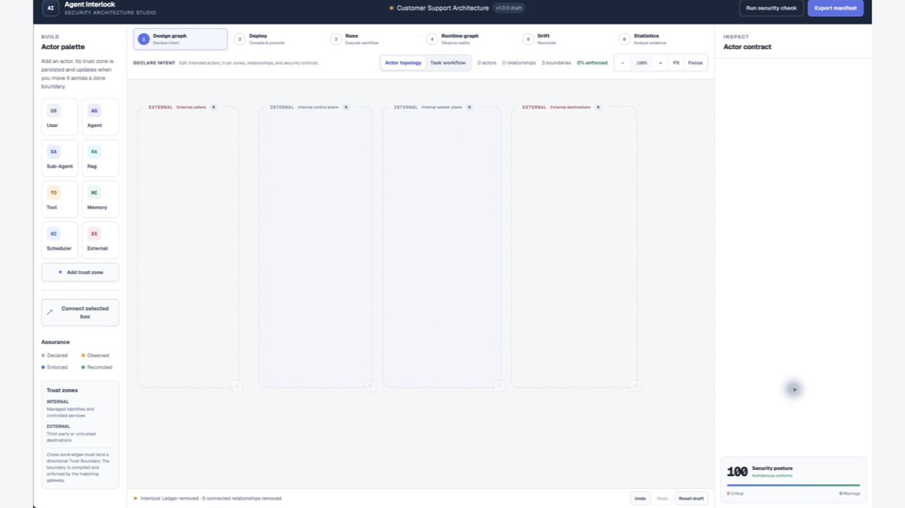
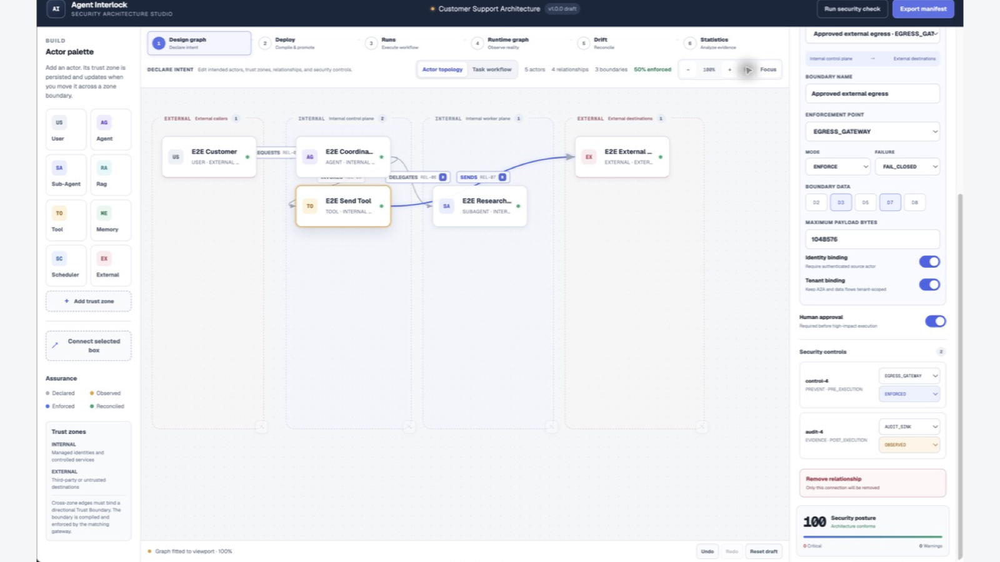
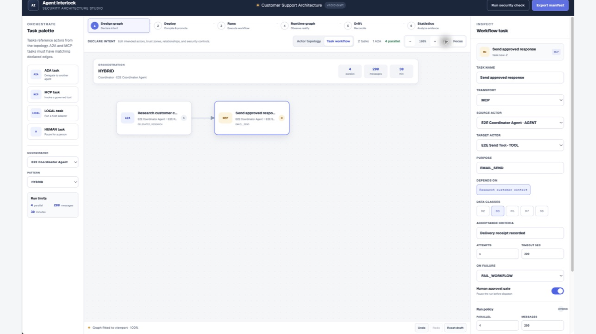
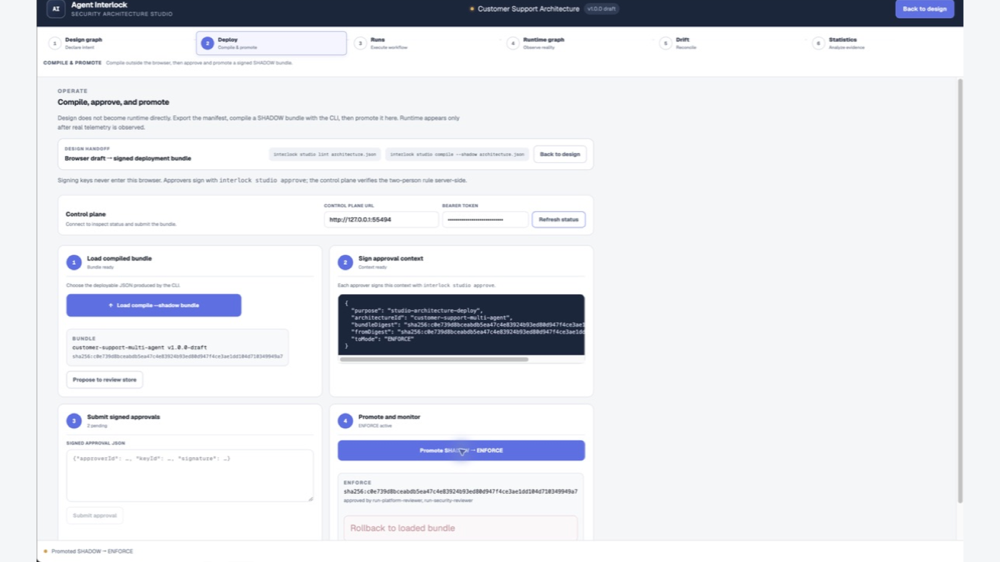
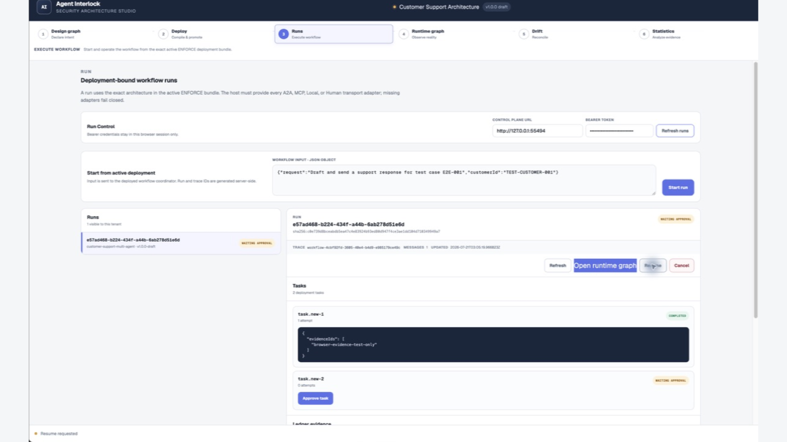
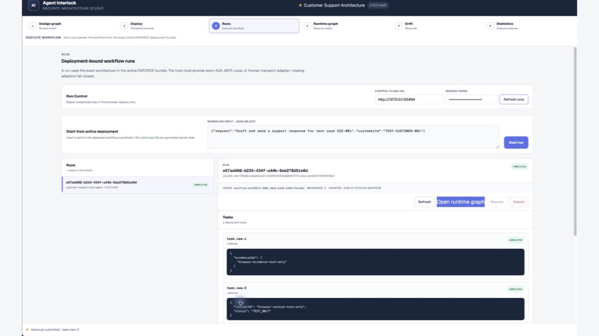
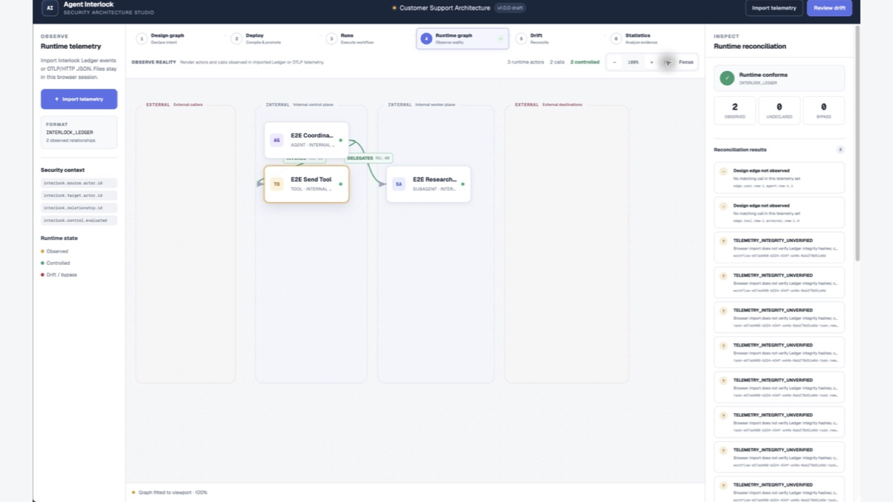
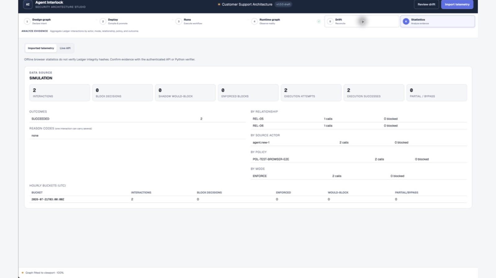

# 수동 브라우저 E2E 화면 증거

이 문서는 [가짜 데이터 플랫폼 E2E 시나리오](14-fake-platform-e2e-scenario.md)를 Studio UI에서 수동 실행한 화면 증거를 모은다. 모든 화면은 test-only Control Plane과 `SIMULATION` Ledger로 생성했다. 실제 고객 데이터나 외부 전송은 포함하지 않는다.

이미지는 Chrome 탭, 주소창, 브라우저 왼쪽 사이드바를 제거하고 Agent Interlock 홈페이지 영역만 유지했다. 제품 UI 픽셀과 문자열은 재생성하지 않았으며, 원본 비율을 보존한 상태로 중립 배경의 1600×900 문서 캔버스에 배치했다.

## 1. 설계 및 보안 계약

### 빈 Trust Zone

### 액터와 경계가 연결된 Security Graph

### A2A에서 MCP로 이어지는 Task Workflow

## 2. 배포 및 실행

### 두 사람의 승인으로 ENFORCE 승격

### MCP 실행 전 사람 승인 대기

### 두 태스크 실행 완료

## 3. Runtime 및 Statistics

### Runtime reconciliation

### 실행 증거 통계

## 4. 전체 캡처 목록

| 순서 | 화면 | 파일 |
|---:|---|---|
| 1 | 빈 Trust Zone | [01-empty-zones](images/agent-interlock-e2e/01-empty-zones-1600x900.png) |
| 2 | USER 보안 계약 | [02-user-configured](images/agent-interlock-e2e/02-user-configured-1600x900.png) |
| 3 | AGENT 보안 계약 | [03-agent-configured](images/agent-interlock-e2e/03-agent-configured-1600x900.png) |
| 4 | SUBAGENT 보안 계약 | [04-subagent-configured](images/agent-interlock-e2e/04-subagent-configured-1600x900.png) |
| 5 | TOOL 보안 계약 | [05-tool-configured](images/agent-interlock-e2e/05-tool-configured-1600x900.png) |
| 6 | EXTERNAL 보안 계약 | [06-external-configured](images/agent-interlock-e2e/06-external-configured-1600x900.png) |
| 7 | Security Graph | [07-security-graph](images/agent-interlock-e2e/07-security-graph-1600x900.png) |
| 8 | Task Workflow | [08-workflow-graph](images/agent-interlock-e2e/08-workflow-graph-1600x900.png) |
| 9 | ENFORCE 배포 | [09-deployed](images/agent-interlock-e2e/09-deployed-1600x900.png) |
| 10 | 승인 대기 | [10-run-waiting-approval](images/agent-interlock-e2e/10-run-waiting-approval-1600x900.png) |
| 11 | Run 완료 | [11-run-completed](images/agent-interlock-e2e/11-run-completed-1600x900.png) |
| 12 | Runtime 일치 | [12-runtime-conforms](images/agent-interlock-e2e/12-runtime-conforms-1600x900.png) |
| 13 | Statistics | [13-statistics](images/agent-interlock-e2e/13-statistics-1600x900.png) |

`Runtime conforms`는 이번 trace에서 미선언 관계와 통제 우회가 없다는 뜻이다. 이 수동 실행은 A2A `REL-06`과 MCP `REL-05`를 호출했으므로 Runtime에는 두 관계가 관측된다. USER ingress와 External egress처럼 실행되지 않은 설계 관계는 별도 정보 항목으로 남는다.
